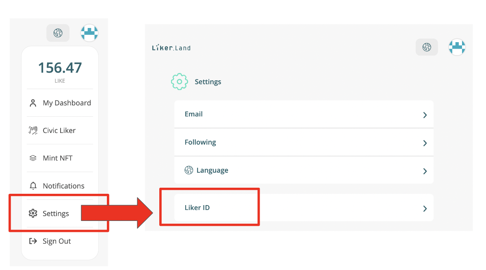

# Decentralize Publishing

### What is LikeCoin?

LikeCoin decentralises publishing by NFT.

### Content Ownership

Own your content by publishing NFT on LikeCoin chain.

### Decentralize Publishing

Mint and sell your work's NFT. Selling Writing NFT in marketplace is just like selling books in bookstore.

### Writing NFT

NFT can be an email, an image, an identity or a book.  LikeCoin NFT is designed especially for  text-based content creation.

Similar to the workflow of traditional publishing, i.e., securing content authorship -> printing the content in books -> selling in bookstore, creators can now register the content on LikeCoin chain -> mint an NFT of it -> sell it in NFT marketplaces. Compared with the constraints in physical publishing, publishing content and exchanging value in metaverse can be more flexible and everlasting.

.png>)

### LikeCoin DAO

[LikeCoin DAO](https://dao.like.co/proposals) is a decentralized organization that allows all LIKE token holders to participate in governance decisions. Every LikeCoin holder is a stakeholder of the DAO.&#x20;

The DAO performs collective decisions of the public treasury, infrastructure for common goods, and evolvement of policies, which can all be evolved via the LikeCoin DAO governance process. Governance decisions include, for example, voting on governance decisions related to the token or other rules impacting the LikeCoin ecosystem. The LikeCoin community uses proposals to decide how to allocate resources from the community fund, rules and procedures for governance, selection of representatives for various working groups (“subdao’s”), etc.

### LIKE token

LIKE is the native token of LikeCoin, a BPoS blockchain built on Cosmos SDK. LIKE is the utility and governance token of the LikeCoin ecosystem.

All transaction fees, network usage, and services built upon LikeCoin infrastructure will use LIKE as the primary token across new projects

LIKE is hyperinflationary, with incentives for staking to secure the LikeCoin chain. There is no fixed total supply of LIKEs and the total supply will increase each year between 7-20% due to inflation. The top 50 validators that have the most staked LIKE will fill the active validator's seats for validating and creating new transactions for the chain. Active validators' seats can be changed by the community through proposals that are voted on by those holding LIKE tokens.

### LikeCoin ecosystem

The [LIKE ecosystem](https://likecoin.bigdipper.live/) is made up of the community of everyday people who hold LIKE and the creators of products and services utilizing LIKE. Currently, this community comprises 60k+ addresses, 8k+ media sites, and 2 mil+ registered pieces of content authored by 26k+ creators in the LikeCoin ecosystem.

Liker Land is one of the core teams in the LikeCoin community and it created the early MVP and Dapps of LikeCoin — including the [LikeCoin button](https://docs.like.co/developer/likecoin-button), [WordPress plugin](https://wordpress.org/plugins/likecoin/), [ISCN app](https://app.like.co/), and the upcoming NFT minting widget that allows creators to mint NFTs directly from their own website.

One of the newest, and most promising Dapps in the LikeCoin ecosystem is [depub.space](https://depub.space/). [depub.space](https://depub.space/) is a web3-native “decentralized Twitter” where influencers sell ”Follows" and creations as NFTs.&#x20;

### Kickstarted

The first step is to own LikeCoin, and use it for publishing or governance.  You can try to post a decentralized tweet on [depub.space](https://depub.space), vote on [dao.like.co](http://dao.like.co/), or reward any creators by transferring LIKE via Keplr.

Visit [here](https://about.like.co/apps) for more LikeCoin Dapps. &#x20;


[faq.md](faq.md)



[list-of-media.md](archive/archive/liker-land/list-of-media.md)


## More about LikeCoin

* **Website**: [Like.co](https://like.co) (for all stakeholders; in English), [Liker.Land](https://liker.land) (for readers and Content Jockey), [ISCN App](https://app.like.co/) (ISCN Registry), [iscn.io](https://iscn.io/) (ISCN Specifications)
* ****[**Discord**](http://discord.gg/likecoin): development, governance discussion
* ****[**Twitter**](https://twitter.com/likecoin): **** announcements
* [**Publication**](https://blog.like.co): progress update, governance, products
* ****[**Telegram**](https://t.me/likecoin\_dao): announcements
* [**GitHub**](https://github.com/likecoin): **** source codes
* ****[**Matters**](https://matters.news/tags/VGFnOjgwOTQ) [**#讚賞公民共和國**](https://matters.news/tags/VGFnOjgwOTQ) **** : **** governance, progress update, products; in Chinese
* **Facebook**: **** [page](https://www.facebook.com/Liker.Land/) (announcement); [group](https://www.facebook.com/groups/likecoin) (creators' sharing); in Chinese
* [**Reddit**](https://www.reddit.com/r/LikeCoin/)

## Contact Us

* Customer Service: [please click here](https://go.crisp.chat/chat/embed/?website\_id=5c009125-5863-4059-ba65-43f177ca33f7), or visit [Liker Land](https://liker.land/) or [like.co](https://like.co/) and click "Help", "Support".
* Partners and Cooperation: [partners@like.co](mailto:partners@like.co)
