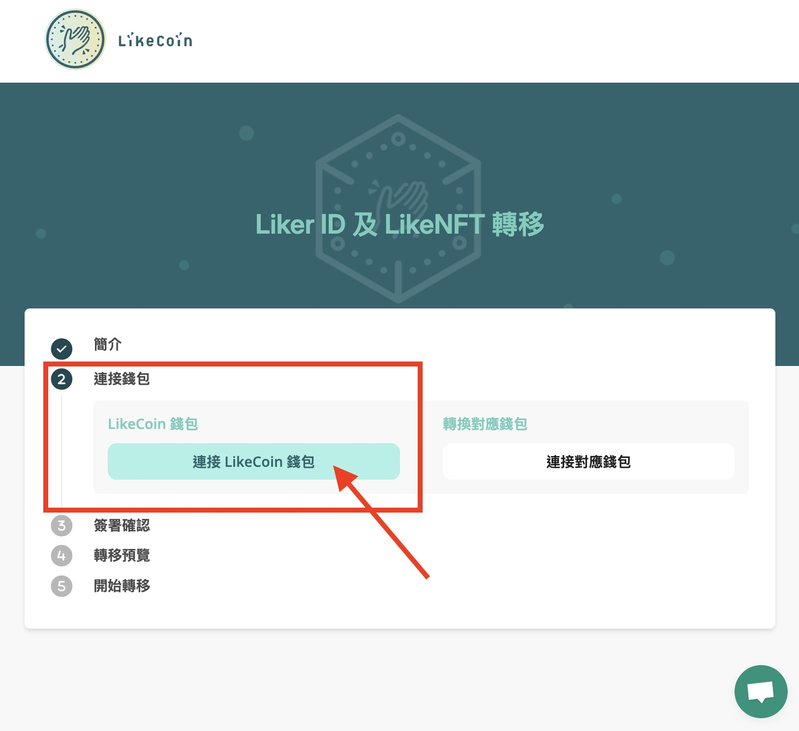

# 從 Liker.Land 遷到 3ook.com

**步驟一**：訪問 [Liker ID 及 LikeNFT 轉移網站](https://v3-book-migration.like.co/)

**步驟二**：閱讀遷移簡介，點「確認」

<figure><figcaption></figcaption></figure>

**步驟三**：點擊「連接 LikeCoin 錢包」按鍵，登入 Liker Land 帳號。系統會彈出登入選項，請以你慣常的方式登入，例如以 Google 登入、電郵地址及密碼登入、或以 Keplr 錢包登入等。成功登入 Liker Land 後，畫面會顯示目前你登入的帳戶資料，請核實這是你將要遷移的帳號。

<figure><figcaption>
點擊「連接 LikeCoin 錢包」按鍵
</figcaption></figure>

<figure><figcaption>
成功登入 Liker Land 後，會顯示你帳號的資料
</figcaption></figure>

**步驟四**：點擊「連接對應錢包」按鍵，登入 3ook.com 帳號。建議選用電郵登入。若你已有以太坊的錢包，並想把 Liker Land 現有的書都轉移到那錢包的話，也可以選以選當前的錢包地址。只要你的瀏覽器有安裝到 MetaMask, Rabby 或 Keplr，系統便會顯示對應的錢包登入選項。

注意：

* 若你決定以錢包登入，請先選定**當前**的錢包地址，因為一旦簽署，選定的錢包地址便會跟 Liker Land 的帳號綁定，無法更改。
* 若你選擇以電郵登入，日後仍可以把私鑰導出，並導入到支援以太坊的錢包工具，讓你能露活地選用電郵或錢包登入。

<figure><figcaption></figcaption></figure>

<figure><figcaption>
建議使用電郵地址登入
</figcaption></figure>

<figure><figcaption>
若你選用電郵地址登入，請查看郵箱，並填上 6 位數字驗證碼
</figcaption></figure>

**步驟五**：系統會列出你在 Liker Land 的所有書。點擊「確認轉移」按鍵開始轉移。

<figure><figcaption></figcaption></figure>

**步驟六**：當畫面出現預計轉移完成時間，代表轉移過程以經開始。由於轉移工作需要排隊處理，或需長一點的時間。你可以先把瀏覽器關掉，稍後再重覆步驟一至三，查看轉移結果。

<figure><figcaption></figcaption></figure>

**步驟七**：登入 3ook.com 查看轉移結果

轉移完成後，請以步驟四的方式登入 [3ook.com](https://3ook.com/) ，點「書架」，查看你從 Liker Land 搬到 3ook.com 的書。

<figure><figcaption></figcaption></figure>

