# How to be a Civic Liker


Archived on 2022/06/14. Information is out of date, please refer to the new entry "[How to be a Civic Liker](be-a-civic-liker.md)".


Before becoming a Civic Liker, please [register a Liker ID](https://docs.like.co/user-guide/liker-id/register).

## Subscribe to a content creator

### Step 1: Target your favourite content creator&#xD;


You can support your content creator starting from the following:

* Click on the [sponsor link](../creatortools/sponsor-link.md) provided by the content creator, for example  [https://liker.land/ckxpress/civic ](https://liker.land/ckxpress/civic)
* Click on the "Become a Civic Liker" button on the content creator's&#x20;
  [Portfolio Page](../../../user-guide/creatortools/portfolio-page.md)

* Click on the "Become a Civic Liker" button on the content creator's [LikeCoin button](../../../user-guide/creator/)

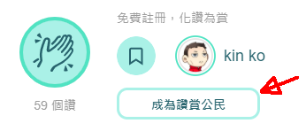

* Become a Civic Liker on [Matters](https://matters.news/)

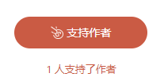

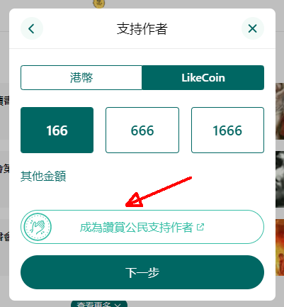

### Step 2: Select the amount to support

A brief introduction of Civic Liker and the content creator's avatar appears, click the "+" to change the amount to support. If you do not want to change it just click on "Confirm" to subscribe to the content creator with USD 5.

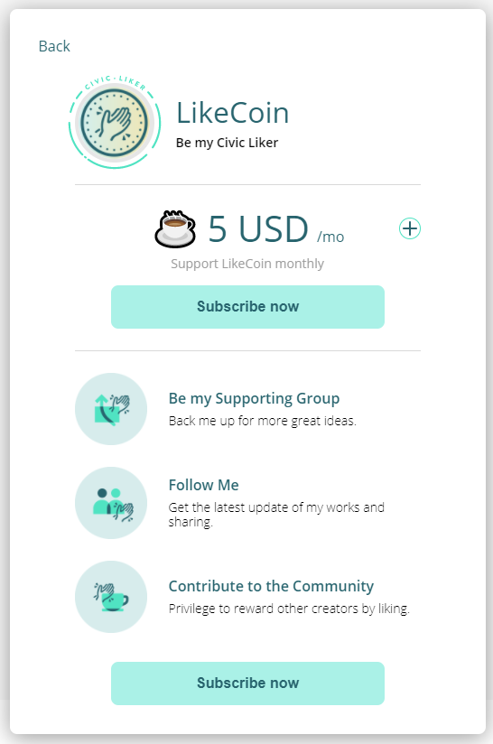

Choose the monthly supporting amount, now is 5 USD/mo, 20 USD/mo and 100 USD/mo.&#x20;
The amount deducting the credit card transaction fee will be exchanged to LikeCoin and support the creator. Choose the amount to support and click "Next".

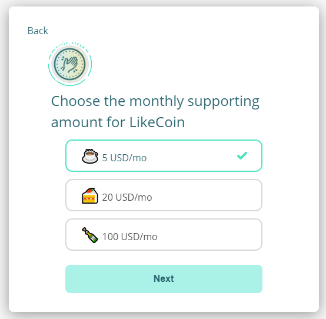

### Step 3: Confirm your subscription

Confirm the content creator and the amount that you would like to support, click "Confirm".

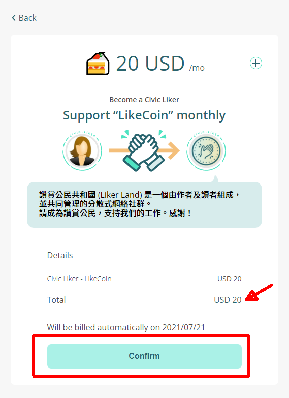

### Step 4:  Fill in your credit card information

Fill in your credit card information and then click "subscribe / 訂閱".

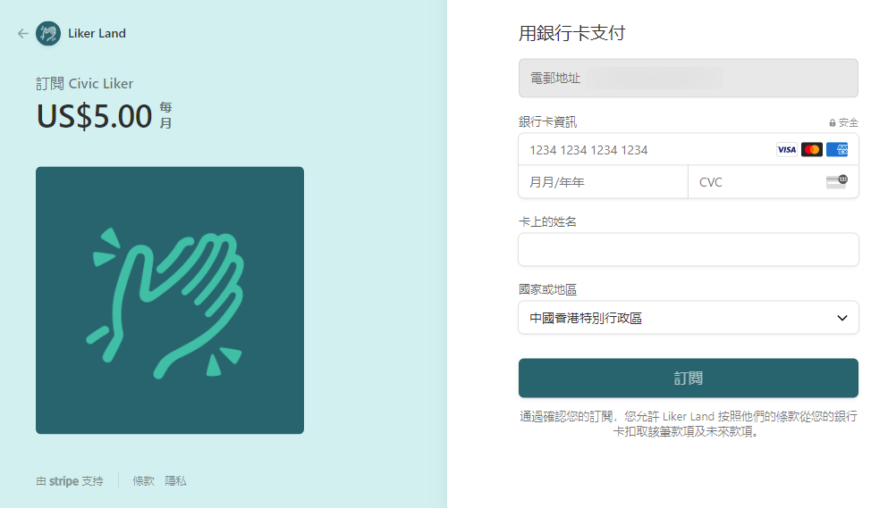

### Step 5: Becoming a Civic Liker

After completing the previous step, a pop-up appears saying that "You have become the Civic Liker of \[Content Creator name]".

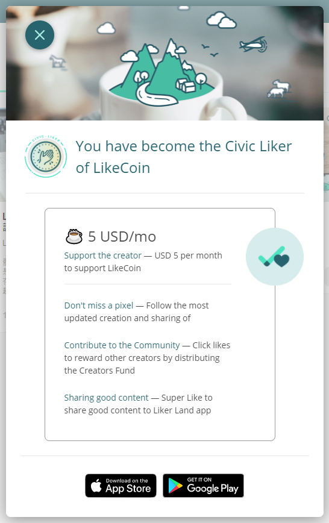

You can also go to his/her Portfolio Page and check out that you are "Supporting" him/her.

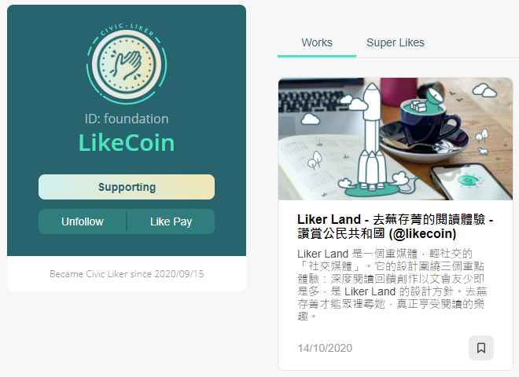

### Step 6:  Manage Civic Liker Subscription

Login in [Liker Land web](https://liker.land/) and select "[Civic Liker](https://liker.land/civic/dashboard)'' on the menu on the right hand side, you can manage payment methods and check your billing history. You can also check out who you are supporting and change the monthly supporting amount, click "Edit" on the content creator that you subscribed to.

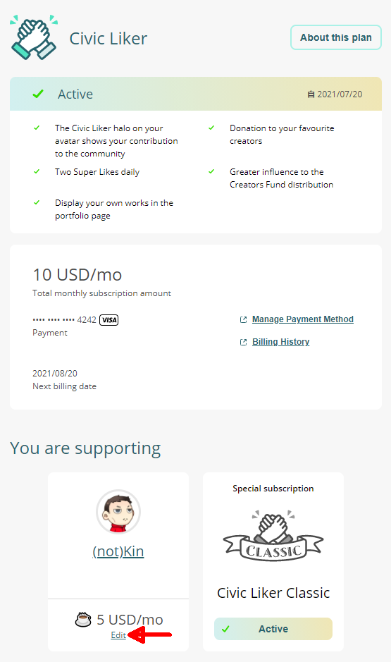

Select the new amount to support and click "Next".

Click "Confirm" again to apply the change.

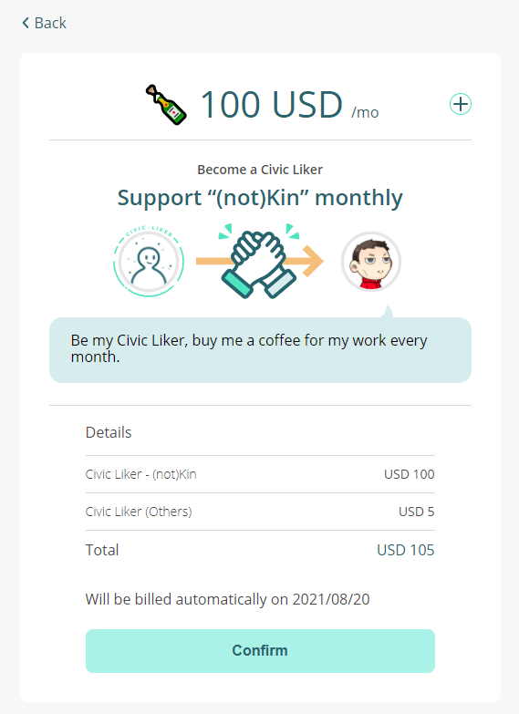

Changes made will be effective on the next billing date, please note the money paid for previous and current subscription will not be refunded.

### Step 7: Subscribe to more than one content creator

Please subscribe to the 1st content creator. Then follow the same steps to subscribe to the 2nd and the other creators. Please note the newly added monthly subscription amount will be charged on the next billing date.

## Civic Liker Classic

### Step 1: **Identify** "Special Subscription"

Login in [Liker Land web](https://liker.land/), click on the menu at the top right hand corner, select "Civic Liker".


On "You are supporting", click "Subscribe" in Civic Liker Classic.

### Step 2: Confirm Subscription

Click "Subscribe Now".

Click "Confirm".

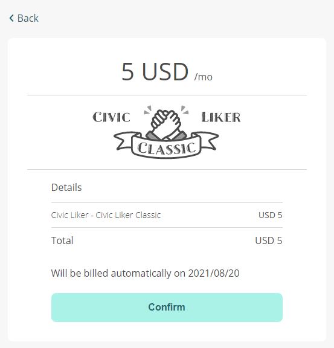

### Step 3  :  Fill in your credit card information

Refer to [Subscribe to a content creator Fill in your credit card information](be-a-civic-liker.md#step-4-fill-in-your-credit-card-information).

### Step 4: Successful subscribe Civic Liker Classic

On "You are supporting", Civic Liker Classic is "Active".

