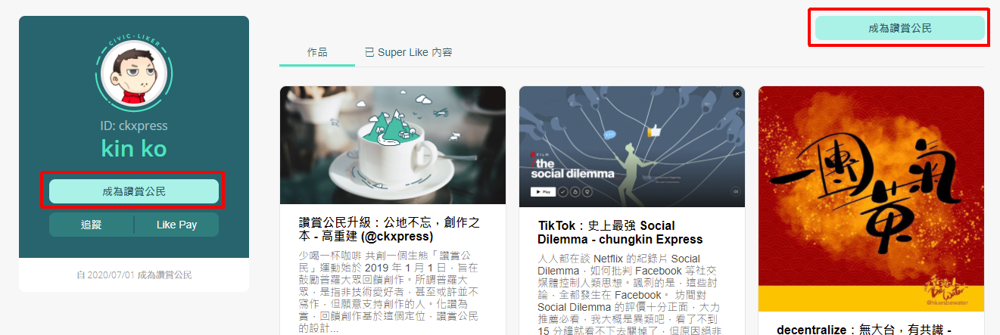
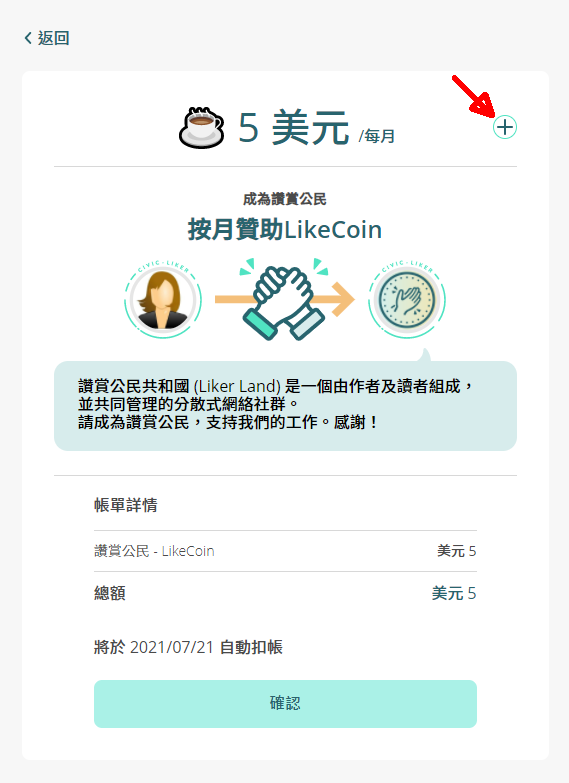
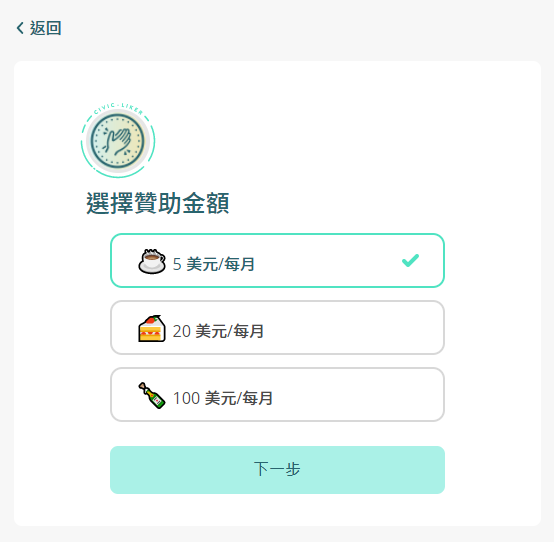
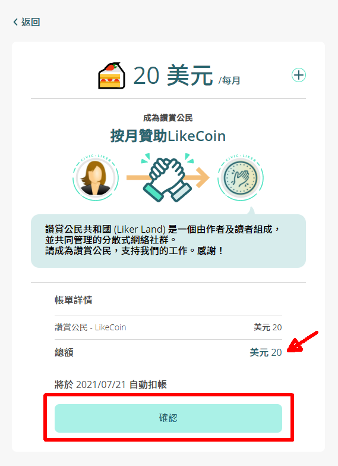
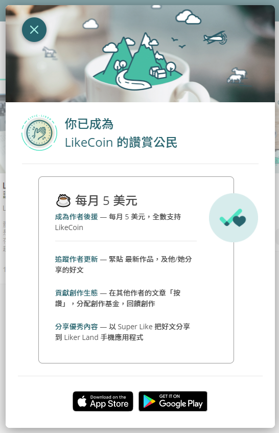
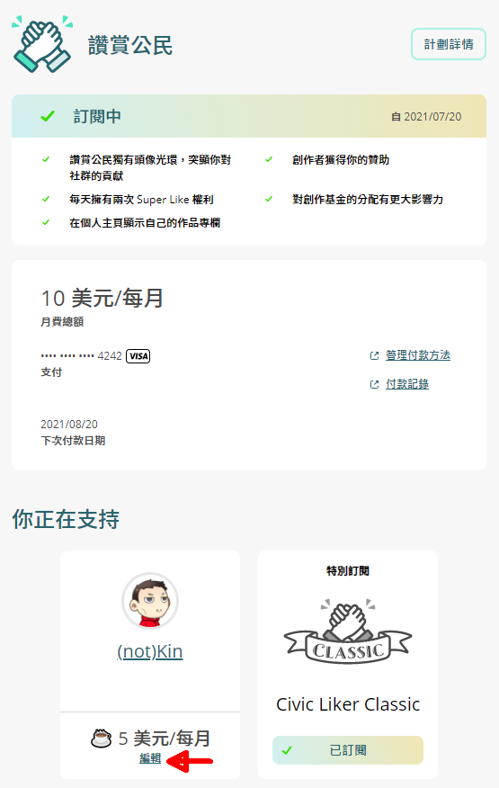
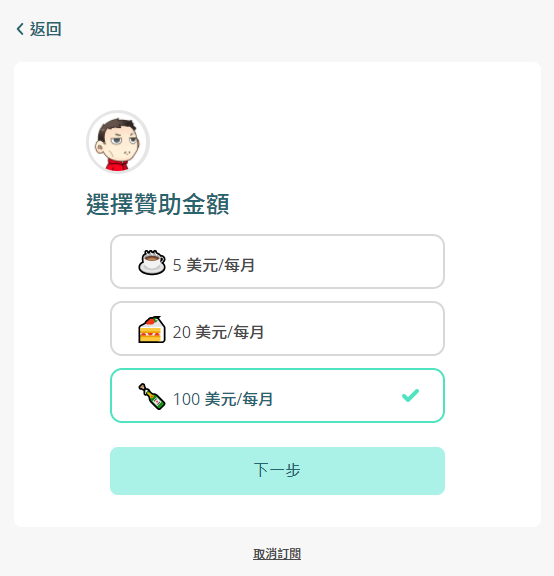
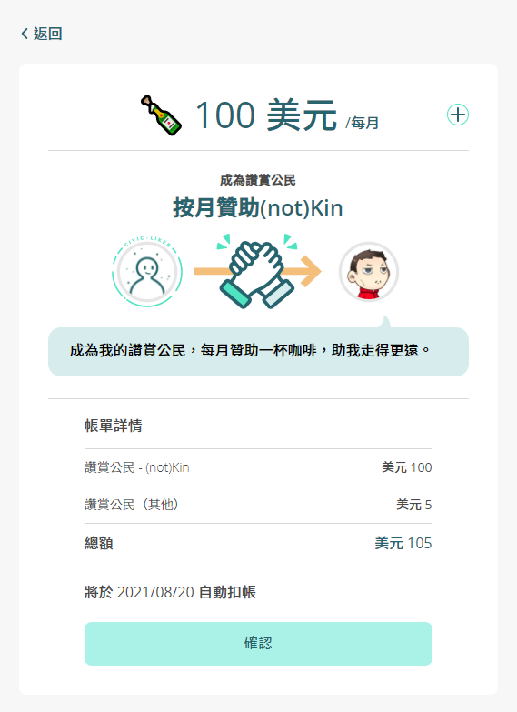

# 如何訂閱讚賞公民


2022/06/14 存檔。資訊已過期，請參看新條目 [如何成為讚賞公民](<../../../user-guide/civic-liker/be-a-civic-liker (1).md>)


成為讚賞公民前請先 [註冊 Liker ID](../../../user-guide/liker-id/)。

## 訂閱心儀創作者

### 步驟一：瞄準心儀創作者&#xD;

你可以從以下渠道開始支持創作者：

* 點擊創作者提供的[贊助鏈結](../creatortools/sponsor-link.md)，例如 [https://liker.land/ckxpress/civic ](https://liker.land/ckxpress/civic)
* 從創作者的[個人主頁](../creatortools/portfolio-page.md)點擊「成為讚賞公民」

* 點擊創作者 [LikeCoin button 讚賞鍵](../../../user-guide/creator/)的「按月贊助」

* 在 [Matters](https://matters.news/) 點擊「支持作者」並成為讚賞公民

### 步驟二：選擇贊助金額&#xD;

畫面出現你想要贊助創作者的頭像及讚賞公民簡介。點擊「+」號變更贊助金額。如不想變更贊助金額可以直接點擊「確認」即可以每月五美元訂閱該作者。

現時讚賞公民月費選擇為每月 5、20 及 100 美元。你選擇金額的到帳部分會全數兌換成讚賞幣支持該名創作者。修改贊助金額後點擊「下一步」

### 步驟三：確認課金支持&#xD;

再次確認你選擇支持的創作者及每月支持 LikeCoin 的金額，核對無誤請點擊「確認」。

### 步驟四：填寫信用卡資料&#xD;

填寫你的信用卡資料，再點擊「訂閱」。

### 步驟五：成為讚賞公民&#xD;

完成上一步後系統會彈出視窗確認「你已成為 \[作者名稱] 的讚賞公民」。

你也可以到他/她的個人主頁查看，頁面顯示為「贊助中」，代表你已成功贊助這位創作者。

### 步驟六：管理讚賞公民訂閱&#xD;

登入 [Liker Land 網頁版](https://liker.land/)，在右手邊的選單選擇[讚賞公民](https://liker.land/civic/dashboard)，即可管理付款方法和查看付款紀錄。你也可以查看你正在支持的作者清單並編輯每月支持作者的金額。在已支持的作者底下點擊「編輯」。

選擇新的支持金額並點擊「下一步」。

再點擊「確認」即可完成修改。

留意所作更改將於下一個付款日期方能生效，已付的金額將不能更改用途也不會退還。

### 步驟七：訂閱多於一位作者&#xD;

請先訂閱一位作者，完成後，再以同樣步驟贊助另一位作者。第二位及隨後作者的贊助份額將於下一個付款日期生效。

## Civic Liker Classic

### 步驟一：尋找「特別訂閱」

到 [Liker Land 網頁版](https://liker.land/)登入，打開位於畫面右上角的菜單，選「讚賞公民」。

在「你正在支持」的 Civic Liker Classic 點擊「立即訂閱」。

### 步驟二：確認訂閱

點擊「立即訂閱」。

再點擊「確認」。

### 步驟三：填寫信用卡資料&#xD;

請參考[訂閱心儀創作者步驟四：填寫信用卡資料](be-a-civic-liker.md#bu-zhou-si-tian-xie-xin-yong-ka-zi-liao)。

### 步驟四：成功訂閱 Civic Liker Classic

「你正在支持」顯示「已訂閱」Civic Liker Classic。

