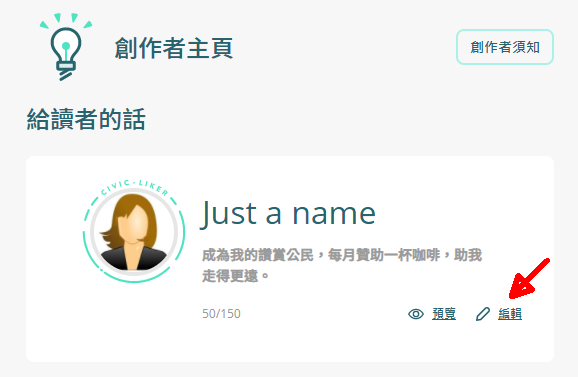
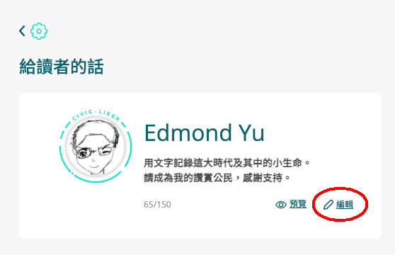

# 給讀者的話


2022/06/14 存檔。資訊已過期。


要吸引眼球，不妨落力介紹自己的創作理念。創作者可使用「給讀者的話」功能突出自己的長處，招聚更多讀者贊助。

「給讀者的話」設定非常簡單，請執行以下步驟：

步驟一：到 [Liker Land 網頁版](https://liker.land/)登入，打開位於畫面右上角的菜單，選「創作者」。

步驟二：在「給讀者的話」點擊「編輯」。

步驟三：留意撰寫內容連同標點符號必須於 70 個中文字 / 150 英文字以內，完成後點擊「確認」儲存內容。

步驟四：你的說話將會在 Liker Land 的各種使用場境中顯示：


[portfolio-page.md](portfolio-page.md)

