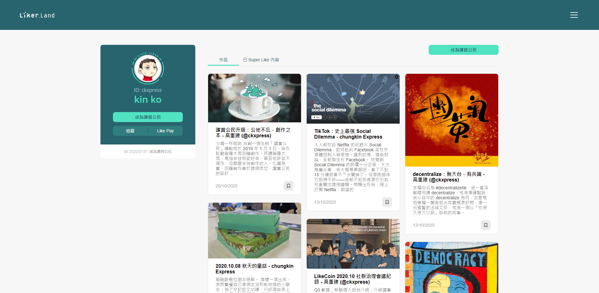

# 個人主頁


2022/08/15 存檔。資訊已過期。


## 如何打開個人主頁

個人主頁可讓用戶向跟隨自己的人分享閱讀足跡，個人主頁的網址是 https://liker.land/\[你的 Liker ID] ，例如 [Liker ID](../../../user-guide/liker-id/) 是 ckxpress，鏈結便是 [https://liker.land/ckxpress](https://liker.land/ckxpress)。

## 個人資訊

頁面的左手邊展示個人資訊，包括 [Liker ID](../../../user-guide/liker-id/) 及姓名。假若用戶是讚賞公民則包括成為[讚賞公民](../../../user-guide/civic-liker/)的日期，並提供以下功能：

* 追蹤－點擊並追蹤[該用戶的 Super Like 推文](../../../user-guide/liker-land/superlike.md)
* [LIKE pay](../../../guides/wallet/like-pay.md)－直接轉帳 LikeCoin 予該用戶

## 作品

假若創作者曾 [Super Like 自己的文章](../../../user-guide/liker-land/superlike.md)均會展示於此頁。創作者需要[成為讚賞公民](../../../user-guide/civic-liker/)方可 Super Like 自己的文章。留意為自己的作品 Super Like 並不能獲得分配創作基金。

## 已 Super Like 內容

Super Like 履歷功能展示用戶曾經 Super Like 過甚麼好文。

