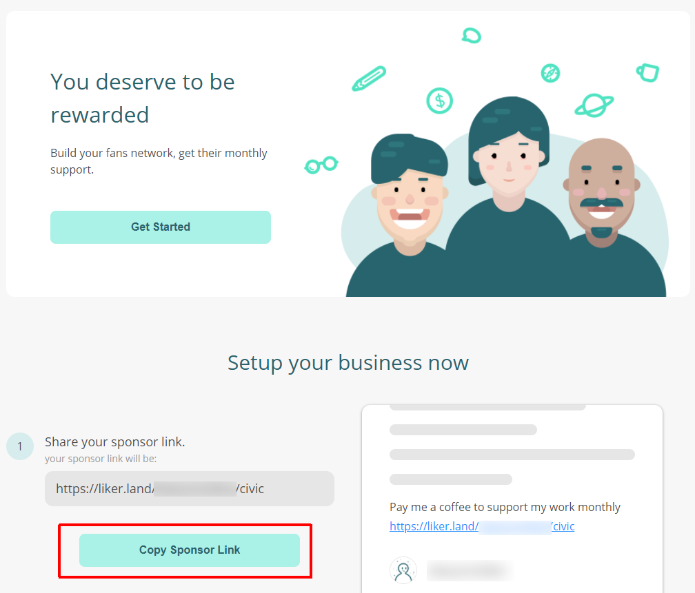

# Sponsor Link


Archived on 2022/06/14. Information is out of date.


Sponsor link supports various platforms and embrace openness. Creators create content in any platforms and simply include the sponsor link in their work to acquire new sponsors. No matter if you are on Facebook, Youtube, Instagram, Line, Telegram, MeWe, Gab...you can provide your sponsor link and attract readers to [become a Civic Liker](../../../user-guide/civic-liker/) and support you.

Format of the sponsor link url is https://liker.land/\[Your Liker ID]/civic, if your [Liker ID](../../../user-guide/liker-id/) is edmondyu, your link is going to be [https://liker.land/edmondyu/civic](https://liker.land/edmondyu/civic).

You can also login Liker Web, click on the menu at the top right hand corner, select "I'm a Creator too" or simply go to [https://liker.land/creators](https://liker.land/creators) and copy your sponsor link.

