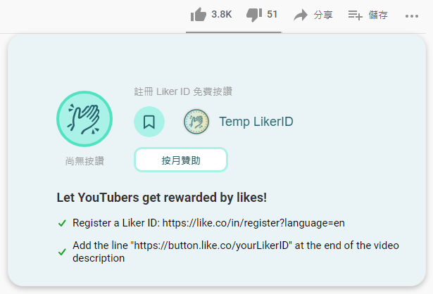
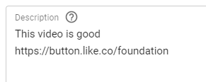
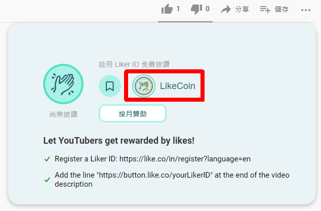

# Youtube


Archived on 2022/06/14. Information is out of date.


### \[The plugin is no longer updated, the development is opened to be picked up by the community.]

Liker Land Chrome / Brave / Firefox Extension is not only for [bookmarking any web page to your Liker Land Reading List for reading them later](../../../user-guide/liker-land/readling-list.md), Youtuber can also earn LikeCoin with it. Just complete a simple step when uploading your video and you are ready to get rewards.

Before installing the LikeCoin plugin, please [register a Liker ID](../../../user-guide/liker-id/).

### Step 1: Install Liker Land Chrome / Brave / Firefox extension

Go to Chrome / Firefox web store and add the extension to your browser.

[Chrome / Brave Version](https://chrome.google.com/webstore/detail/liker-land/cjjcemdmkddjbofomfgjedpiifpgkjhe)

[Firefox Version](https://addons.mozilla.org/en-US/firefox/addon/liker-land/?src=search)

After installation, a Temp LikerID will display in your Youtube video.

### Step 2:  Add your Liker ID in the description

After uploading your video,  add the code https://button.like.co/Your Liker ID in the video description.

For example if your Liker ID is foundation ( This the Liker ID of LikeCoin foundation ), the code is https://button.like.co/foundation

### Step 3: Check out the LikeCoin button on your Youtube video


Your Liker ID is ready and no longer displays Temp LikerID.

### Step 4: Invite your fans to install Liker Land Chrome / Brave / Firefox extension

Invite your fans to install Liker Land Chrome / Brave / Firefox extension. Supporters who installed the Liker Land Chrome / Brave / Firefox extension can clap and reward you work at any time!
