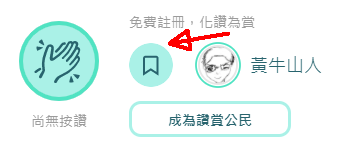
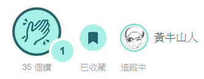
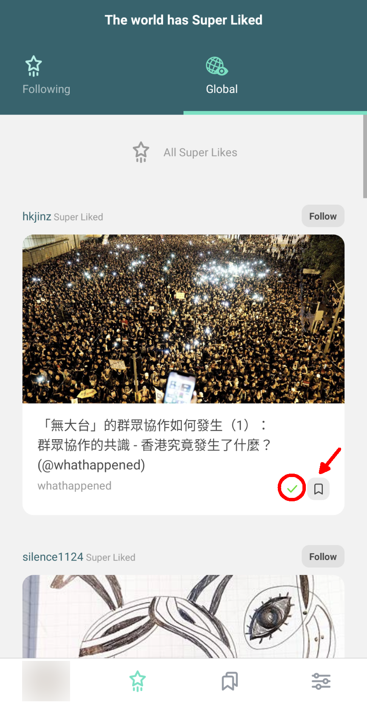
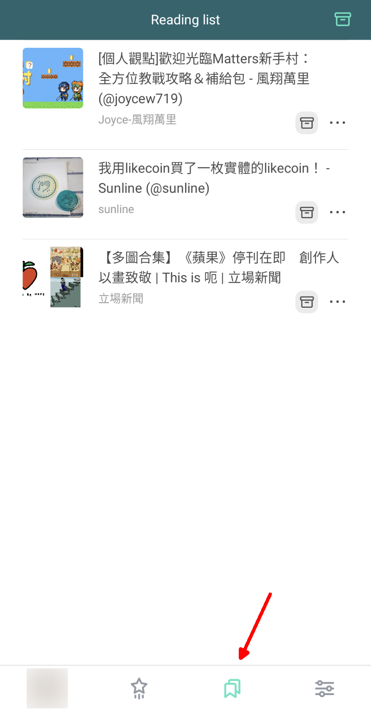

# Readling List


Archived on 2022/08/17. Information is out of date.


Bookmark content from everywhere for reading it later, Liker Land brings you the convenience to read on the go. No matter if you are using a desktop computer, mobile, tablet or Liker Land app, you can bookmark any web page at any time, for reading them later.

## Bookmark content by LikeCoin button

Click the bookmark icon on LikeCoin button to save a web page&#x20;

The bookmark icon is highlighted after the content is saved

Bookmark content on Liker Land app

If you finished reading an article on "Following" or "Global", the system will add a green tick on it (circled in red), you can also click on the bookmark icon (red arrow) to save the article to Reading list for read it later.

## Bookmark content on mobile and tablet to Liker Land

Step 1: When reading an article on browser or mobile app (e.g. Twitter), click the "Share" button

Step 2: Click on the Liker Land app icon

Step 3: The following screen appears which means the web page is saved to Liker Land

## Bookmark content on computer to Liker Land

Liker Land Chrome / Brave / Firefox Extension for bookmarking any web page to your Liker Land Reading List for reading them later.

Step 1: Go to Chrome / Firefox web store and add the extension to your browser.

[Chrome / Brave Version](https://chrome.google.com/webstore/detail/liker-land/cjjcemdmkddjbofomfgjedpiifpgkjhe)

[Firefox Version](https://addons.mozilla.org/en-US/firefox/addon/liker-land/?src=search)

Step 2: When reading an article on a website, click on the icon to bookmark the article.

## Check out the Readling List

Click the bookmark icon on Liker Land app or [Liker Land web](https://liker.land/bookmarks) and check all the articles that you've saved.

