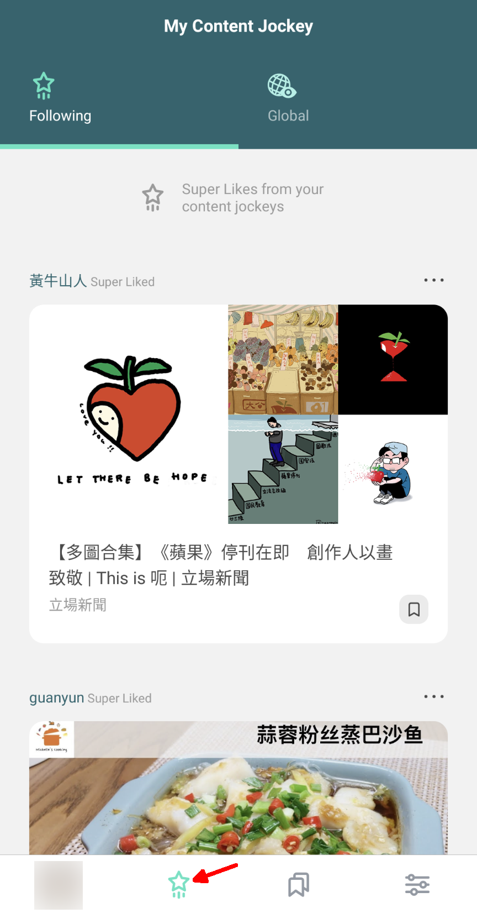
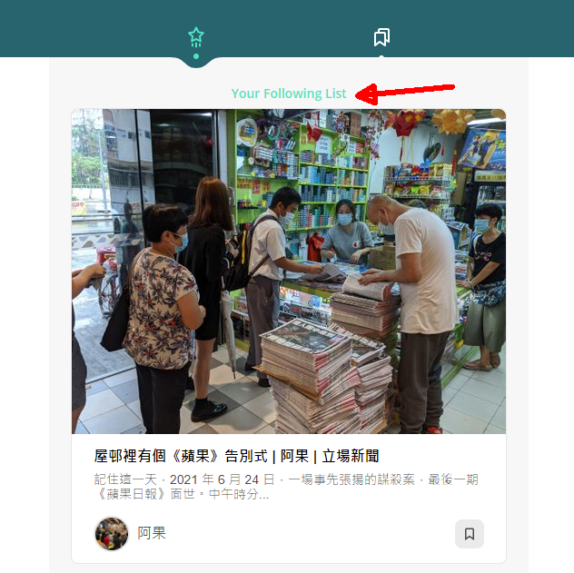
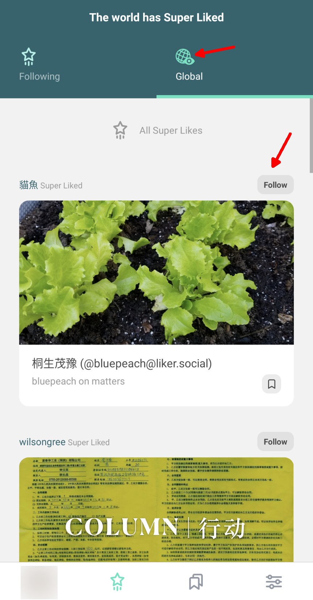
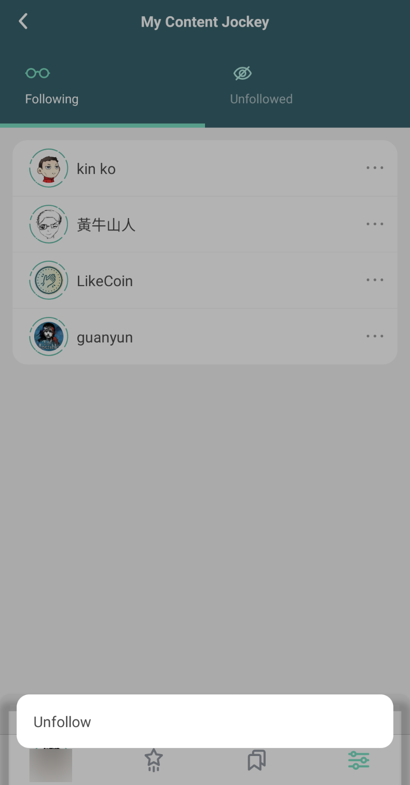

# My Content Jockey


Archived on 2022/06/14. Information is out of date.


## Not Browsing, But Reading 

Open the Liker Land app and click on the star icon underneath, you can see the "My Content Jockey", just like newspapers, the most important news are selected.

"My Content Jockey" are hand picked by Content Jockey with [Super Like](../../../user-guide/liker-land/superlike.md), and without the use of AI. Every Content Jockey has two quotas per day, to ensure every selection is the finest. On the other hand to make sure that readers will not sumerge to the seas of junk content.

The default Content Jockeys was managed by the LikeCoin DAO with [Liquid Democracy](../../../general-guides/governance/liquid-democracy.md), Content Jockeys of good quality and word of mouth are selected by community voting. Currently, there are 3 default Content Jockeys in Liker Land:​

* inmedia：[inmediahknet](https://like.co/inmediahknet)​​
* Matters：[hi176-matters](https://like.co/hi176-matters)​
* LikeCoin Foundation：[foundation](https://like.co/foundation)（Reports, Announcements, Proposals, etc）

## My Content Jockey: Follow a Content Jockey 

Readers can follow their trusted Content Jockeys, you can go to their [Portfolio Page](../../../user-guide/creatortools/portfolio-page.md) for following them.

Click on the star icon underneath in the Liker Land app, you can check the content provided by your beloved Content Jockey, go to [Liker Land web](https://liker.land/following) and login will do the same.

## The world has Super Liked

If "My Content Jockey" got too less to read, click on the Global icon and read Super Liked articles by all the Content Jockeys and explore more wonderful contents. If you love his/her taste, click \[Follow] and articles hand picked by him/her will appear on your "My Content Jockey".

## Stop Following a Content Jockey

If you want to stop following a Content Jockey, you can click on settings at the lower right hand corner and select \[Content Jockey], click on the avatar and click \[Unfollow] to  confirm. You can also go to [Liker Land web](https://liker.land/settings/following/) to unfollow a Content Jockey.

