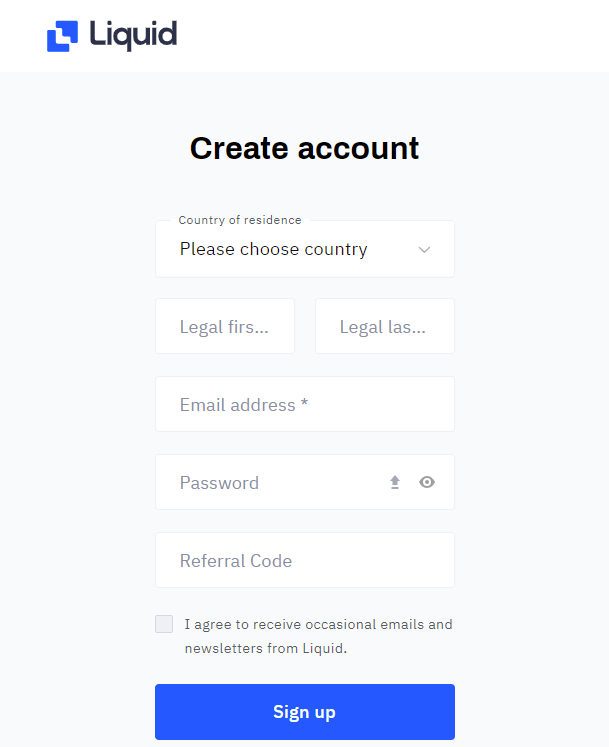
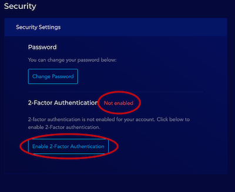
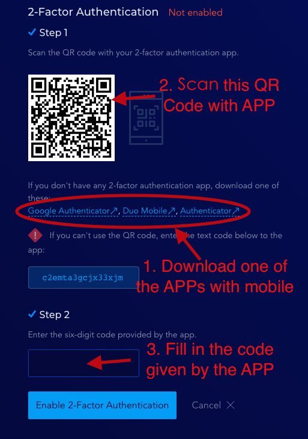
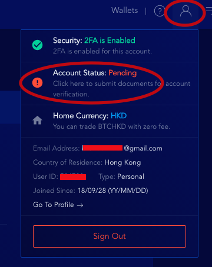

# Registering on Liquid


Archived on 2022/08/15.

Due to Liquid being acquired by Singapore exchange FTX, LIKE trading will no longer be supported. From August 2022, users will not be able to deposit LikeCoin on Liquid, and all related trading operations will be completely stopped on August 21. This is an internal restructuring decision of Liquid. At the same time, ATOM, UNI, DYDX, DOGE, AAVE, ENS, CRV and other tokens will also be delisted. The founding team of LikeCoin will strive to find other trading channels, while users can continue to trade LikeCoin on other exchanges.


You have to register a Liquid account and pass the account verification in order to use their service.

Please note that you cannot use Liquid if you are in certain countries.

> [Can I use Liquid in my country?
> ](https://help.liquid.com/en/articles/2272984-can-i-use-liquid-in-my-country)

### &#xD;Step 1: Complete basic info&#xD;

Go to [Liquid.com](https://www.liquid.com/) and [register](https://www.liquid.com/sign-up/?affiliate=zlgAOAX564083) an account, simply fill in the details however please fill in your \[Legal First Name] \[Legal Last Name] as account verification is required

Liquid will immediately send you a verification email, click on the link in the email and activate your account.

### Step 2: Set up 2-Factor Authentication&#xD; (2FA)

The service of crypto exchange adopts a high security standard, therefore users have to set up 2FA before utilizing their services.

1\. After completing the basic info and activated your account, the following appears when you login again, click "Enable 2-Factor Authentication"

2\. Download authenticator app on your mobile, for example Google Authenticator

[Google Play Download](https://play.google.com/store/apps/details?id=com.google.android.apps.authenticator2\&hl=zh\_TW)\
[App Store Download](https://apps.apple.com/hk/app/google-authenticator/id388497605)

Scan the QR Code, then fill in the 6-digit code generated by Google Authenticator&#x20;

Fill in the code correctly and the set up of 2-Factor Authentication is completed.

#### Liquid Official Tutorial

> [How to set up 2FA?](https://help.liquid.com/en/articles/4883860-how-to-set-up-2fa)

> [Compatible 2FA Applications
> ](https://help.liquid.com/en/articles/5200243-compatible-2fa-applications)

### Step 3: Send the documents required for account verification

After completing 2FA, you can have a look at the exchange panel but the only thing you can do is deposit. To facilitate withdrawal, account verification has to be completed, please follow the steps:

1\. Check your account status by clicking on the top right hand corner of your avatar, it shows "Pending"\

2\. Click on the above circled in red, which brings you to the page below. Click on the button below and start to submit your personal credentials for account verification

3\. You have to provide the following:

* National ID Document
* Selfie
* Proof of Address e.g. Utility bills, government correspondents, etc, The document should have your legal name on it

Submit the documents and wait for Liquid to confirm your application. It takes a few days for it to go through if everythings is all good.

#### Liquid Official Tutorial

> [How do I verify (KYC) my Liquid account?
>
> ](https://help.liquid.com/en/articles/2273305-how-do-i-verify-kyc-my-liquid-account)

> [How do I submit the required KYC documents](https://help.liquid.com/en/articles/4250426-how-do-i-submit-the-required-kyc-documents)

> [How does video call account verification work?
> ](https://help.liquid.com/en/articles/3104816-how-does-video-call-account-verification-work)[
> ](https://help.liquid.com/en/articles/4250426-how-do-i-submit-the-required-kyc-documents)

> [Liquid Account Verification & Identification Changes
> ](https://help.liquid.com/en/articles/4246962-liquid-account-verification-identification-changes)

### **If you experience difficulties, contact Liquid Help Desk**

If you have any questions about using Liquid and their products,  please check [Liquid Help Center](https://help.liquid.com/en/) or contact Liquid customer service.
