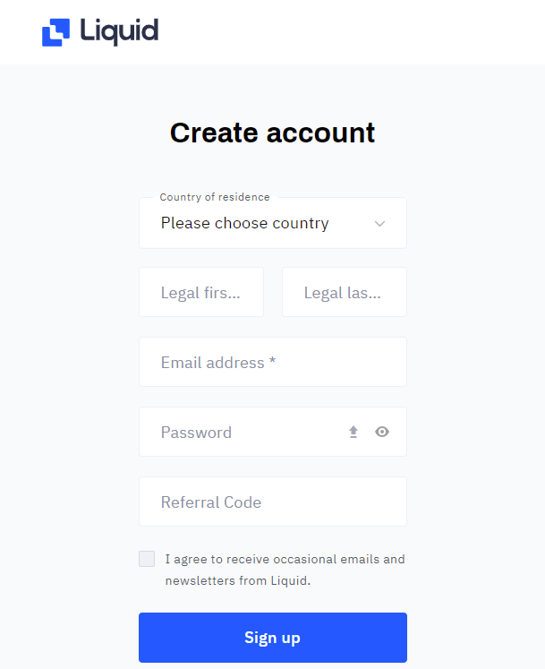
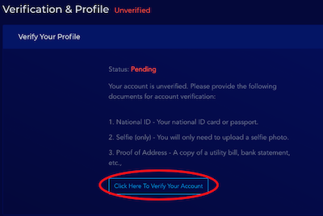

# 註冊 Liquid 帳號

使用 Liquid 交易所的服務，必須先註冊 Liquid 帳號並通過實名認證。

留意若干國家並不能使用 Liquid 的服務，詳見：

> [我可以在我的國家使用Liquid嗎？
> ](https://help.liquid.com/zh-TW/articles/2272984-%E6%88%91%E5%8F%AF%E4%BB%A5%E5%9C%A8%E6%88%91%E7%9A%84%E5%9C%8B%E5%AE%B6%E4%BD%BF%E7%94%A8liquid%E5%97%8E)

### 步驟一：填寫基本資料

請到 [Liquid.com 註冊帳號](https://www.liquid.com/sign-up/?affiliate=zlgAOAX564083)。過程中你只需填上簡單的資料，但由於需要實名認證，請填寫你的身份證明文件上的真實姓名 \[Legal First Name] \[Legal Last Name]

Liquid 系統會立即發送一封驗證電郵到你的註冊電子郵箱。請點擊電郵中的鏈結，激活帳號。

### 步驟二：設定雙重認證

交易所服務要求高度安全性，因此用戶必須設定密碼及編碼器雙重認證，才可以使用交易所提供的所有服務

1\. 提交完基本資料並激活帳號後，再次登入系統會見到以下頁面。點擊 "Enable 2-Factor Authentication"

2\. 下載手機編碼器認證，例如 Google Authenticator 應用程式

[安卓版下載鏈結](https://play.google.com/store/apps/details?id=com.google.android.apps.authenticator2\&hl=zh\_TW)\
[蘋果版下載鏈結](https://apps.apple.com/hk/app/google-authenticator/id388497605)

掃描頁面中的二維碼，再在頁面下方填上 Google Authenticator 所提供的認證碼

填上正確的認證碼後，雙重認證設定便告成功。

#### Liquid 官方教學

> [如何設置2FA](https://help.liquid.com/zh-TW/articles/4883860-%E5%A6%82%E4%BD%95%E8%A8%AD%E7%BD%AE2fa)

> [兼容的2FA應用程序
> ](https://help.liquid.com/zh-TW/articles/5200243-%E5%85%BC%E5%AE%B9%E7%9A%842fa%E6%87%89%E7%94%A8%E7%A8%8B%E5%BA%8F)

### &#xD;步驟三：提交文件作實名認證

完成雙重認證設定後，你雖已可以進到交易所的交易畫面，但只能存款，不能領款；原因是你還未完成實名認證的程序。請執行以下程序：

1\. 點擊畫面右上角的人像圖示，能查看你的帳號狀態。留意此時你的帳號狀態是 "Pending" （待審核）

2\. 點擊上圖紅圈的位置，會進到以下頁面，要求你提交文件驗證身份。請點擊頁面下方的按鍵開始提交文件

3\. 你需要提交三份文件：

* 國民身份證明文件 ( National ID Document )
* 個人照片 ( Selfie )，清淅的自拍照也可
* 住址證明 ( Proof of Address ) ，例如水電、銀行賬單、政府信件等。文件上必須印有你身份證明文件上的姓名

遞交文件後，需等待 Liquid 確認申請。若所遞交的文件清楚無誤，最快幾天內便可以完成申請。

#### Liquid 官方教學

> [如何驗證（KYC）我的流動賬](https://help.liquid.com/zh-TW/articles/2273305-%E5%A6%82%E4%BD%95%E9%A9%97%E8%AD%89-kyc-%E6%88%91%E7%9A%84%E6%B5%81%E5%8B%95%E8%B3%AC%E6%88%B6)

> [視頻通話帳戶驗證如何工作？
> ](https://help.liquid.com/zh-TW/articles/3104816-%E8%A6%96%E9%A0%BB%E9%80%9A%E8%A9%B1%E5%B8%B3%E6%88%B6%E9%A9%97%E8%AD%89%E5%A6%82%E4%BD%95%E5%B7%A5%E4%BD%9C)

#### 參考文章

> [如何把你的LikeCoin變成台幣（上）：LIQUID交易所帳號申請與認證教學](https://xrine.com/how-to-turn-likecoin-into-ntd-liquid-verification/)

### 如有疑難，聯絡 Liquid 客服 

若你在開戶或任何交易所服務的過程中遇到困難，請參考 [Liquid 幫助中心（繁体中文）](https://help.liquid.com/zh-TW/)或直接聯絡 Liquid 客服。


點擊你的頭像進入 My Profile，點選 Language Default 可以將使用者界面預換為繁體中文或简体中文，又或者在網頁的語言列進行轉換

