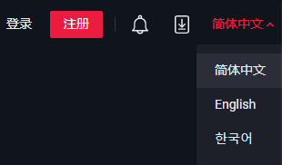
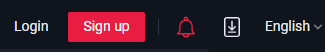
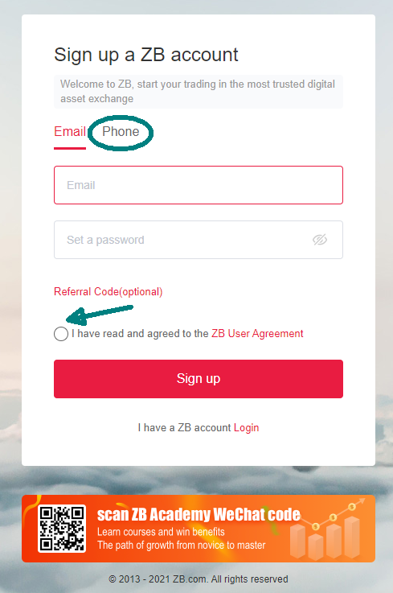
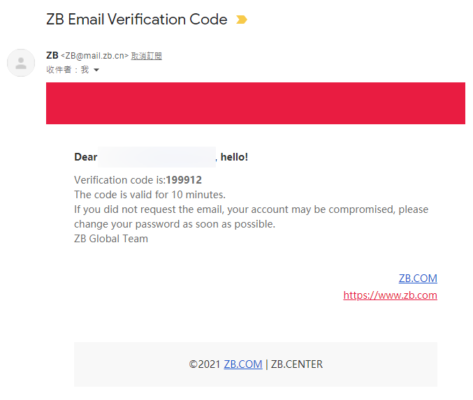
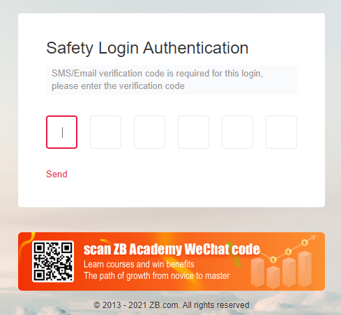
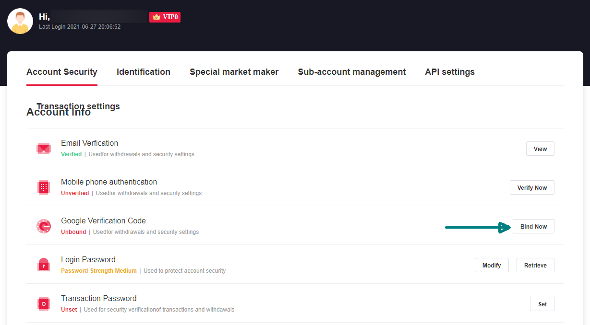
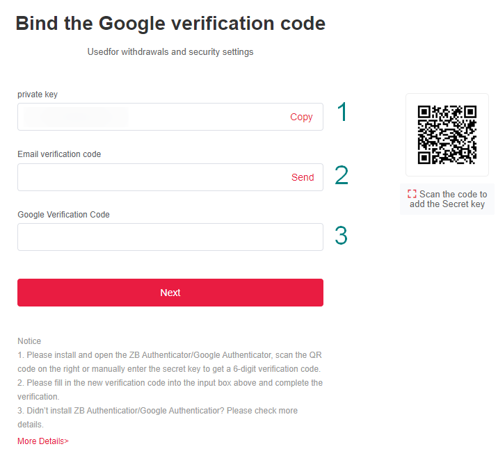
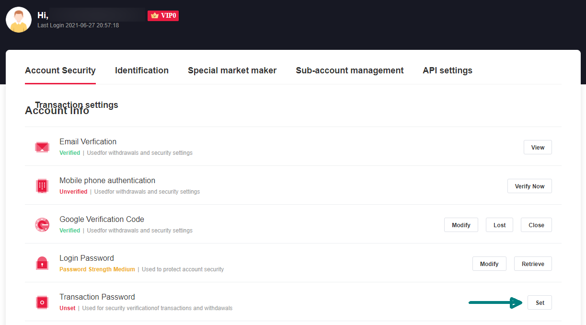
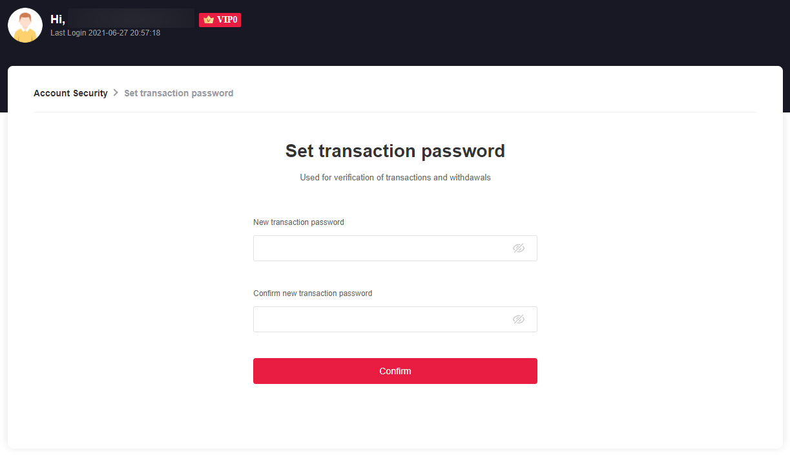
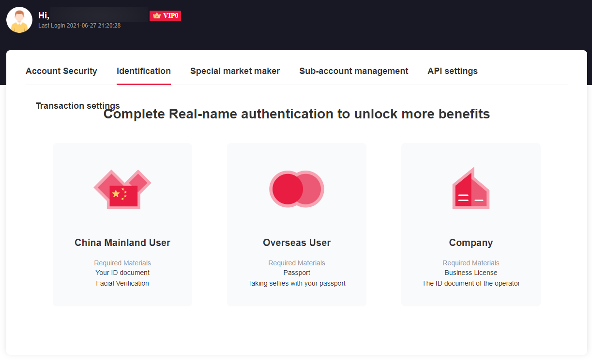

# Registering on ZB


Archived on 2022/08/18. Information is out of date.


Buy and Sell LikeCoin on ZB requires an account, please go to [ZB website](https://www.zb.com/) and follow these steps to register a account:

Switch to English on top right hand corner

### Step 1: Confirm password and email or mobile phone number

On the right hand corner of the website, click "Register"

You can use mobile or phone (circled in green) to register, email was used for the following demo. Please input your email and password, if you have a referral code you can fill it in too. Then click on "I have read and agreed to the ZB User Agreement" (green arrow) and lick "Sign up"

Go to your email and check out the verification code

Input the 6 digital verification codes and you can login your account. Please note that you will have to go through the following procedure for logging in.

### Step 2: Set up 2-Factor Authentication&#xD; (2FA)

You have to set up 2-Factor Authentication for your account's protection, please download Google Authenticator on your mobile

[Google Play Download](https://play.google.com/store/apps/details?id=com.google.android.apps.authenticator2\&hl=zh\_TW)\
[App Store Download](https://apps.apple.com/hk/app/google-authenticator/id388497605)

Click on the avatar on the top right hand corner and go to "Account Security". On "Google Verification Code", click on "Bind Now"

Please follow the steps:

1. Copy your private key and save it to an encrypted safe place
2. On "Enail verification Code" click "Send", then fill in the code received from email
3. Scan the QR Code with Google Authenticator and fill in the 6-digit 2FA code, then lcick "Next", your 2FA setting is completed.

### Step 3: Transaction Password

You have to input a transaction password for transaction and withdrawal. On "Transaction Password", click "Set"

Input a 6 digit password twice, and click "Confirm" to finish the setting.

### Step 4: Identification (Optional)

ZB classifies users by grades, VIP0 who is not completing Real-name authentication can trade with no issue. It is just a matter of having a different [Transaction Fee rate](https://www.zb.com/help/rate). You may go to "Identification" to complete the authentication.

### If you experience difficulties, contact ZB Help Desk

If you have any questions about using ZB and their products,  please check [ZB Help Center](https://www.zb.com/help/guides) or contact ZB customer service.
