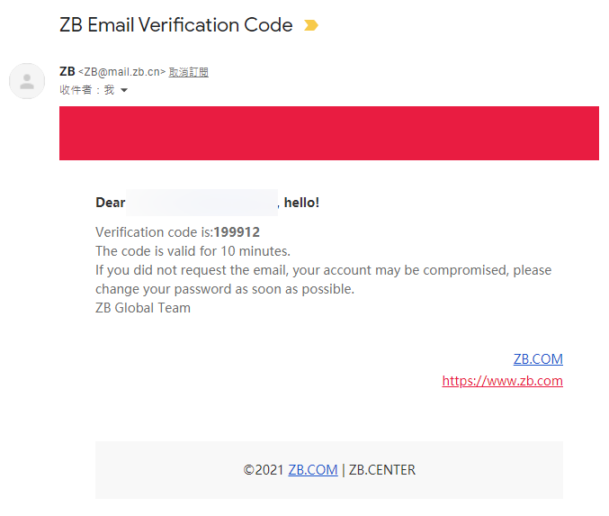
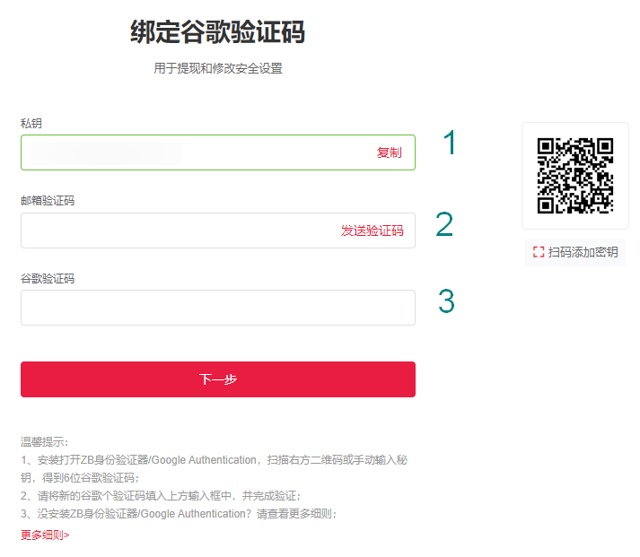
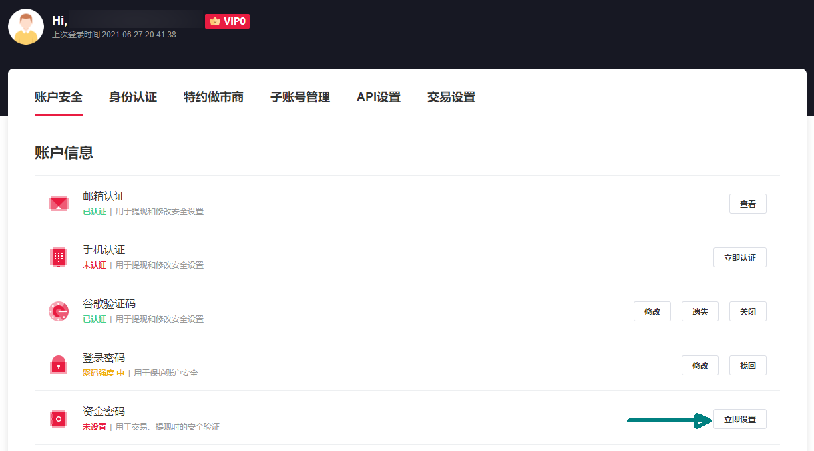

# 註冊 ZB 帳號

在 ZB 買賣 LikeCoin，請先註冊帳號。請到 [ZB 網站](https://zb.com)並按以下步驟註冊：

### 步驟一：確認密碼，及電子郵箱或手機號碼 

於網站右上角，點選「注冊」

你可以選擇使用手機註冊（下圖綠圈位置）或使用電郵註冊。以下示範使用電郵註冊為例，請輸入電子郵件信箱、自定登錄密碼及邀請碼（可選填），接著點擊「我已阅赞并同意《中币用户服务协议》」（綠箭嘴），再點擊「注冊」

在電郵收到驗證碼

輸入 6 位數字驗證碼。以後登入時也需要使用同樣步驟輸入驗證碼，即可登入。

### 步驟二：雙重驗證 

你必須要設定雙重驗證碼以確保帳戶安全，請使用手機下載  Google Authenticator 應用程式

[安卓版下載鏈結](https://play.google.com/store/apps/details?id=com.google.android.apps.authenticator2\&hl=zh\_TW)\
[蘋果版下載鏈結](https://apps.apple.com/hk/app/google-authenticator/id388497605)

於網站右上角點擊人像進入帳戶設定頁面。在「帐户安全」的「谷哥验证码」點擊「立即绑定」

按照以下步驟：

1. 複製私鑰並放置於安全及已加密的地方
2. 在「邮箱验证码」欄位點擊「发送验证码」並輸入於電郵收取的驗證碼
3. 以 Google Authenticator 應用程式掃描頁面中的二維碼，將獲得的 6 位雙重驗證碼輸入「谷歌验证码」欄位再點擊「下一步」，即可完成設定。

### 步驟三：資金密碼

交易及禔幣時需要資金密碼，建議一拼設定。於「资金密码」點擊「立即设置」

輸入自訂 6 位數字資金密碼兩次，再點擊「确认」，即可完成設定。

### 步驟四：身份認證（非必須）

ZB 區分不同用戶等級，VIP0 亦即是未認證身份的用戶亦可進行交易，只是交易費率與已認證用戶不同，詳見「[费率标准](https://www.zb.com/help/rate)」。有需要的用戶可點擊「身份认证」進行驗證。

### 如有疑難，聯絡 ZB 客服

若你在開戶或任何交易所服務的過程中遇到困難，請參考 [ZB 新手指導](https://www.zb.com/help/guides)或直接聯絡 ZB 客服。
