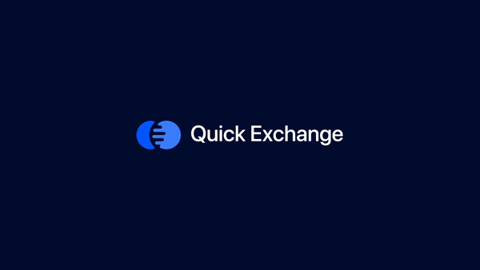
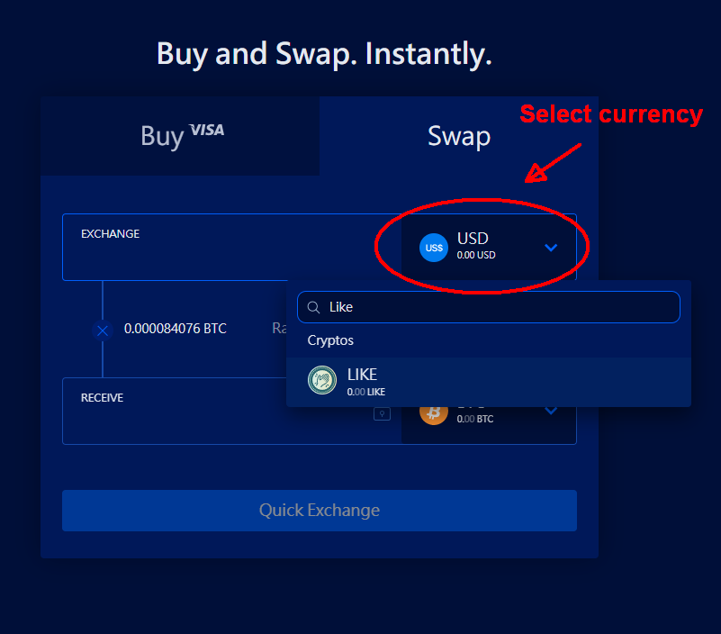
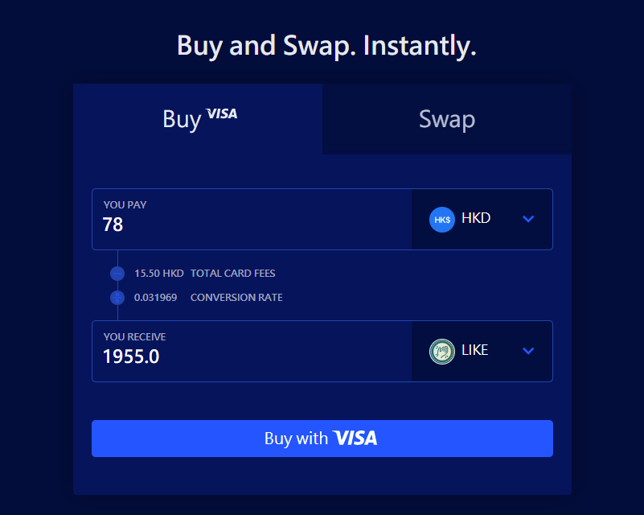
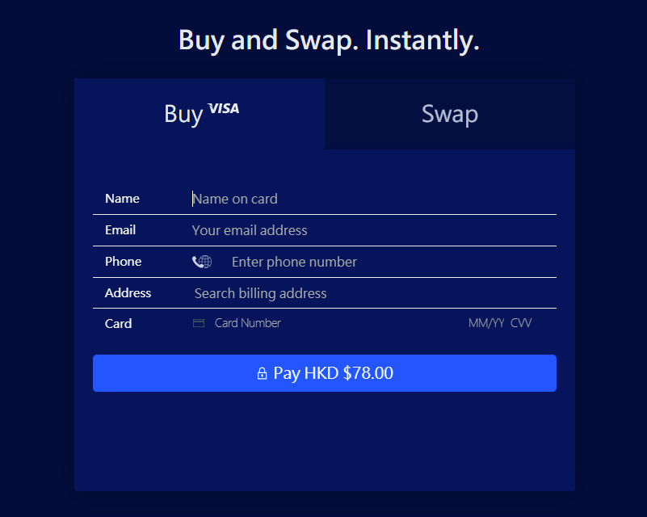

# Trade in Liquid


Archived on 2022/08/15.

Due to Liquid being acquired by Singapore exchange FTX, LIKE trading will no longer be supported. From August 2022, users will not be able to deposit LikeCoin on Liquid, and all related trading operations will be completely stopped on August 21. This is an internal restructuring decision of Liquid. At the same time, ATOM, UNI, DYDX, DOGE, AAVE, ENS, CRV and other tokens will also be delisted. The founding team of LikeCoin will strive to find other trading channels, while users can continue to trade LikeCoin on other exchanges.


## Quick Exchange 

[Quick Exchange ](https://app.liquid.com/quick-exchange)provides a simple interface for users to exchange LikeCoin.

**Please be reminded: The transaction amount affects the exchange rate, the system displays real time offers.**

.png>)

### **Exchange LikeCoin with fiat money or others cryptocurrency** 

* On the Quick Exchange interface, select the "Swap" tab
* Select the type of currency that you would like to sell, on "EXCHANGE" select LIKE, on "RECEIVE" select fiat or other cryptocurrency for example BTC/ETH/USDC/USDT. If you would like to buy LikeCoin, revise the logic.
* Rate is displayed instantly
* Fill in the amount to sell on the "EXCHANGE" field, if you do not have enough balance in your Liquid account, a warning will be displayed
* Fill in the amount to exchange, the system will show the amount that you can get on the "RECEIVE" field. If it's OK to you, click the "Quick Exchange'' button and the transaction is done. The exchanged amount will be credited to your account instantly
* Or vice versa, fill in the amount of currency that you want to get, the system will show the amount of currency that you need to sell in the "EXCHANGE" field

### Purchase LikeCoin with credit card 

* Accept Visa or MasterCard in some of the countries
* Minimum purchase amount is approximately USD15 or equivalent fiats
* The system displays credit card service fee and exchange rate, the currency amount displayed is the amount after deduction of service fee

Click on "Buy with VISA", fill in credit card information and pay for it

#### Liquid Official Tutorial

> [How do I deposit crypto](https://help.liquid.com/en/articles/2275493-how-do-i-deposit-crypto)

> [How long will my crypto deposit take?
> ](https://help.liquid.com/en/articles/3473156-how-long-will-my-crypto-deposit-take)

> [How to Buy Crypto Instantly with Liquid Buy and Swap
> ](https://help.liquid.com/en/articles/5143957-how-to-buy-crypto-instantly-with-liquid-buy-and-swap)

> [Liquid Buy FAQ
> ](https://help.liquid.com/en/articles/4141955-liquid-buy-faq)

> [Liquid Swap FAQ](https://help.liquid.com/en/articles/2607590-liquid-swap-faq)

> [How to withdraw funds from my Liquid account
>
> ](https://help.liquid.com/en/articles/2275670-how-to-withdraw-funds-from-my-liquid-account)


Liquid [does not charge fees for incoming cryptos or fiat deposits](https://help.liquid.com/en/articles/3297509-deposit-fees), for information about minimum withdraw amount and other service fees, please check [Fee Structure](https://www.liquid.com/fees/). For the type of fiats supported and their bank processing fee, please check [Liquid Withdrawal fees](https://help.liquid.com/en/articles/3297510-withdrawal-fees).

