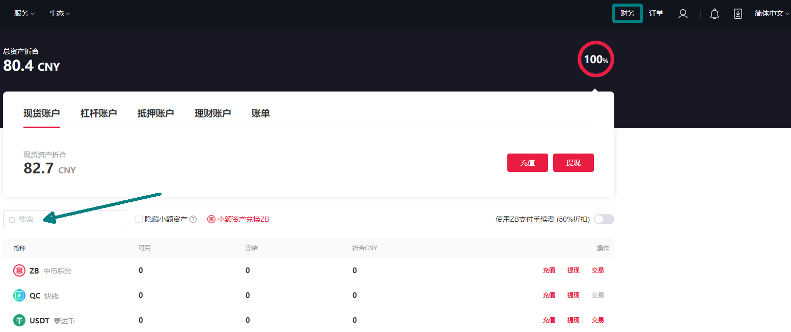
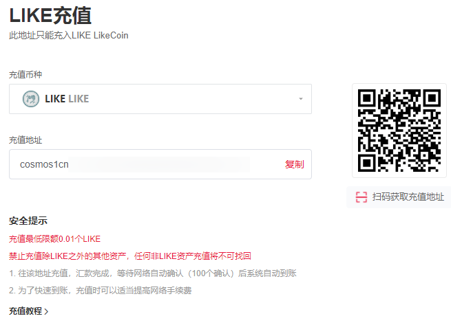
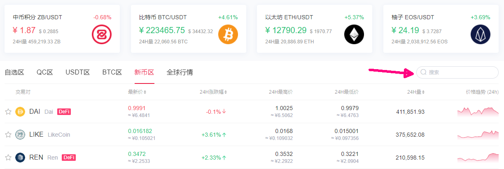
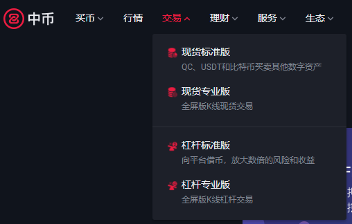
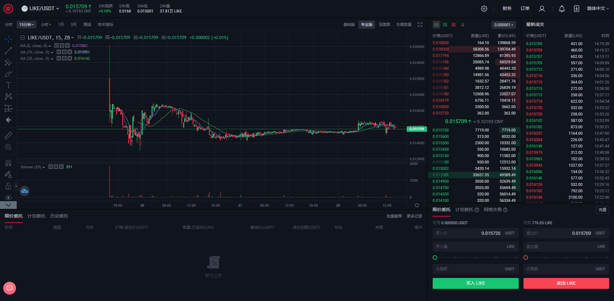
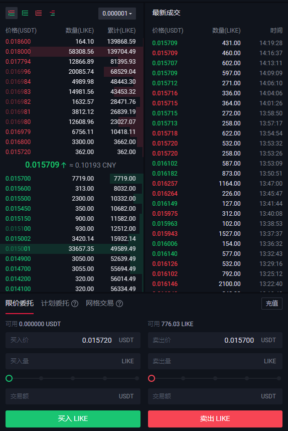
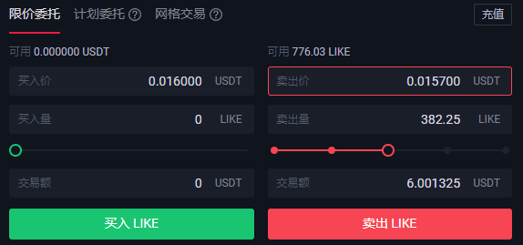
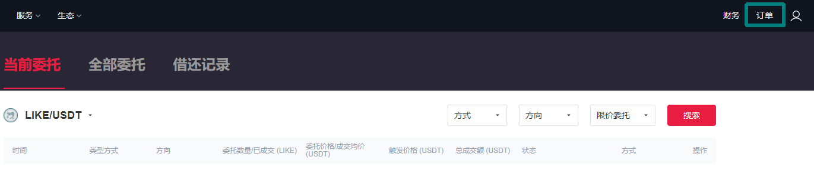
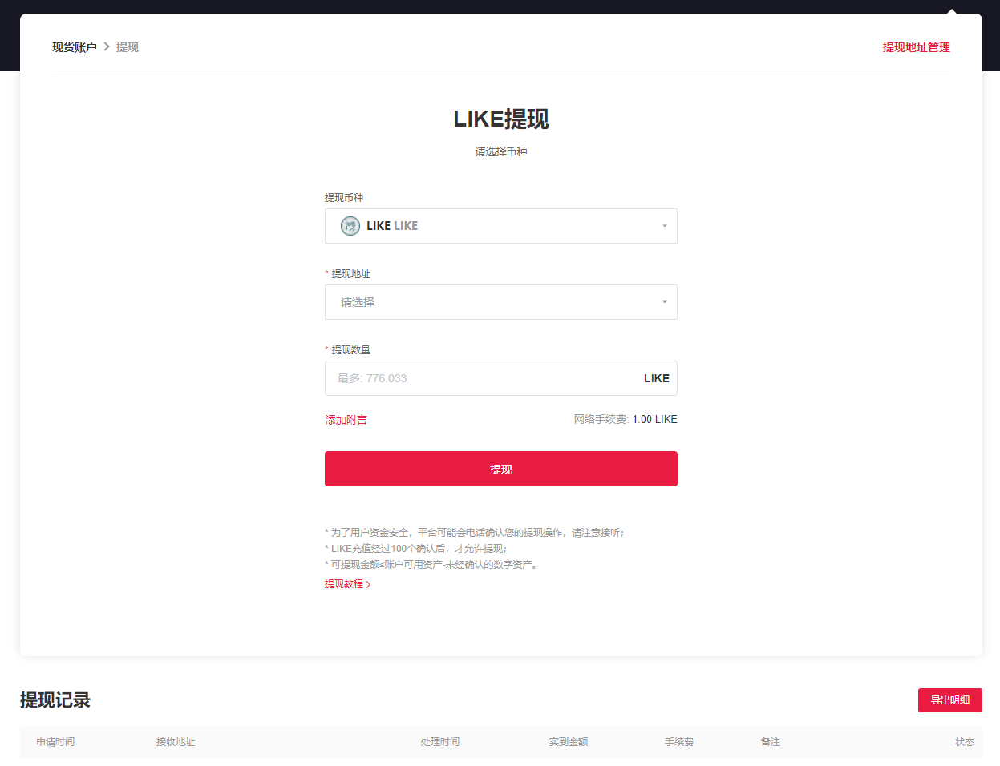

# 在 ZB 交易


2022/08/18 存檔。


[中幣 ( ZB ) ](https://zb.com)集團是全球領先的區塊鏈和數字資產金融服務商，旗下業務涵蓋數字資產交易平台集群、電子錢包、投資基金、研究機構等區塊鏈產業上下游，中幣集團在新加坡、美國、韓國、中國香港、瑞士、馬耳他、馬來西亞均有業務佈局。現時 ZB 提供 LIKE/USDT 交易對，若你還未有 ZB 帳號，[請參考這篇](registering-on-zb.md)。此外你也需要下載 [Keplr](../../../guides/wallet/keplr/) 錢包 或[ Liker Land 手機應用程式](https://liker.land/getapp)用來傳送/提取 LikeCoin。以下示範以 ZB 網頁版為例，你亦可使用 [ZB 手機應用程式](https://www.zb.com/cn/download)進行交易。

### 步驟一：開立 ZB 帳戶的 LikeCoin 錢包收款地址

第一步要把你的 LikeCoin 轉賬到 ZB 交易所。點擊 ZB 網站右上角的「财务」 ，並在搜尋欄輸入 "LIKE"

點擊「充值」

.png>)

點擊「获取 LIKE 充值地址」

出現你專屬的充值地址及二維碼

### 步驟二：轉帳 LikeCoin 到 ZB

打開 [Liker Land 手機應用程式](https://liker.land/getapp)，點擊「我的錢包」，再點畫面上的「LIKE pay」（下圖紅圈位置）

進入下一頁後，點下圖紅圈位置的二維碼圖示。app 會跳進照相機介面讓你掃描二維碼，請掃描【步驟一】中你的 ZB 帳戶 LikeCoin 錢包二維碼

輸入你想要轉帳的 LikeCoin 金額，然後點擊「確認」

接下來便要等 ZB 確認收款了。


ZB 充值最小限额為 0.1 LikeCoin


### 步驟三：確認 ZB 收款

你可以到【步驟一】中點擊「充值」畫面下方的「充值记录」查看 LikeCoin 是否經已收妥。

### 步驟四：選個好價錢買入/賣出


「交易费率」及「提现费率 & 额度」，可參考「[费率标准](https://www.zb.com/help/rate)」


在 ZB 網頁的左上角有「行情」及「交易」等選項。先看看行情

點選「行情」，在搜尋欄輸入 "LIKE" 出現走勢圖表。現時 LIKE 新上市故此在「新币区」

到達交易頁面有幾種途徑：在「新币区」點擊 LIKE 或在【步驟一】的「财务」頁面選取 LIKE 再點擊交易，可直接到達「现货专业版」页面。又或者點擊 ZB 網頁的左上角「交易」再選取「现货标准版」或「现货专业版」交易頁面

查看畫面右邊的「交易掛單」上方紅色列出的是掛出在市場上的「賣單」，以下圖的例子舉例，有人願意以 0.15720 USDT/LIKE 的價格賣出 362 LikeCoin，然後再有人願意以 0.016800 USDT/LIKE 的價格賣出 3300 LikeCoin。假設你想買入 3600 LikeCoin，你便可以最高價 0.016800 USDT/LIKE 的價格全數買入

若你想賣出 LikeCoin，你便要觀察綠色的「買單」找買家。以下圖為例，假設你想要賣出 7000 LIKE，可保證以 0.015700 USDT/LIKE 的價格賣出，因為目前有人出的最高價是 0.015700 購買 7719 LikeCoin

總而言之，賣 LikeCoin 時看下方綠色的買單；買 LikeCoin 時看上方紅色的賣單，此外你可以參考右手邊的「最新成交」數據

決定了買賣的價錢和數量後，可在畫面下方的「限价委托」欄下單：

你需要輸入三項資料：

1. 確認選對了「买入 LIKE」或「卖出 LIKE」，這一步很多時候也會被忽略了然後做錯事
2. 輸入「卖出价」：以上圖的掛單簿為例，若我想賣出 LikeCoin 這裡應填上 "0.015700"
3. 輸入「卖出量」：若我想賣出 200 LikeCoin 這裡應填上 200。你也可以隨意選擇庫存的百份比

資料填妥後，系統會自動計算成交額。確認無誤後，點擊「卖出 LIKE」，操作完成！

### 步驟五：查看交易詳情

交易完成後，你可在畫面右上角點擊「订单」查看交易的詳情，你的錢包亦會反映餘額。

### 步驟六：提幣

回到【步驟一】的「财务」頁面尋找幣種，再點擊「提现」，在「LIKE 提现」或「USDT 提现」畫面（視乎你是購買還是賣出 LikeCoin），再填寫你的「提现地址」及輸入你的「提现数量」然後點擊「提现」，系統會要求你輸入「动态验证码」及「[资金密码](https://docs.like.co/v/zh/guides/trade/registering-on-zb#bu-zhou-san-zi-jin-mi-ma)」，再點擊「確認」即可完成提幣。你亦可以隨時在下方查看「提现纪录」。

