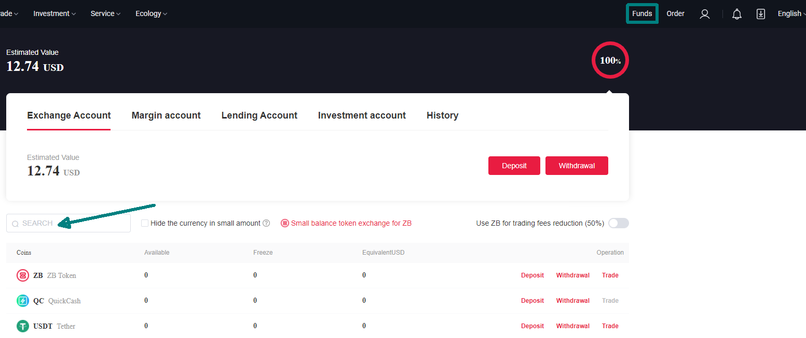
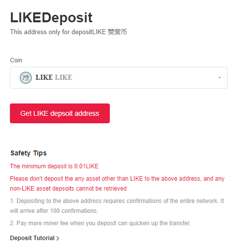
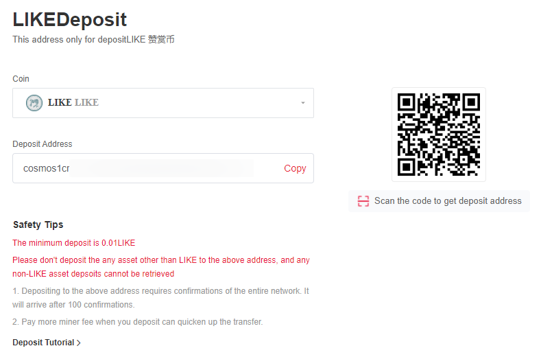
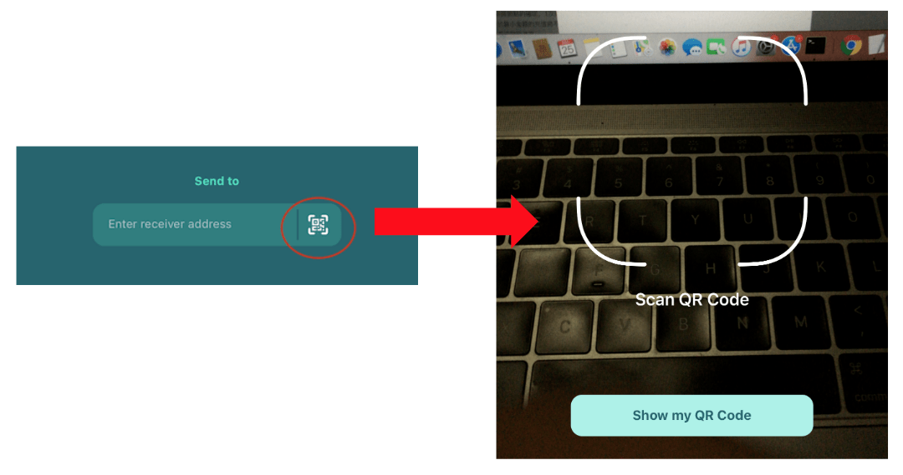
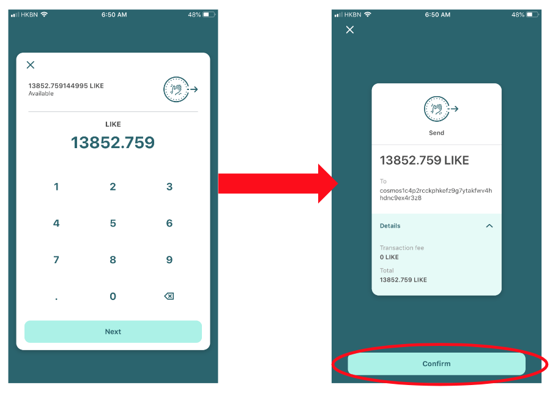
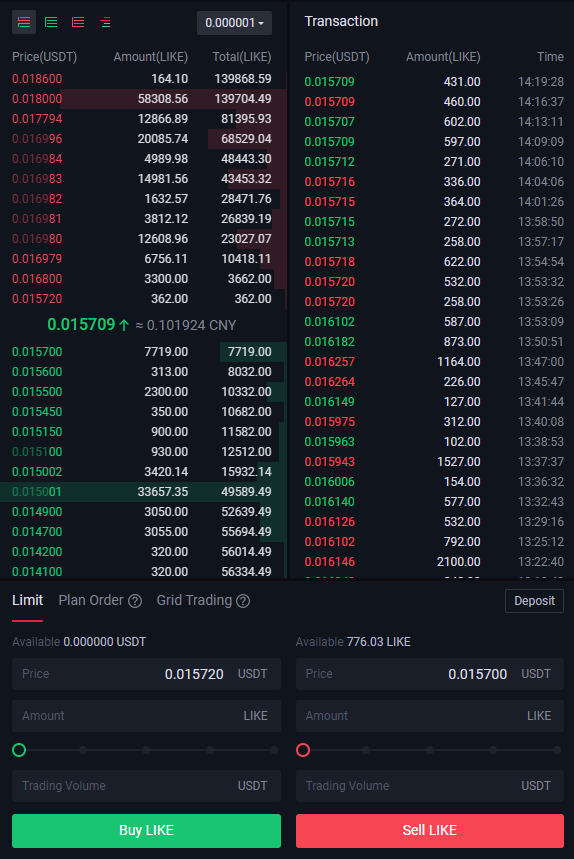

# Trade in ZB


Archived on 2022/08/18.


[ZB](https://www.zb.com/) is the world’s leading digital asset trading platform. Since its establishment in 2013, it has provided digital asset trading services for more than 10 million users worldwide. It has been operating steadily for more than 8 years, with an average daily transaction volume of more than 1.5 billion US dollars. BTC, ZB, EOS, and XRP mainstream currencies have long been among the top for a long time. ZB now offers LIKE/USDT trading pairs, if you do not have a ZB account, please take a look at [this](registering-on-zb.md). Moreover, you have to download the [Keplr](../../../general-guides/wallet/keplr.md) wallet or [Liker Land app](https://liker.land/getapp) to send/receive LikeCoin. The following instructions are based on ZB web, you may also use the [ZB app](https://www.zb.com/en/download) to trade LikeCoin.

### Step 1: Create your LikeCoin wallet on ZB

First of all you have to create your wallet address on ZB so as to transfer LikeCoin to the exchange. Click on "Funds" on the top right hand corner, on the search box, input "LIKE"

Click "Deposit"

Click "Get LIKE deposit address"

You wallet address and QR Code appears

### Step 2: Transfer LikeCoin to ZB

Open the [Liker Land app](https://liker.land/getapp), click on "My Wallet. Then, click on the \[Send] button (circled in red below)

![On Liker Land app select \[Send\] (circled in red)](../../../.gitbook/assets/bitasset-trade-6.png)

Go to the next page, click on the QR Code icon circled in red, the app will open camera mode for you to scan the QR Code, please scan the QRCode that you have on Step 1, cause you have to transfer LikeCon to ZB

Input the amount of LikeCoin that you want to transfer, then click \[Confirm]

Next step is to wait for ZB to confirm the transfer.


The Minimum Deposit Amount of ZB is 0.1 LIKE


### Step 3: Confirm the transfer to ZB

You can check "Deposit Record" by clicking "Deposit" in \[Step 1] and see if the LikeCoin is being received or not.

### Step 4: Buy or Sell


Transaction Fee, Withdrawel Fees & Limits are listed in "[Fee Rate](https://www.zb.com/help/rate)"


On the top left corner of ZB website there are "Markets" and "Trade" on the menu

Click "Markets", on the search box input "LIKE" will show the chart. LikeCoin is now on the "New Market" tab

There are several ways to start trade: Click on LIKE in "New Market" or click on "Trade" in the "Funds" page indicated in \[Step 1] to reach the "Exchange Pro". Or click on the top left hand corner of the ZB website and click on "Exchange Basic" or "Exchange Pro"

Take a look at the order book on the right hand side. The figures in red are those orders who want to "Sell", for example below there are people who want to sell 362 LikeCoin at the price of 0.15720 USDT/LIKE, and then some other people want to sell 3300 LikeCoin at 0.016800 USDT/LIKE. If you want to buy 3600 LikeCoin, you can buy them all at 0.016800 USDT/LIKE

If you want to sell your LikeCoin, you have to monitor the seller in green. For example below if you want to sell 7000 LikeCoin, it is guaranteed to be sold at 0.015700 USDT/LIKE because the highest selling price is 0.015700 to buy 7719 LikeCoin

To make it simple, if you want to sell, check out the orders in green; if you want to buy, check out the orders in red
. You can also take a look at the "Latest" transaction statistic on the right hand side.

Once you decide the price and amount to buy or sell, go to "Limit" to sell:

you have to input 3 parameters:

* Select the right action for "Buy LIKE" or "Sell LIKE
* Input "Price": using the order book above as an example, fill in 0.015700 for selling LikeCoin
* Input "Amount": Fill in 200 for selling 200 LikeCoin, or adjust the percentage e.g. 100%, 50%, etc

The system will calculate "Total", confirm if they are correct or not, then click "Sell LIKE" to complete the transaction.&#x20;

### Step 5: Check Transaction details

Click on the top right hand corner "Order" to check the transaction details. your wallets reflect new balances as well.

### Step 6: Withdrawal

Going back to "Funds" page in \[Step 1] and find the coins that you need to withdraw, click on "Withdrawal" and go to "LIKEWithdrawal" or "USDTWithdrawal" page ( depends on if you are buying or selling LikeConi ). Fill in the "Withdrawal address" and "Amount" then click "Withdrawal" and your coins will be transferred. You can also check the Withdrawal Records underneath.

