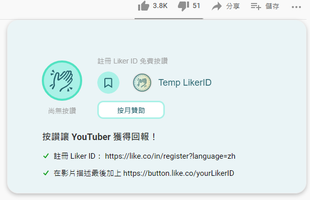
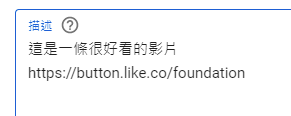
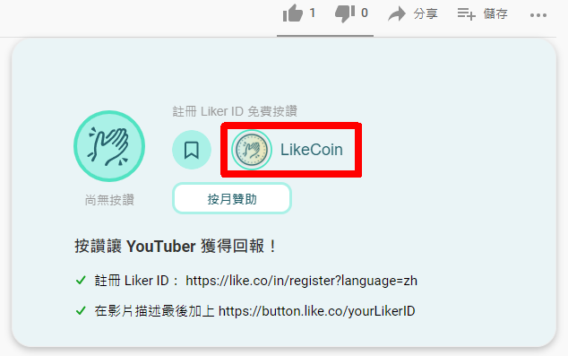

# Youtube


2022/06/14 存檔。資訊已過期。


### 【Youtube 功能經已再無更新，歡迎社群成員接手開發。】

Liker Land Chrome / Brave / Firefox 插件除了可以[為網頁加上書籤儲存於 Liker Land](../../../user-guide/liker-land/reading-list.md) 留待有空時細閱，更能讓 YouTuber 賺取 LikeCoin，上載影片時一拼完成簡單設定即可。

執行以下步驟前，請先 [註冊 Liker ID](../../../user-guide/liker-id/)。

### 步驟一：安裝 Liker Land Chrome / Brave / Firefox 插件

到 Chrome / Firefox 線上應用程式商店把 Liker Land 插件「加到 Chrome/Firefox」。

[Chrome / Brave 版](https://chrome.google.com/webstore/detail/liker-land/cjjcemdmkddjbofomfgjedpiifpgkjhe)

[Firefox 版](https://addons.mozilla.org/en-US/firefox/addon/liker-land/?src=search)

完成安裝後，查看自己的 Youtube 影片會顯示 Temp LikerID 的字樣

### 步驟二：在影片描述加入自己的 Liker ID

上載影片後在「描述」欄輸入代碼，格式是 https://button.like.co/你的Liker ID

假設你的 Liker ID 是 [fondation](https://liker.land/foundation)（Liker Land 的 Liker ID），代碼便是 https://button.like.co/foundation

### 步驟三：查看影片的讚賞鍵

你會發現你個人專屬的讚賞鍵經已安裝就緒，再不會顯示 Temp LikerID。

### 步驟四：邀請你的安裝 Liker Land Chrome / Brave / Firefox 插件

只要你的粉絲安裝 Liker Land Chrome / Brave / Firefox 插件就可以隨時為你的影片按讚了！
