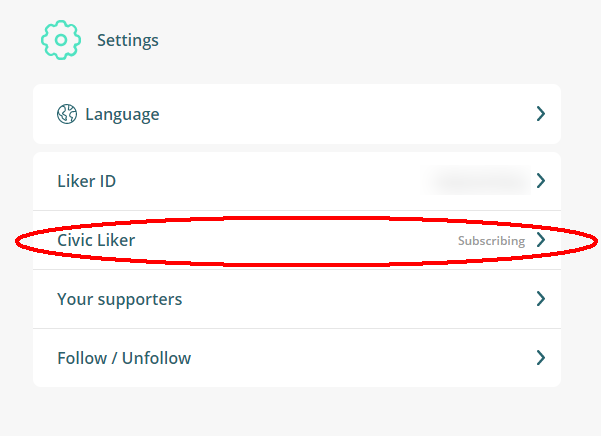
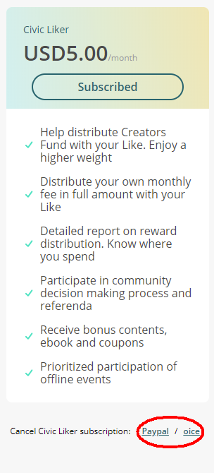
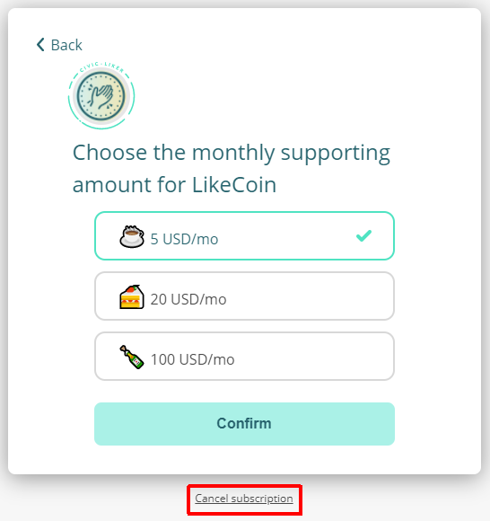

# Unsubscribe Civic Liker

Please follow the steps:

Step 1: Login in [Liker Land web](https://liker.land/), click on the menu at the top right hand corner, select "Settings".

Step 2: In the Setting page, select "Civic Liker". It shows "Subscribing", click on it.

Step 3: For Civc Liker 1.0 old scheme, there is a "Cancel Civic Liker subscription: Paypal / oice". Click and you are free to go.

For Civic Liker 2.0, select the content creator to unscribe and click "Edit".

Then click "Cancel subscription" to proceed.

If you unsubscribe Civic Liker, the money paid will not be refunded. The subscription ends automatically on the next billing date.

