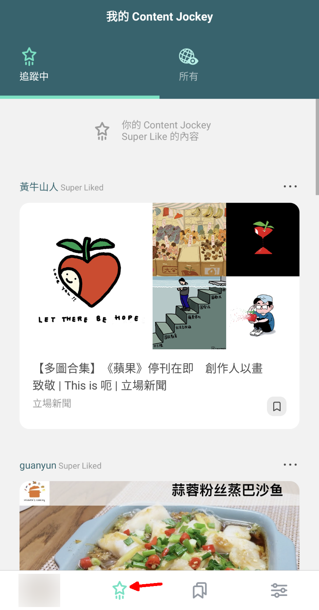
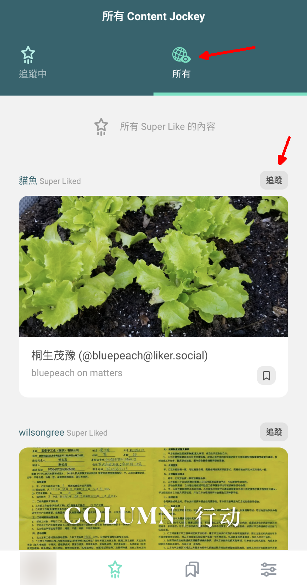
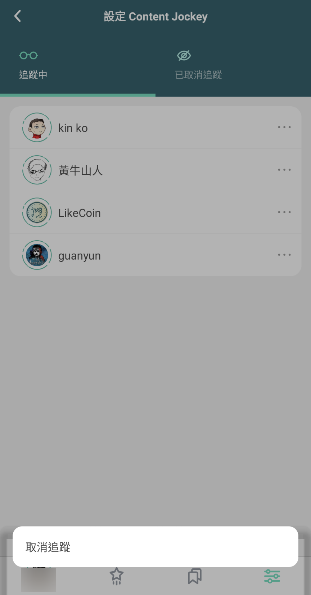

# 我的 Content Jockey

## 不是瀏覽，而是閱讀

打開 Liker Land 手機應用程式再點擊底下的「星星」圖示，即可看到「我的 Content Jockey」，就像以往的報紙，每天選出有限的、重要的新聞。

「我的 Content Jockey」內容由內容伯樂 \( Content Jockey \) 每天使用 [Super Like](https://docs.like.co/v/zh/dapps/liker-land/superlike) 人手挑選，完全不使用 AI。每位內容伯樂每天只有兩個限額，一方面確保精挑細選，另方面亦確保讀者不會浸沒於內容大海。

Liker Land 預設內容伯樂由讚賞公民共和國以[流動民主](https://docs.like.co/v/zh/guides/governance/liquid-democracy)治理，由社群投票選出質量高、具口碑的內容伯樂。現時，Liker Land 設有五個預設內容伯樂：

* 立場新聞：[standnews](https://like.co/standnews)
* 獨立媒體：[inmediahknet](https://like.co/inmediahknet)
* 眾新聞：[hkcitizennews](https://like.co/hkcitizennews)
* Matters：[hi176-matters](https://like.co/hi176-matters)
* 讚賞公民基金會：[foundation](https://like.co/foundation)（報告、公布、議案等）

## 我的 Content Jockey：追蹤心儀內容伯樂 

除預設內容伯樂以外，讀者可自行追蹤其他可信賴，關注不同範疇的內容伯樂。到他們的[個人主頁](https://docs.like.co/v/zh/dapps/creator/portfolio-page)點擊追蹤即可。

點擊 Liker Land 手機應用程式的「星星」圖示，即可在「我的 Content Jockey」查看你已追蹤的內容伯樂所提供的內容。

## 所有 Content Jockey 

覺得你的「我的 Content Jockey」不夠看？不打緊！點擊地球圖示「所有」即可暢讀「所有 Content Jockey」的 Super Like 精選文章，發堀更多精彩內容。假如你覺得他/她的品味不錯，更可點擊「追蹤」，以後他/她經手 Super Like 的文章就會在你的「我的 Content Jockey」版面出現。

## 停止追蹤內容伯樂

若你想停止追蹤某位內容伯樂，可在 Liker Land 手機應用程式選右下角設定下的「Content Jockey」，再點擊頭像，然後點擊「取消追蹤」確認。你亦可以到 [Liker Land 網頁版](https://liker.land/settings/following/)中設定取消追蹤。

