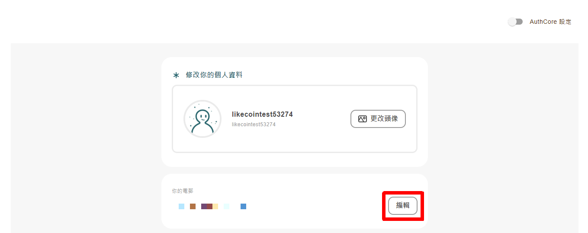
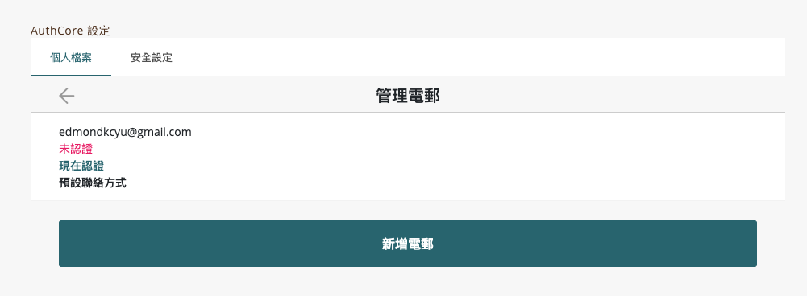
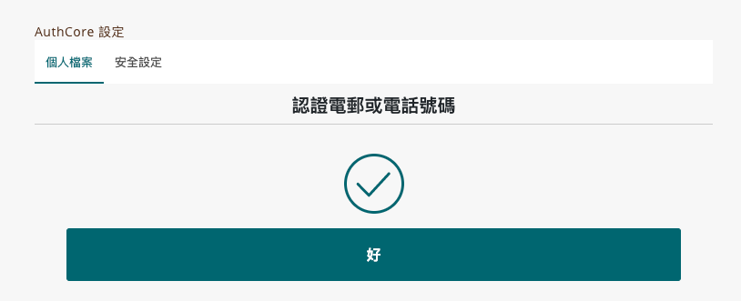
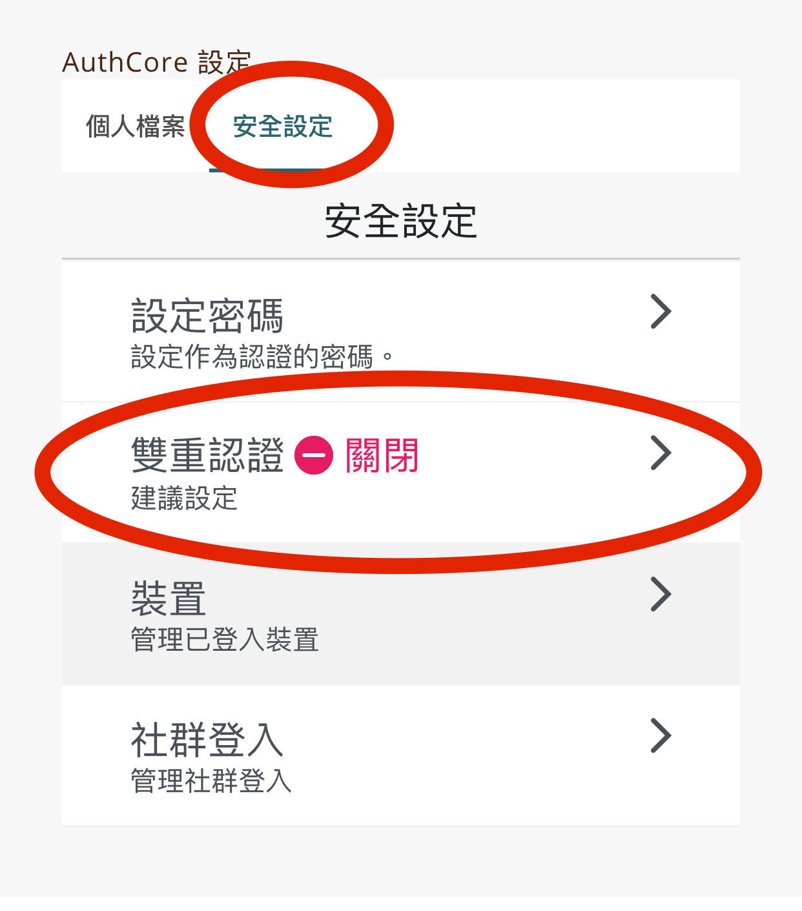
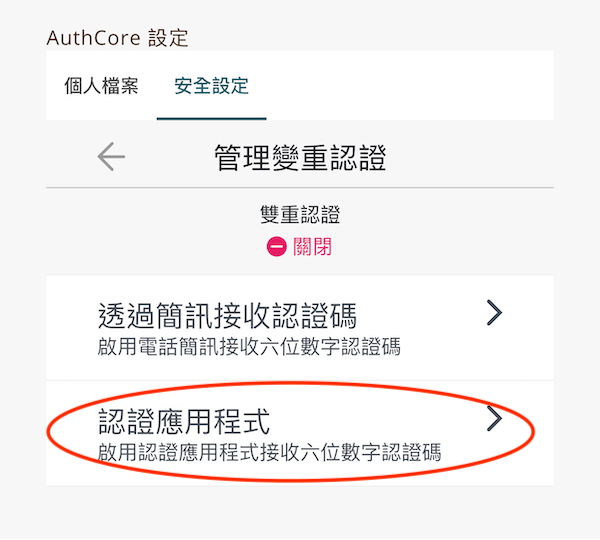
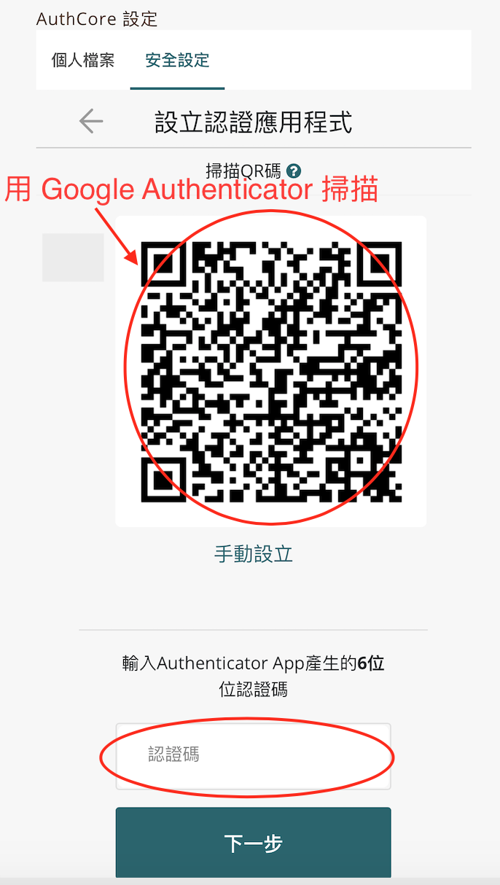
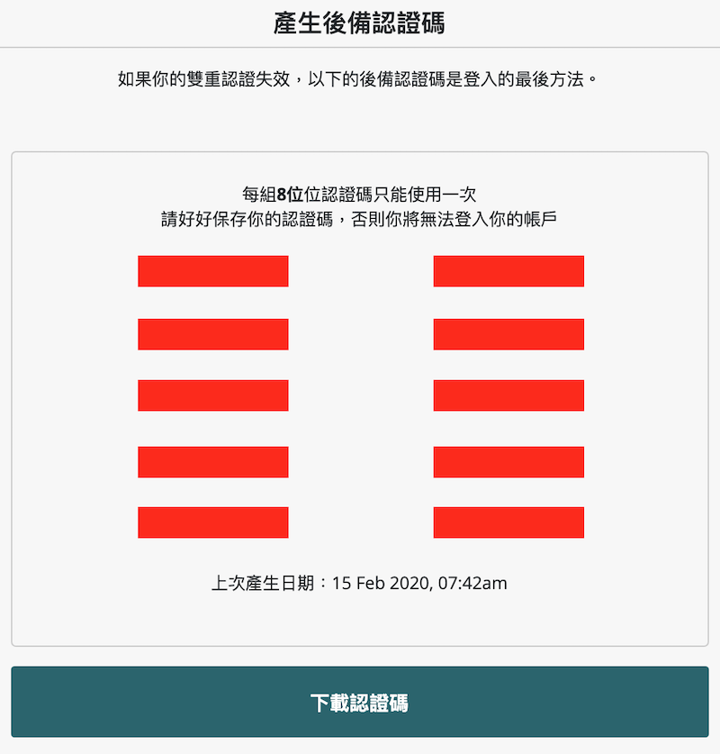

# 保護你的 Liker ID


以下內容只適用於[以電郵或社交登入 ( Authcore ) 註冊的 Liker ID](./)。


## 認證電郵地址 

### 步驟一：進入 Liker ID 設定

到 [Liker Land](https://liker.land/) 網站右上角點「登入」。

<figure><figcaption>
點「登入」
</figcaption></figure>

點 Email/Social 使用 Liker ID 以電郵/社交登入。

<figure><figcaption>
點 Email/Social 使用 Liker ID 以電郵/社交登入
</figcaption></figure>

登入後點右上角頭像，點「設定」再點「Liker ID」。&#x20;

<figure><figcaption>
點「設定」再點「Liker ID」
</figcaption></figure>

在「你的電郵」點「編輯」進入「管理電郵」的頁面。

<figure><figcaption>
在「你的電郵」點「編輯」進入「管理電郵」的頁面
</figcaption></figure>

### 步驟二：認證電郵

在「管理電郵」的頁面，點「現在認證」。

### 步驟三：輸入認證碼

你的郵箱會收到一封包含六位數字認證碼的電郵。請填在下方畫面的空格中，點「認證」。

<figure><figcaption>
六位數字認證碼電郵
</figcaption></figure>

<figure><figcaption>
輸入六位數字認證碼再點「認證」
</figcaption></figure>

見到下方這畫面，代表認證已成功。

***

## 雙重認證 ( 2FA ) 

設定雙重認證後，新裝置登入時會要求填上認證碼產生器生成的 6 位數字認證碼。

以下步驟須在桌面電腦上操作，也需要備妥一部你常用的手機。設定步驟如下：

### 步驟一：登入 Liker Land

到 [Liker Land](https://liker.land/) 網站右上角點「登入」。

<figure><figcaption>
點「登入」
</figcaption></figure>

點 Email/Social 使用 Liker ID 以電郵/社交登入。

<figure><figcaption>
點 Email/Social 使用 Liker ID 以電郵/社交登入
</figcaption></figure>

登入後點右上角頭像，點「設定」再點「Liker ID」。&#x20;

<figure><figcaption>
點「設定」再點「Liker ID」
</figcaption></figure>

### 步驟二：進入安全設定

打開右上角「Authcore 設定」。

<figure><figcaption>
打開「Authcore 設定」
</figcaption></figure>

選「安全設定」分頁並點「雙重認證」。

### 步驟三：選取認證認用程式

1. 點「設立雙重認證」。
2. 這裡先介紹以 Google Authenticator 設定的流程。請在畫面下方選「使用其他方式」。

.png>)

在下一個頁面，選「認證應用程式」。

### 步驟四：設定 Google Authenticator

上一步後，屏幕上顯示的裡面是：

1. 在手機上下載 Google Authenticator 應用程式：\
   [安卓版下載鏈結](https://play.google.com/store/apps/details?id=com.google.android.apps.authenticator2\&hl=zh_TW)\
   [蘋果版下載鏈結](https://apps.apple.com/hk/app/google-authenticator/id388497605)
2. 打開 Google Authenticator 應用程式。點應用程式右上角的 「＋」。
3. 掃描桌面電腦上的二維碼。
4. Google Authenticator 畫面的底部會新增了一個 Authcore 的列，並顯示一組六位的數字。把該組數字填寫在桌面電腦畫面的底部紅圈位置，再點「下一步」，看見「設立認證應用程式」「完成」後，點「好」。
5. 按下來，選「產生後備認證碼」。

所有設定雙重認證的步驟至此完成了。

#### 教學影片


