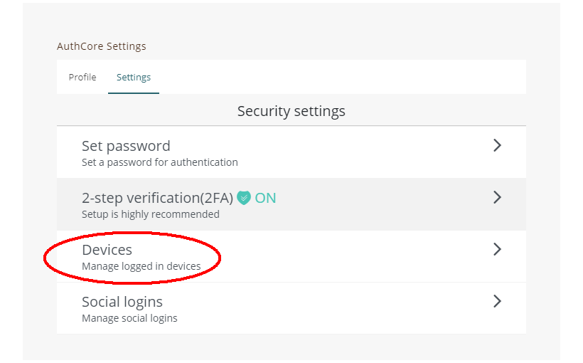
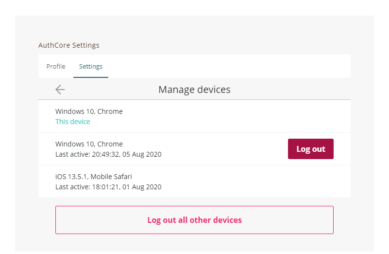
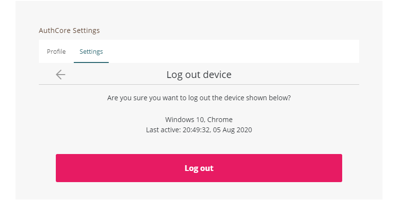

# Manage logged in devices




The followings are for [Liker ID registered through Email/Social (with Authcore)](./).


You can see computers, phones, and other devices that are currently using or have recently used your Liker ID. You can check this info to make sure no one else has signed in to your account.

## Step 1: Login

Go to the upper right corner of the [Liker Land website](https://liker.land/en) and click "Login".

<figure><figcaption>
Click "Login"
</figcaption></figure>

Click "Email/Social" using Liker ID by email or social login

<figure><figcaption>
Click Email/Social using Liker ID by email or social login
</figcaption></figure>

After logging in, click on the avatar in the upper right corner, click ‘Settings’, and then click ‘Liker ID’.”

<figure><figcaption>
click "Settings", and then click "Liker ID"
</figcaption></figure>

Click "AuthCore Settings" in the upper right corner.

<figure><figcaption>
Click "AuthCore Settings"
</figcaption></figure>

Click "Security settings" and "Devices".

## Step 2: Log Out Devices

"Manage devices" shows all the devices currently logged in your Liker ID, you can click on one of the devices and click "Log Out", or click "Log out all other devices" to log out all devices.


To help keep your Liker ID secure, sign out on devices that:

* Are lost or you no longer own
* Don't belong to you

