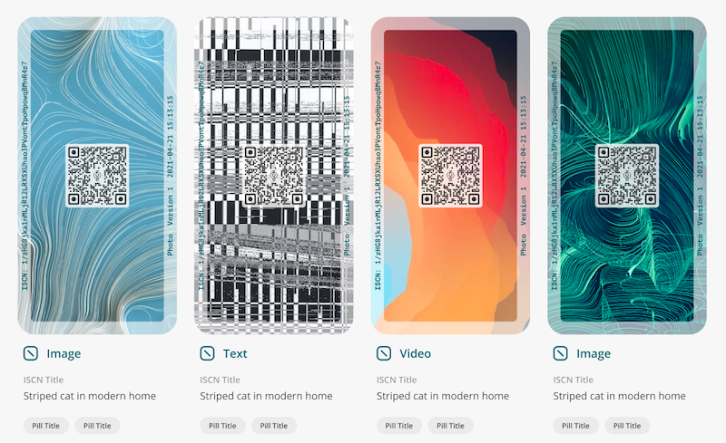

# How to register an ISCN?


The documentation is designed for Liker Land and LikeCoin v2. For information on 3ook.com and LikeCoin v3, please visit [docs.3ook.com](https://docs.3ook.com).



📣Register ISCN requires a desktop computer and LikeCoin, users can get a small amount of LikeCoin from the [faucet](../../../general-guides/faucet.md) for testing.


Users can go to [app.like.co](https://app.like.co/) and register an ISCN for their content and a unique image will be generated randomly. Even if there is a tiny little change to two pieces of similar content, the image for the ISCN will not be the same.

Registering ISCN to the LikeCoin chain will also upload the content to [IPFS](https://ipfs.io/) and [Arweave](https://www.arweave.org/) and/or [Numbers Protocol](https://www.numbersprotocol.io/). Users only have to pay a small amount of LikeCoin for registering and hosting.

Users can also check an ISCN record and its details in [app.like.co](https://app.like.co/).

***

## Ways to register an ISCN

#### Recommend:thumbsup:Users can [Emal/Social](authcore.md) login and link to [app.like.co](https://app.like.co/) to try out and register an ISCN.

Users can also register an ISCN using [Keplr](keplr.md), [Cosmostation](cosmostation.md), [Cosmostation app](cosmostation-app.md)...etc.

Or register an ISCN on [Matters](matters.md).

***

## Publish Writing NFT

After registering an ISCN, users can [publish it as Writing NFT](../../nft-portal/iscn-id.md).
