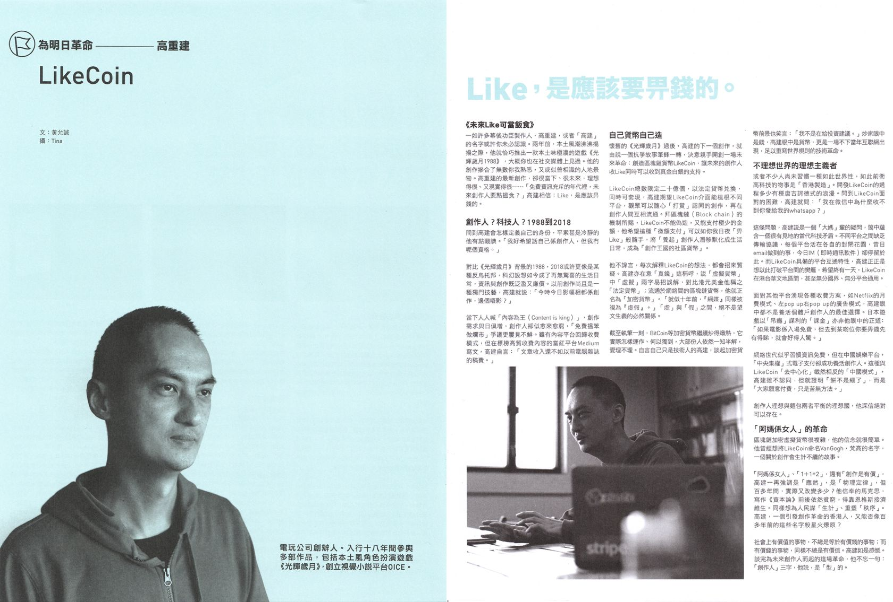

# Interview and Features



### 06/15 私董會 OUR BOARD ROOM

[了解NFT相關的版權問題！訪問 LikeCoin 內容NFT 和 MonkeyKing 玩具NFT。](https://www.clubhouse.com/room/xpQaNVKv)



### 05/24 風傳媒

[華爾街日報》NFT在中國有了新用途：在疫情中對抗審查](https://www.storm.mg/article/4347313?page=2)

### 05/24  The Wall Street Journal

[NFTが中国で急増、検閲かいくぐる新手法](https://jp.wsj.com/articles/nfts-are-put-to-new-use-in-china-countering-censorship-during-pandemic-11653345896)

### 05/23 The Wall Street Journal

[NFT在中国有了新用途：在疫情中对抗审查](https://cn.wsj.com/articles/nft%E5%9C%A8%E4%B8%AD%E5%9B%BD%E6%9C%89%E4%BA%86%E6%96%B0%E7%94%A8%E9%80%94-%E5%9C%A8%E7%96%AB%E6%83%85%E4%B8%AD%E5%AF%B9%E6%8A%97%E5%AE%A1%E6%9F%A5-11653306611)

### 05/21 The Wall Street Journal

[NFTs Are Put to New Use in China, Countering Censorship During Pandemic](https://www.wsj.com/articles/nfts-are-put-to-new-use-in-china-countering-censorship-during-pandemic-11653134403)

### 05/21 #1 Episode: The Missing Archive



### 05/21 @beincrypto

[Arweave Attracts More Chinese Content Creators in Fight Against Censorship](https://beincrypto.com/arweave-attracts-more-chinese-content-creators-in-censorship-battle/)

### 05/14 unwire.pro

[「去中心化」偽命題抑或真革命？ 初創冀優化 Web3 用戶體驗](https://unwire.pro/2022/05/14/web3-2/feature/)

### 04/30 尹思哲



### 04/26 Crypto Conscious



### 04/21 信報 優雅生活

[【Blockchain鏈出個未來】高重建：鏈上追求三種自由](https://lj.hkej.com/lj2017/artculture/article/id/3108283/%E3%80%90Blockchain%E9%8F%88%E5%87%BA%E5%80%8B%E6%9C%AA%E4%BE%86%E3%80%91%E9%AB%98%E9%87%8D%E5%BB%BA%EF%BC%9A%E9%8F%88%E4%B8%8A%E8%BF%BD%E6%B1%82%E4%B8%89%E7%A8%AE%E8%87%AA%E7%94%B1)

### 04/12 Openbook

[出版NFT移民．典範轉移》重新省思數位世界：LikeCoin創辦人高重建談分散式出版](https://www.openbook.org.tw/article/p-66082)

### 04/12 好青年荼毒室



### 03/30 Web2.5 時代



### 02/24 Impact Incubator 創匯點



### 01/14 C基金



:end:



### 12/26 明報

[未來城市：元宇宙之DAO 無大台社群 投票話事](https://news.mingpao.com/pns/%E5%89%AF%E5%88%8A/article/20211226/s00005/1640456257406/%E6%9C%AA%E4%BE%86%E5%9F%8E%E5%B8%82-%E5%85%83%E5%AE%87%E5%AE%99%E4%B9%8Bdao-%E7%84%A1%E5%A4%A7%E5%8F%B0%E7%A4%BE%E7%BE%A4-%E6%8A%95%E7%A5%A8%E8%A9%B1%E4%BA%8B)

### 12/19 明報

[未來城市：元宇宙「咁假」點解有價值？ 加密貨幣誕生的啟示](https://ol.mingpao.com/ldy/cultureleisure/culture/20211219/1639851408826/%E6%9C%AA%E4%BE%86%E5%9F%8E%E5%B8%82-%E5%85%83%E5%AE%87%E5%AE%99%E3%80%8C%E5%92%81%E5%81%87%E3%80%8D%E9%BB%9E%E8%A7%A3%E6%9C%89%E5%83%B9%E5%80%BC-%E5%8A%A0%E5%AF%86%E8%B2%A8%E5%B9%A3%E8%AA%95%E7%94%9F%E7%9A%84%E5%95%9F%E7%A4%BA)

### 12/18 財科暗戰









### 12/14 立場新聞



### 12/14 中廣新聞

10 分鐘「新書快報」周詳 《區塊鏈社會學》



### 11/21 中山銅鑼灣書店書店



### 09/15 信報 徐家健

[沒有大台，出版還意味着什麼?
](https://www1.hkej.com/dailynews/investment/article/2913449/%E6%B2%92%E6%9C%89%E5%A4%A7%E5%8F%B0%EF%BC%8C%E5%87%BA%E7%89%88%E9%82%84%E6%84%8F%E5%91%B3%E7%9D%80%E4%BB%80%E9%BA%BC%3F)

### 07/29 財科暗戰



### 07/25 財科暗戰



### 07/21 &#xD;財科暗戰



### 07/21 區塊勢

[去中心化出版的基礎建設 ft. LikeCoin 創辦人高重建
](https://blocktrend.substack.com/p/ep124)

### 07/19 unwire.pro

[「萬物代幣化時代」降臨！用 NFT 交易房地產又如何？](https://unwire.pro/2021/07/19/nft-property/feature/)

### 07/08 HK01

[IPFS｜將會取代現有 HTTP 架構？可以永久保存內容與檔案的技術](https://www.hk01.com/sns/article/648037)

### 06/26 cointribune

[Quand la blockchain contourne la censure d’Hong-Kong
](https://www.cointribune.com/blockchain/ecosysteme/quand-la-blockchain-contourne-la-censure-dhong-kong/)

### 06/25 REUTERS

[Hong Kong's Apple Daily to live on in blockchain, free of censors](https://www.reuters.com/world/asia-pacific/hong-kongs-apple-daily-live-blockchain-free-censors-2021-06-24/)

### 06/25 Taipei Times

[HK’s ‘Apple Daily’ to live on in blockchain
](https://www.taipeitimes.com/News/world/archives/2021/06/25/2003759792)

### 06/25 The Business Times

[Queues form for final issue as Apple Daily closes](https://www.businesstimes.com.sg/government-economy/queues-form-for-final-issue-as-apple-daily-closes)

### 06/25 區塊客

[香港《蘋果》停刊、網站熄燈！網友自發備份「上鏈永存」
](https://blockcast.it/2021/06/25/cyber-activists-are-backing-up-articles-from-apple-daily-using-blockchain/)

### 06/25 動區 BlockTempo

[香港蘋果日報停刊，歷年報導被放上區塊鏈：不因為喜歡，因是需要做的事！
](https://www.blocktempo.com/apple-daily-news-was-put-on-blockchain/)

### 06/24 聯合早報

[香港网民将苹果文章上传至区块链平台
](https://www.zaobao.com/realtime/china/story20210624-1160475)

### 06/24 鏈新聞

[香港蘋果日報最終章！支持者利用去中心化平台保護「新聞自由」](https://www.abmedia.io/20210624-using-blockchain-to-preserve-apple-daily)

### 06/24 Bitcoin Mexico

[El diario Apple Daily se convierte en Blockchain](https://www.boursorama.com/bourse/actualites/hong-kong-les-contenus-d-apple-daily-transferes-sur-des-serveurs-decentralises-0fab802ad878fc61f1a7272dcf9a524f)

### 06/24 Bourse

[Hong Kong-Les contenus d'Apple Daily transférés sur des serveurs décentralisés
](https://www.boursorama.com/bourse/actualites/hong-kong-les-contenus-d-apple-daily-transferes-sur-des-serveurs-decentralises-0fab802ad878fc61f1a7272dcf9a524f)

### &#xD;06/24 Les Echos

[A Hong Kong, ruée sur le dernier numéro du quotidien pro démocratie « Apple Daily »
](https://www.lesechos.fr/monde/asie-pacifique/a-hong-kong-ruee-sur-le-dernier-numero-du-quotidien-pro-democratie-apple-daily-1326489)

### 06/24 Objetivo Famosos

[A Hong Kong, ruée sur le dernier numéro du quotidien pro démocratie « Apple Daily »](https://www.objetivofamosos.com/apple-daily-en-hong-kong-para-vivir-en-blockchain-sin-censura/)

### 06/24 Business World

[Apple Daily to live on in blockchain, free of censors
](https://www.bworldonline.com/apple-daily-to-live-on-in-blockchain-free-of-censors/)

### 06/24 RTHK

[Cyber activists race to back up Apple Daily articles
](https://news.rthk.hk/rthk/en/component/k2/1597503-20210624.htm)

### &#xD;06/24 CNBC

[Hong Kong’s Apple Daily to live on in blockchain, free of censors](https://www.cnbc.com/2021/06/24/hong-kongs-apple-daily-to-live-on-in-blockchain-free-of-censors.html)

### 06/23 明報

[網民備份《蘋果》報道 IT界倡開放CC授權
](https://news.mingpao.com/pns/%E6%B8%AF%E8%81%9E/article/20210623/s00002/1624385871098/%E7%B6%B2%E6%B0%91%E5%82%99%E4%BB%BD%E3%80%8A%E8%98%8B%E6%9E%9C%E3%80%8B%E5%A0%B1%E9%81%93-it%E7%95%8C%E5%80%A1%E9%96%8B%E6%94%BEcc%E6%8E%88%E6%AC%8A)

### 06/23 HK01

[《蘋果日報》網站即將停運　民間倡內容共享創意授權保存未有下文](https://www.hk01.com/%E7%A4%BE%E6%9C%83%E6%96%B0%E8%81%9E/641736/%E8%98%8B%E6%9E%9C%E6%97%A5%E5%A0%B1-%E7%B6%B2%E7%AB%99%E5%8D%B3%E5%B0%87%E5%81%9C%E9%81%8B-%E6%B0%91%E9%96%93%E5%80%A1%E5%85%A7%E5%AE%B9%E5%85%B1%E4%BA%AB%E5%89%B5%E6%84%8F%E6%8E%88%E6%AC%8A%E4%BF%9D%E5%AD%98%E6%9C%AA%E6%9C%89%E4%B8%8B%E6%96%87)

### &#xD;06/20 城寨 x Yolo 街

[城寨 x Yolo 街 - 科技與香港人身份證同行動(1)：海外香港人網絡與科技創新](https://twitter.com/bonkat/status/1406443103179837444)

### 05/27 CryptoPotato

[People in Hong Kong Use The Blockchain To Fight Against Media Censorship
](https://cryptopotato.com/people-hong-kong-use-blockchain-fight-media-censorship/)

### 05/27 Decrypt

[Hong Kong Media Turns to Blockchain to Preserve Protest Archives](https://decrypt.co/72057/hong-kong-media-turns-blockchain-preserve-protest-archives)

### 05/27 Business AM

[Hoe Hongkong de geschiedenis wil censureren en blockchain-technologie de oplossing werd
](https://businessam.be/hoe-hongkong-de-geschiedenis-wil-censureren-en-blockchain-technologie-de-oplossing-werd/)

### &#xD;05/27 Cointelegraph

[Hong Kongers use blockchain to save evidence of anti-authoritarian struggles](https://cointelegraph.com/news/hong-kongers-use-blockchain-to-save-evidence-of-anti-authoritarian-struggles)

[Los habitantes de Hong Kong usan blockchain para guardar evidencia de luchas antiautoritarias
](https://es.cointelegraph.com/news/hong-kongers-use-blockchain-to-save-evidence-of-anti-authoritarian-struggles)

[Gli abitanti di Hong Kong usano la blockchain per salvare le prove della lotta anti-autoritaria
](https://it.cointelegraph.com/news/hong-kongers-use-blockchain-to-save-evidence-of-anti-authoritarian-struggles)



### [&#xD;](https://cointelegraph.com/news/hong-kongers-use-blockchain-to-save-evidence-of-anti-authoritarian-struggles)05/26 QUARTZ

[Hong Kongers are using blockchain archives to fight government censorship
](https://qz.com/2008673/hong-kongers-use-blockchain-to-fight-government-censorship/)

### 05/21 眾新聞

[【NFT拍賣熱潮】蕭雲作品《我們的獅子山》2.8萬元賣出　競投者：相片代表港人重要記憶
](https://www.hkcnews.com/article/41482/%E4%BD%99%E5%AE%B6%E9%BD%8A\_edmond\_yu-nft-41542/nft)

### 05/15 城寨 Singjai



### 05/15 &#xD;theDesk Hong Kong



### 05/09 堅離地傾 · 沈旭暉[&#xD;](https://beta.thestandnews.com/society/%E5%A0%85%E9%9B%A2%E5%9C%B0%E5%82%BE-%E9%AB%98%E9%87%8D%E5%BB%BA-%E5%85%A8%E6%B0%91%E5%8D%80%E5%A1%8A%E9%8F%88-backup-%E7%9C%9F%E9%A6%99%E6%B8%AF)



### 04/29 台灣事實查核中心

[【共享讚賞幣理念】LikeCoin創辦人高重建買下查核中心首份NFT藏品](https://tfc-taiwan.org.tw/articles/5348)

### 02/05 The News Lens 關鍵評論網

[專訪LikeCoin創辦人高重建：政府自言支持區塊鏈發展，但新監管制度自相矛盾 ](https://www.thenewslens.com/feature/crypto-hk/146508)

### 02/04 【菲妮莫屬】區塊鏈人才說 Proof of Talents

[第二季 海外人才篇 #9 探討區塊鏈對價值、媒體、民主的再想像 -《區塊鏈社會學》作者 高重建](https://player.soundon.fm/p/558a3a20-12ce-4540-b78c-013717e8c6c7/episodes/7e2f78a6-0b8b-458c-a238-abc0dfa3d4f1)



:end:



### 12/23 寶博朋友說



### 11/28 科創社工學會 Society for Innovation and Technology in Social Work

[區塊鏈社會學與社會工作分享會](https://www.facebook.com/SITSWHK/posts/381713766500377)



### 11/14 信報財經新聞

[LikeCoin用區塊鏈為文字創富](https://www1.hkej.com/dailynews/article/id/2635378/)

### 10/14 Hour of Code Hong Kong Meetup Group

[HoCHK Webinar: Kin Ko, Entrepreneur, Founder, LikeCoin](https://www.meetup.com/Hong-Kong-Hour-of-Code-Meetup-Group/events/273470964/)



### 10/07 IPFS

[Case study: LikeCoin](https://docs.ipfs.io/concepts/case-study-likecoin/#overview)

### 08/26 掌舖 x VSMedia 網上書展



### 08/17 香港蘋果日報

[派讚賞幣回饋創作者
](https://hk.appledaily.com/finance/20200817/BYQBDVDNPVCFPIZQFMAGIYXEIA/)

[LikeCoin發起人：區塊鏈可還權於民
](https://hk.appledaily.com/finance/20200817/MDJN6LLEHVCMVDSSFCAFTIQY2E/)

### 08/07 香港無線電視財經 ‧ 資訊台 看出個未來

[未來發幤人](https://programme.tvb.com/info/futurescope)



### 23/07 Lighthouse Consultant Limited - Lighthouse Presents: NExT - How Event Professionals Make the Comeback Stronger than the Setback

[Lighthouse Presents: NExT - How Event Professionals Make the Comeback Stronger than the Setback](https://www.lighthouse.hk/Lighthouse%20Presents%3A%20NExT%20%232)

[Virtual Book Fair](https://www.linkedin.com/posts/lighthouse-consultant-limited\_lighthouseconsultant-eventplanning-eventmanagement-activity-6698471598539845632-1hFO)



### 07/15 區塊勢



### 05/15 港故仔



### **03/10 寶博士**

【寶博朋友說】區塊鏈打賞: 按讚就能讓人賺幣致富?! - 專訪 讚賞公民共和國 LikeCoin 創辦人 高重建 Kin Ko｜EP23



### 02/19 Meet 創業小聚

【創業新聲帶】EP4 LikeCoin｜按讚有錢賺！LikeCoin 用區塊鏈打造創作者生態系，實現創作可當飯吃｜Meet 創業小聚



### 02/10 Meet 創業小聚

創業之星 - LikeCoin 一分鐘快問快答！



### 02/05 Meet 創業小聚

[\[創業小聚NO.109\] 區塊鏈的N種應用：打造超有感的生活體驗！](https://meet.bnext.com.tw/articles/view/46021)

### 01/14 Meet 創業小聚

[按讚有錢賺！LikeCoin 用區塊鏈打造創作者生態系，實現創作可當飯吃](https://meet.bnext.com.tw/articles/view/45970)

### 01/02 CUHK Engineering Faculty Alumni Association (ERGAA).

中大工程校友「你問我答」第一回：區塊鏈



:end:&#x20;



### 12/7 区块链研究院



### 11/13 FINDIT



[全球早期資金趉勢觀測月報 2019.11](https://findit.org.tw/upload/research/news\_201912161930304057-1.pdf)

### 10/9 AIre VOICE



### 09/06 香港獨立媒體網

[香港獨立媒體網 x LikeCoin Foundation 成為「讚賞公民」 獎勵創作](https://www.inmediahk.net/node/1067055)

### 09/05 WP Builds





### 7/31 CIBS節目：區塊鏈與你 (Blockchain and You)&#x20;

第四集



### 06/14 區塊勢



### 06/04 Global Voices



### 05/24 iMoney 智富雜誌

[ 「創作可以當飯吃」 港人推LikeCoin望聚集讚賞公民](https://imoney.hket.com/article/2360745/%E3%80%8C%E5%89%B5%E4%BD%9C%E5%8F%AF%E4%BB%A5%E7%95%B6%E9%A3%AF%E5%90%83%E3%80%8D%20%E6%B8%AF%E4%BA%BA%E6%8E%A8LikeCoin%E6%9C%9B%E8%81%9A%E9%9B%86%E8%AE%9A%E8%B3%9E%E5%85%AC%E6%B0%91)

### 05/24 明報

[「讚賞公民」運動 化讚賞為作者收入](https://www.mpfinance.com/fin/daily2.php?node=1558639282687\&issue=20190524)

### 05/22 眾新聞

{% embed url="https://www.hkcnews.com/article/20686/%E8%AE%9A%E8%B3%9E%E5%85%AC%E6%B0%91-likecoin-%E7%9C%BE%E6%96%B0%E8%81%9E-20686/%E3%80%8C%E8%AE%9A%E8%B3%9E%E5%85%AC%E6%B0%91%E3%80%8D%E8%A8%88%E5%8A%83%E5%95%9F%E5%8B%95-%E7%B6%B2%E5%AA%92%E7%9A%84%E6%9C%AA%E4%BE%86%EF%BC%9A%E6%9C%89like%E5%B0%B1%E6%9C%89coins%EF%BC%9F" %}

### **05/21 立場新聞**

{% embed url="https://www.thestandnews.com/media/likecoin-%E6%98%AF%E7%B6%B2%E5%AA%92%E5%87%BA%E8%B7%AF-%E5%89%B5%E5%A7%8B%E4%BA%BA%E9%AB%98%E9%87%8D%E5%BB%BA-%E6%9C%9F%E6%9C%9B%E5%8C%96%E8%AE%9A%E7%82%BA%E8%B3%9E-%E8%AE%93%E5%85%AC%E6%B0%91%E6%94%AF%E6%8C%81%E5%89%B5%E4%BD%9C%E8%80%85/" %}

### 05/13 眾新聞

{% embed url="https://www.hkcnews.com/article/20226/%E8%AE%9A%E8%B3%9E%E5%85%AC%E6%B0%91-likecoin-%E7%9C%BE%E6%96%B0%E8%81%9E-20490/%E7%9C%BE%E6%96%B0%E8%81%9E%E5%8F%83%E8%88%87%E3%80%90%E8%AE%9A%E8%B3%9E%E5%85%AC%E6%B0%91%E8%A8%88%E5%8A%83%E3%80%91%E2%80%94%E2%80%94%E4%B8%80%E5%A0%B4%E8%AE%93%E5%89%B5%E4%BD%9C%E5%8F%AF%E4%BB%A5%E7%95%B6%E9%A3%AF%E5%90%83%E7%9A%84%E9%81%8B%E5%8B%95" %}

### 01/01 新頭殼 Newtalk



:end:&#x20;



### 12/29 新頭殼 Newtalk



### 09/24 ZEEK 玩家誌

[\[一文搞懂\] 給內容創作者的《LikeCoin》讚賞幣 含WordPress加入「LikeButton」教學](https://zeekmagazine.com/archives/77926)

### 09/20 港台電視31 講錢。講呢啲：21世紀揾錢搞革命都靠條鏈?&#xD;



### **08/17 HK01**

{% embed url="https://www.hk01.com/%E5%B0%88%E9%A1%8C%E4%BA%BA%E8%A8%AA/222574/%E5%B0%88%E8%A8%AA-%E5%89%B5%E6%84%8F%E6%9C%89%E5%83%B9-%E7%B6%B2%E6%B0%91%E6%8C%89likecoin%E9%8D%B5-%E5%8F%AF%E5%8A%A9%E5%89%B5%E4%BD%9C%E8%80%85%E6%97%A5%E9%80%B2%E5%8D%83%E9%87%91" %}

{% embed url="https://www.hk01.com/%E5%B0%88%E9%A1%8C%E4%BA%BA%E8%A8%AA/222576/likecoin%E5%B0%88%E8%A8%AA-%E9%AB%98%E9%87%8D%E5%BB%BA-%E6%96%B0%E5%B9%A3%E6%99%AE%E5%8F%8A%E4%B8%8D%E6%98%93-%E6%9C%80%E9%87%8D%E8%A6%81%E6%9C%89%E6%98%8E%E7%A2%BA%E5%AE%9A%E4%BD%8D" %}

{% embed url="https://www.hk01.com/%E5%B0%88%E9%A1%8C%E4%BA%BA%E8%A8%AA/222575/likecoin%E5%B0%88%E8%A8%AA-%E5%80%9F%E7%B6%B2%E6%B0%91%E8%88%89%E5%A0%B1%E6%8A%84%E8%A5%B2%E8%A1%8C%E7%82%BA-%E9%AB%98%E9%87%8D%E5%BB%BA-%E9%9B%A3%E7%A6%81%E7%B5%95%E4%BD%86%E6%AF%94%E7%8F%BE%E6%B3%81%E5%A5%BD" %}

### 08/05 D100

[《對沖人生路》主持：錢志健 『 Likecoin』 嘉賓：高重建、Bonita Wang](https://www.d100.net/%E3%80%8A%E5%B0%8D%E6%B2%96%E4%BA%BA%E7%94%9F%E8%B7%AF%E3%80%8B%E4%B8%BB%E6%8C%81%EF%BC%9A%E9%8C%A2%E5%BF%97%E5%81%A5-%E3%80%8E-likecoin%E3%80%8F-%E5%98%89%E8%B3%93%EF%BC%9A%E9%AB%98%E9%87%8D%E5%BB%BA/)



### **08/01 突破書誌 054期 搵真銀**

****[價值重組實驗](https://like.co/pdf/articles/breakazine.pdf)

### 06/11 Cryptocurrency Satellite&#xD;

[【LikeCoin(ライクコイン)】Kin(キン)CEOへインタビュー](https://web.archive.org/web/20180724091850/https://cryptocurrency-sat.com/topic/interview/likecoin-ceo/)

### 06/06 HK01

{% embed url="https://www.hk01.com/%E8%B2%A1%E7%B6%93%E5%BF%AB%E8%A8%8A/196190/%E6%B8%AF%E7%94%A2ico-likecoin%E9%9B%86%E8%B3%87%E9%80%BE4000%E8%90%AC-%E5%86%80-%E5%8C%96like%E7%82%BAcoin-%E5%9B%9E%E9%A5%8B%E5%89%B5%E4%BD%9C%E4%BA%BA" %}

### 06/01 &#xD;Liquid

QUOINE x LikeCoin: The Future of the Like



### 05/23 **壹**周刊









### &#xD;05/14 opensource.com&#xD;





### 05/10 Crypto Times



### **05/02 彭博商業周刊/中文版 第114期**

****[ICO 狂想曲](http://hk.bbwc.cn/avxzbp.html) [PDF](https://www2.deloitte.com/content/dam/Deloitte/cn/Documents/financial-services/deloitte-cn-fs-bloomberg-business-megazine-ico-zh-180518.pdf)

### 05/01 Cryptoground





### 04/19 區塊客



### 04/16 techapple



### 04/09 信報財經新聞

[首隻港產加密幣點讚成金 創辦人冀改網絡歪風](http://startupbeat.hkej.com/?p=57661)

### 04/09 ejinsight



### 04/02 香港電台普通話台 AM621 CIBS 節目 - 追趕科技世界 (The World towards Information Technology) 科技Band房

第十三集







### 03/30 文化土豆&#xD;

[042 爱国我说不出口【張潔平, 高重建】](http://www.culturepotato.com/blog/042)

### 03/23 香港無線電視財經台 「錢」進新世代

[以「Like」維生？](https://programme.tvb.com/news/freshmanfinance/episode/20180323/)



### 03/21 區塊客



### 03/19 明周

[【當金錢變成數碼】高重建：擁抱觸不到的付款方法 化like成coin支持創作](https://www.mpweekly.com/culture/%E9%9B%BB%E5%AD%90%E8%B2%A8%E5%B9%A3-%E9%9B%BB%E5%AD%90%E6%94%AF%E4%BB%98-%E6%94%AF%E4%BB%98%E5%AF%B6-69230)

### **03/18 INSIDE**



### **03/17 iMoney 智富**

[首隻港產加密貨幣 化Like為Coin](https://imoney.hket.com/article/2031727/%E9%A6%96%E9%9A%BB%E6%B8%AF%E7%94%A2%E5%8A%A0%E5%AF%86%E8%B2%A8%E5%B9%A3%20%E5%8C%96Like%E7%82%BACoin)

### 03/09 Mr.Block 區塊先生

Winnier of Mr.Block x Blockshow Taipei Meetup







### 03/05 香港蘋果日報

[金融中心：ICO籌幾千萬？港產加密貨幣誕生](https://hk.appledaily.com/finance/20180305/HBHYRDIFNDKOXIV2RYX4CJAJHU/)

### **01/01 903**

高重建 為明日革命

:end:&#x20;



### 11/29 香港無線電視財經台 創科導航

[熱炒以太幣](https://programme.tvb.com/news/innovationgps/episode/20171129/)



### **10/08 明報**

****[科網世代﹕LikeCoin將Like變成錢有可能？ 直落創作人口袋](https://news.mingpao.com/pns/%E5%89%AF%E5%88%8A/article/20171008/s00005/1507399895326/%E7%A7%91%E7%B6%B2%E4%B8%96%E4%BB%A3-likecoin%E5%B0%87like%E8%AE%8A%E6%88%90%E9%8C%A2%E6%9C%89%E5%8F%AF%E8%83%BD-%E7%9B%B4%E8%90%BD%E5%89%B5%E4%BD%9C%E4%BA%BA%E5%8F%A3%E8%A2%8B)

:end:&#x20;



