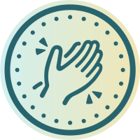
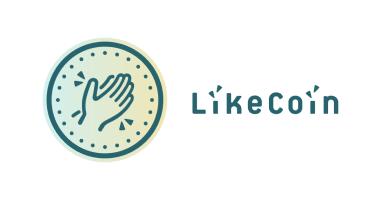
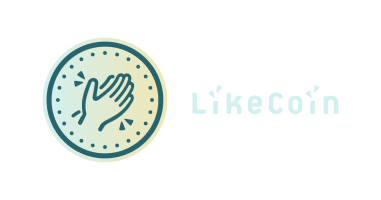
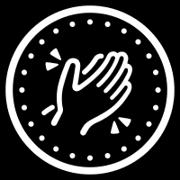
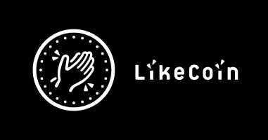
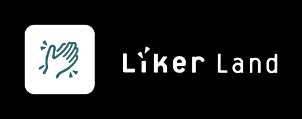
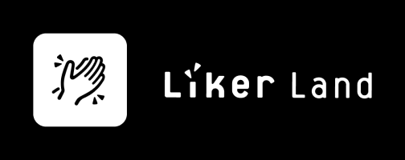
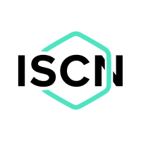

# Branding


* All logos file are in RGB mode . For CMYK / Pantone please refer to the [color library](https://www.notion.so/Color-Library-445246d594cb4d0ab0d4b74a0eead343).
* License: CC BY


## Identity of LikeCoin

### The LikeCoin





### Coin with Logotype (on light Background)





### Coin with logotype (on dark background)





### The LikeCoin (mono on light Background)





### The LikeCoin (mono on dark Background)





### Coin with Logotype (mono on light Background)





### Coin with Logotype (on dark background)





## Identity of Liker Land

### Liker Land (on light background)





### Liker Land (on dark background)





### Liker Land Icon





### Liker Land (mono on light background)





### Liker Land (mono on dark background)





## Identity of ISCN

### ISCN





### ISCN (colors on dark background)





### ISCN (mono on dark background)





### ISCN (mono on light background)





