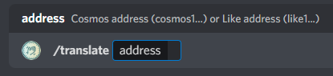

# #translate-wallet-prefix

LikeCoin chain was successfully upgraded to the LaiChiKok version on May 4, 2022. The new LikeCoin wallet address has the prefix "like1" and it also supports the "cosmos1" prefix. On the #translate-wallet-prefix channel, users can check their old and new wallet prefix address bilaterally to review their old records.

1\. Enter the #translate-wallet-prefix channel. If you cannot see the channel please go to the #verify channel and get started.

2\. Type "/translate cosmo1sxxxxxx" to get the new address. Or vice versa, to get the corresponding old address by entering "/translate like1xxxxxx".

