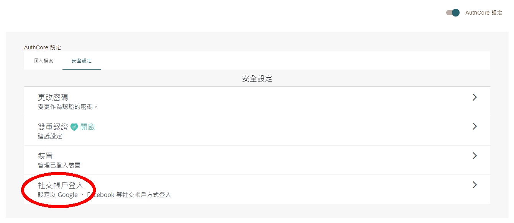
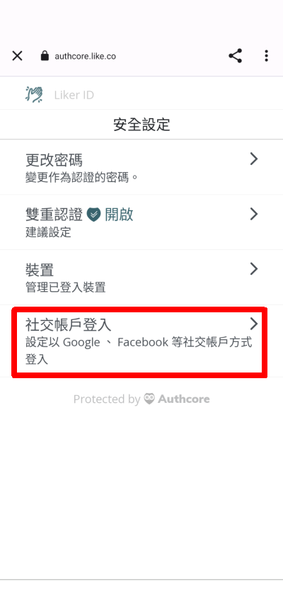
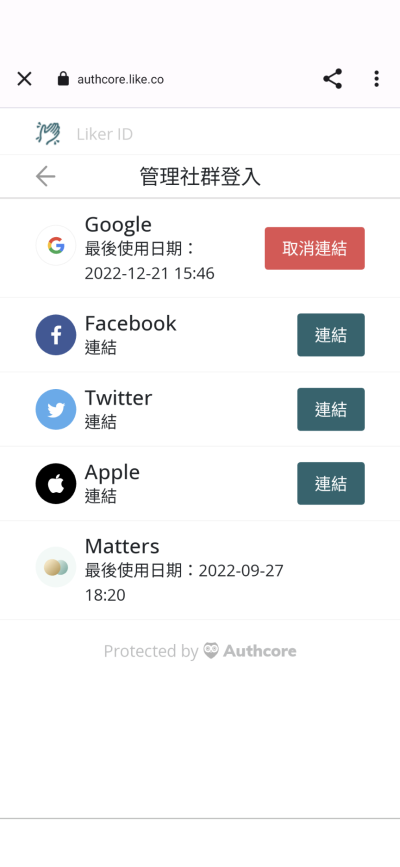

# 綁定社交帳戶




以下內容只適用於[以電郵或社交登入 ( Authcore ) 註冊的 Liker ID](../../../depub/register/)。


## 為什麼要綁定社交帳戶

把 Liker ID 綁定社交帳戶有兩個好處：

1. 登入時可用你慣用的社交媒體帳戶，不用輸入電郵地址及密碼。
2. 保障你的 Liker ID。當一個登入方法出問題時，例如忘了密碼，或出現個別的平台帳戶問題，仍可以用其他帳戶的身份登入。

## 綁定方法（除 Matters 外）

### 網頁版

到 [Liker Land](https://liker.land/) 網站右上角點「登入」。

<figure><figcaption>
點「登入」
</figcaption></figure>

點 Email/Social 使用 Liker ID 以電郵/社交登入。

<figure><figcaption>
點 Email/Social 使用 Liker ID 以電郵/社交登入
</figcaption></figure>

登入後點右上角頭像，點「設定」再點「Liker ID」。&#x20;

<figure><figcaption>
點「設定」再點「Liker ID」
</figcaption></figure>

打開右上角「Authcore 設定」。

<figure><figcaption>
打開「Authcore 設定」
</figcaption></figure>

點「安全設定」及「社交帳戶登入」。

點希望綁定的社交媒體帳戶（除 Matters 外），然後按照屏幕指示登入該平台的帳戶。

 (2).png>)

### 手機版

於 [LikeCoin 手機應用程式](../liker-land/download.md)選畫面右下角設定點「安全」，再點「社交帳戶登入」。

<figure><figcaption>
點「社交帳戶登入」
</figcaption></figure>

點希望綁定的社交媒體帳戶（除 Matters 外），然後按照屏幕指示登入該平台的帳戶。

<figure><figcaption>
點社交媒體帳戶綁定
</figcaption></figure>

## 如何綁定 Matters 帳戶 

用戶需要在 Matters 網站內設置綁定：

1. 請登入 [Matters.town](https://matters.town/)
2. 點擊左手邊「我的」，從菜單中選「設定」
3. 在「錢包設定」部份，選 Liker ID
4. 按畫面指示登入並綁定 Liker ID

#### 更多詳盡介紹


[matters.md](../creator/matters.md)



一旦綁定 Matters ID 跟 Liker ID，便無法解綁。敬請留意。

