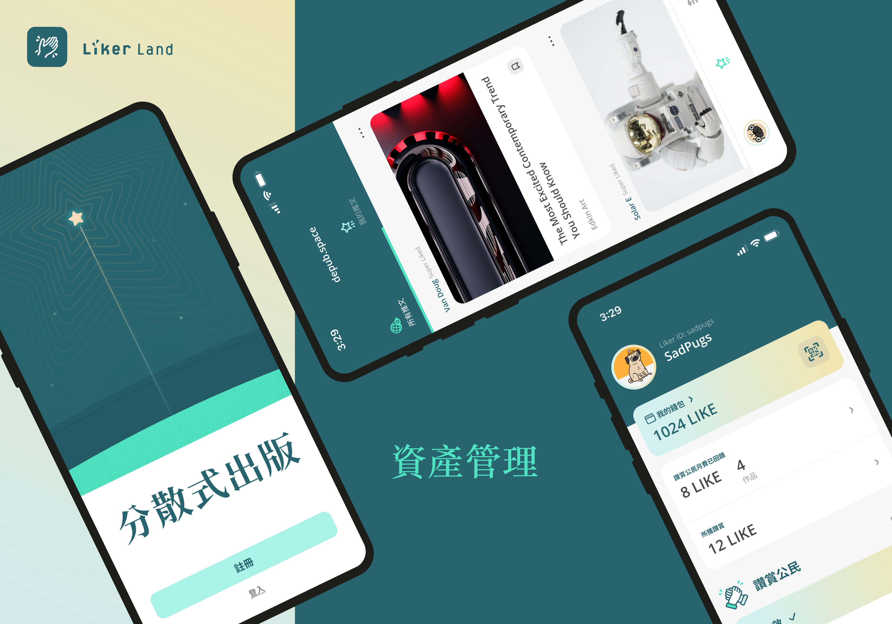

# 下載 LikeCoin app



* 在 [Google Play](https://play.google.com/store/apps/details?id=com.oice) 和 [App Store](https://apps.apple.com/hk/app/liker-land/id1248232355) 即可下載
* 中國大陸，或者其他沒有 Google Play 的 Android 用戶，可於 [GitHub 直接下載 apk 檔](https://github.com/likecoin/likecoin-app/releases)
* [下載 LikeCoin app](https://liker.land/getapp) 後，請花兩分鐘註冊 Liker ID：


[liker-id](../liker-id/)


登入 LikeCoin 手機應用程式於下方出現其他操作選項。

## 選項一：錢包功能

<figure><figcaption>
錢包功能
</figcaption></figure>

* [LIKE Pay](../../wallet/like-pay.md)
* [委託 LikeCoin](../../stake/delegation-of-likecoin/)
* [成為讚賞公民](../civic-liker/be-a-civic-liker.md)

## 選項二：設定

<figure><figcaption>
設定
</figcaption></figure>

* 語言
* [個人資料設定](../../../depub/register/edit-avatar-displayname.md)
* 安全：[更改密碼](../../../depub/register/reset-password.md)、[雙重認證](../../../depub/register/verifying-email-address.md)、[裝置](../../../depub/register/devices.md)、[社交帳戶登入](../liker-id/social-media-logins.md)
* Wallect Connect
* [匯出錢包助記詞](../../../depub/register/export-seed-words.md)
* 閱讀列表
* [推文](superlike.md)
