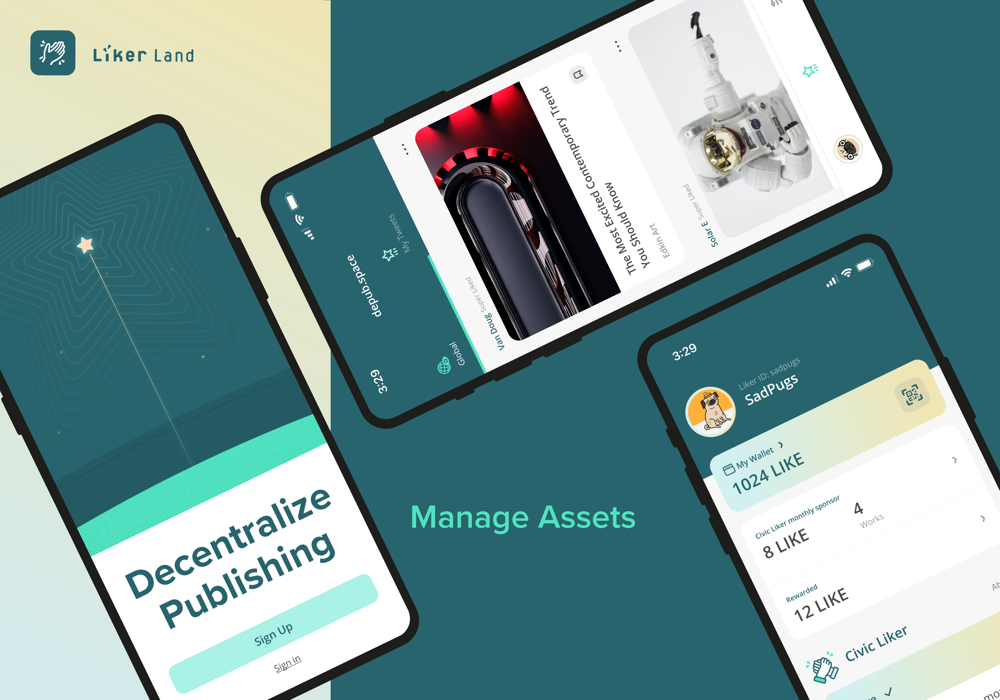

# Download LikeCoin app

* Download LikeCoin app from [Google Play](https://play.google.com/store/apps/details?id=com.oice) or [App Store](https://apps.apple.com/hk/app/liker-land/id1248232355)
* For users in China or Android devices without Google Play, you can download the [APK on GitHub](https://github.com/likecoin/likecoin-app/releases)
* [Once you have download LikeCoin app](https://liker.land/getapp), please proceed to register a Liker ID.


[liker-id](../liker-id/)


Log in to the LikeCoin app and you can find the following:

## Option 1: Wallet

<figure><figcaption>
Wallet
</figcaption></figure>

* [LIKE Pay](../../wallet/like-pay.md)
* [Delegate LikeCoin](../../stake/)
* [Civic Liker](../civic-liker/)

## Option 2: Settings

<figure><figcaption>
Settings
</figcaption></figure>

* Language
* [Profile](../../../depub/register/edit-avatar-displayname.md)
* Security: [Change Password](../../../depub/register/reset-password.md), [2FA](../../../depub/register/verifying-email-address.md), [Devices](../../../depub/register/devices.md), [Social Account Login](../liker-id/social-media-logins.md)
* Wallet Connect
* [Export Seed Words](../../../depub/register/export-seed-words.md)
* Bookmarks
* [Tweets](superlike.md)
