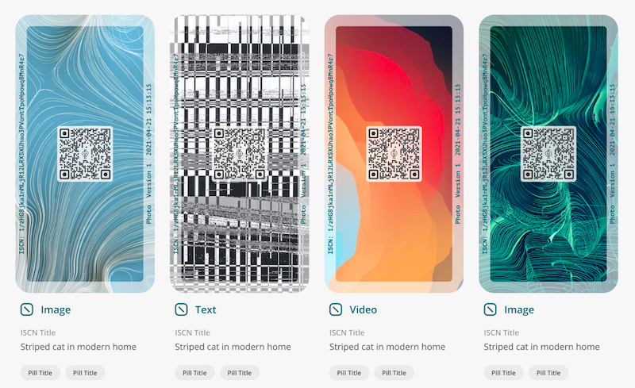

# 如何註冊 ISCN

用戶可經 [app.like.co](https://app.like.co/) 為每個內容註冊 ISCN，系統將基於 ISCN ID 隨機生成一幅獨一無異的美術圖卡。就算兩筆 ISCN 記錄只差之毫釐，ISCN 圖卡的圖案也會完全不同！

註冊 ISCN 到 LikeCoin chain 的同時，系統也會把內容上傳到 [IPFS](https://ipfs.io/) + [Arweave](https://www.arweave.org/) 及/或 [Numbers Protocol](https://www.numbersprotocol.io/)。用戶只需付出少量 LikeCoin 以支付註冊及寄存的費用。

用戶也可在 app.like.co 查看每一筆 ISCN 記錄的詳細內容。

用戶可使用 [app.like.co](https://app.like.co/) 嘗試註冊自己的 ISCN。

## 步驟一：登入 app.like.co

桌面電腦瀏覽器直接進入 [app.like.co](https://app.like.co/) 點右上角「Connect Wallet」或直接點「Register ISCN」。

<figure><figcaption>
在 app.like.co 點右上角「Connect Wallet」或直接點「Register ISCN」
</figcaption></figure>

以 [Keplr](../wallet/keplr/)、[Cosmostation](../wallet/cosmostation/)、[Cosmostation app](../wallet/cosmostation-mobile/) 或 [Liker ID](../../user-guide/liker-land/download.md) 任何一種方式連結並登入網站。

<figure><figcaption>
以 Keplr、Cosmostation、Cosmostation app 或 Liker ID 任何一種方式連結並登入 app.like.co
</figcaption></figure>

### **登入方式 1：Keplr**

請於瀏覽器登入 [Keplr 瀏覽器擴充功能 ( Keplr Browser Extension )](../wallet/keplr/)，點「Keplr」後彈出視窗要求連結，點「Approve」。

<figure><figcaption>
在 Keplr 點「Approve」
</figcaption></figure>

### **登入方式 2**：Cosmostation

請於瀏覽器登入 [Cosmotation 瀏覽器擴充功能 ( Cosmostation Browser Extension )](../wallet/cosmostation/)，點「Cosmostation」後彈出視窗要求連結，點「Confirm」。

<figure><figcaption>
在 Cosmostation 點「Confirm」
</figcaption></figure>

### **登入方式 3**：Cosmostation app

點「Cosmostation app」後出現二維碼。

<figure><figcaption>
點 Cosmostation app 後出現二維碼
</figcaption></figure>

在 [Cosmostation 手機錢包](../wallet/cosmostation-mobile/)點「Wallet Connect」調用鏡頭，並掃瞄二維碼。

<figure><figcaption>
打開 Cosmostation app 點 Wallet Connect 掃瞄二維碼
</figcaption></figure>

輸入 PIN 碼確認。

<figure><figcaption>
PIN 碼認證
</figcaption></figure>

點「OK」確認連結。

<figure><figcaption>
點「OK」確認連結
</figcaption></figure>

成功連結。

<figure><figcaption>
成功連結 app.like.co
</figcaption></figure>

### 登入方式 4：Liker ID

點「Liker ID」後出現二維碼。

<figure><figcaption>
點 Liker ID 後出現二維碼
</figcaption></figure>

在 [Liker Land 手機應用程式](../../user-guide/liker-land/download.md)點二維碼圖示調用鏡頭，並掃瞄二維碼。

<figure><figcaption>
在 Liker Land app 調用鏡頭，掃瞄二維碼
</figcaption></figure>

彈出 ISCN 視窗，點「允許」。

<figure><figcaption>
彈出 ISCN 視窗，點「允許」
</figcaption></figure>

完成連結後右上角顯示你的錢包地址，點「Register ISCN」開始註冊。

<figure><figcaption>
成功連結 app.like.co 並顯示錢包地址
</figcaption></figure>

## 步驟二：上傳或不上傳內容

### 上傳內容

點「Select a file」上傳檔案，例如相片或影片等，又或者直接把檔案拖拉到中間的位置。假如你已將檔案上傳，你也可以選擇「Skip Upload」不上傳檔案。

<figure><figcaption>
點「Select a file」上傳檔案或「Skip Upload」不上傳檔案
</figcaption></figure>

上載完成後，可點「View File Info」查看檔案的屬性和狀態，例如相片的 EXIF 元資料包括拍照時的位置及相機配置等。確認無誤後再點「Start Upload」。

<figure><figcaption>
點「View File Info」查看檔案的屬性和狀態再點再點「Start Upload」
</figcaption></figure>

<figure><figcaption>
點「View File Info」查看檔案的屬性和狀態
</figcaption></figure>

### 不上傳內容

輸入已有的內容指紋 ( content fingerprint )。

<figure><figcaption>
輸入已有的內容指紋 ( content fingerprint )
</figcaption></figure>

## 步驟三：填寫元資料

填寫關於此項內容的元資料：

* Register your asset in Numbers Protocol－勾選它可將內容一拼傳送到 Numbers Protocol（不適用於不需上傳內容的作品）
* ISCN Title－ISCN 標題
* Description－內容描述
* Author－點它填寫更多內容，並可加入多於一名創作者
  * Name－創作者名字
  * Liker ID－創作者的 Liker ID
  * Description－創作者簡介
  * URL－創作者網站
  * Wallet Address－創作者的錢包地址
* Tags－關鍵字，幫助人們搜尋你的內容
* URL－該內容的網址
* License－內容授權，不妨參考共享創意的授權條款

<figure><figcaption>
填寫元資料
</figcaption></figure>

<figure><figcaption>
填寫創作者資料
</figcaption></figure>

雖然很多欄目也不是必填，但建議盡量填寫讓別人可容易發堀你的內容。系統會估算這次註冊所需的費用，點「Register」繼續。

## 步驟四：簽署並獲取 ISCN

要成功註冊 ISCN 需簽署兩次，分別為：

Sign (1/2) Please sign to upload to Arweave

<figure><figcaption>
Sign (1/2) Please sign to upload to Arweave
</figcaption></figure>

Sign (2/2) Please sign to register ISCN record

<figure><figcaption>
Sign (2/2) Please sign to register ISCN record
</figcaption></figure>

請依照不同的登入方式進行簽署：

#### 使用 Keplr 登入

彈出 Keplr 視窗，點「Approve」。

<figure><figcaption>
彈出 Keplr 視窗，點「Approve」
</figcaption></figure>

#### 使用 Cosmostation 登入 

彈出 Cosmostation 視窗，點「Confirm」。

<figure><figcaption>
彈出 Cosmostation 視窗，點「Confirm」
</figcaption></figure>

#### 使用 Cosmostation app 登入

彈出 Request Transaction Sign 視窗，點「Confirm」。

<figure><figcaption>
Cosmostation app 彈出 Request Transaction Sign 視窗，點「Confirm」
</figcaption></figure>

#### 使用 Liker ID 登入

彈出簽名請求視窗，點「允許」。

<figure><figcaption>
Liker Land app 彈出簽名請求視窗，點「允許」
</figcaption></figure>

出版到區塊鏈過程只需數秒。


獨有的作品指紋 ISCN 立即面世。

<figure><figcaption>
成功註冊 ISCN
</figcaption></figure>

點「[My Publishing](https://app.like.co/works)」顯示所有你普經註冊 ISCN 的項目。

<figure><figcaption>
點「My Publishing」查看所有 ISCN
</figcaption></figure>

點項目出現已註冊的元資料內容明細。

<figure><figcaption>
ISCN 詳盡資料
</figcaption></figure>

## 在 Matters 註冊 ISCN

撰文時在右下角的「作品管理」選擇「註冊 ISCN」，即可於發佈文章時一拼註冊 ISCN。

已註冊的 ISCN 可於「[My Publishing](https://app.like.co/works)」查看。

<figure><figcaption>
在 Matters 註冊 ISCN
</figcaption></figure>

## 出版 Writing NFT

註冊 ISCN 後，用戶可以把它[出版成 Writing NFT](app.like.co.md#chu-ban-writing-nft)。&#x20;
