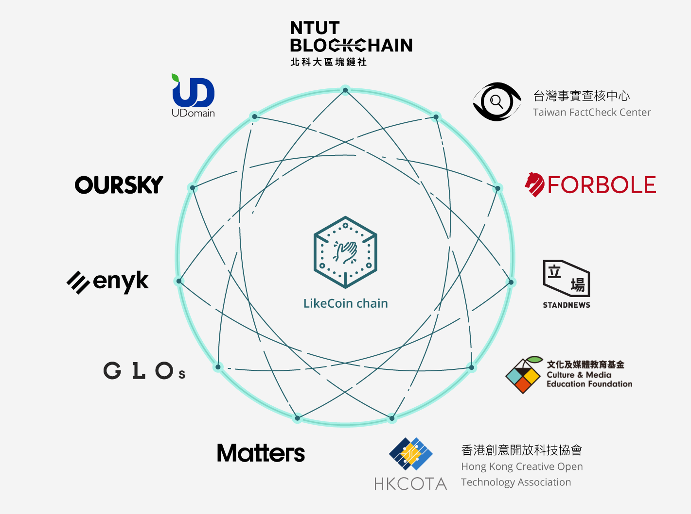

# 社群治理會議

## 會議場地：[http://discord.gg/likecoin](http://discord.gg/likecoin)

## 如何參與


[community-call.md](../community/community-call.md)


## 把會議加入你的行事曆：[https://bit.ly/3c5DaTH](https://bit.ly/3c5DaTH)

## 有問題嗎？請參與 [Discord](http://discord.gg/likecoin) 頻道尋求幫助。

## 常規會議 

[LikeCoin](https://like.co/) 社群會議於每月首個星期一東八時區 1830 線上舉行，主要使用英語。

## 2025 日期及議程

<table><thead><tr><th width="169">日期</th><th>描述</th></tr></thead><tbody><tr><td>星期一，4月7日</td><td>Get updates from the builders. Covering products updates and community news.</td></tr><tr><td>星期一，3月3日</td><td>Seamless Migration Ahead: Unveiling the New UI Design</td></tr><tr><td>星期一，2月3日</td><td>LikeCoin 3.0 Migration Strategy with Updated Timeline and Testing Plan</td></tr><tr><td>星期一，1月6日</td><td>Key Points and Progress of LikeCoin 3.0 Migration Plan</td></tr></tbody></table>

## 2024 日期及議程

<table><thead><tr><th width="172">日期</th><th>描述</th></tr></thead><tbody><tr><td>星期一，12月2日</td><td>Year-End Recap: December Monthly Call Highlights for LikeCoin 3.0</td></tr><tr><td>星期一，11月4日</td><td>Liker Land’s New Books and Tech Upgrades, Plan of LikeCoin’s Migration to Optimism</td></tr><tr><td>星期一，10月7日</td><td>Proposal 85: Migrating LikeCoin to Ethereum OP Mainnet and Explaining the Process</td></tr><tr><td>星期一，9月5日</td><td>Liker Land;s Unique Niche in Hong Kong Publisher Books, Book Sales Surge in August</td></tr><tr><td>星期一，8月5日</td><td>High-Profile Philosophy Book by Hong Kong Influencer Hits Liker Land and Busy July Recap</td></tr><tr><td>星期一，7月1日</td><td>Navigating the Future with LikeCoin 3.0 Green Paper</td></tr><tr><td>星期一，6月3日</td><td>Community Call to Action: Participate in LikeCoin’s Evolution</td></tr><tr><td>星期一，5月6日</td><td>Enhancements in Liker Land: Chain Upgrade, Revamped Homepage and NFT eBook Claim Flow</td></tr><tr><td>星期一，4月1日</td><td>New Physical Bookstore Partnerships, NFT eBooks Tipping Feature and Successful Offline Meetup</td></tr><tr><td>星期一，3月4日</td><td>ISCN Development Progress, Exciting Book Releases and Offline Events in Taipei</td></tr><tr><td>星期一，2月5日</td><td>Expanding Horizons: New Book Listings, Enhanced Functionalities, and Broadened Engagement of Liker Land BookStore</td></tr><tr><td>星期一，1月8日</td><td>Fresh off 2024, Reviews technical tasks and unveils new book titles</td></tr></tbody></table>

## 2023 日期及議程

<table><thead><tr><th width="175">日期</th><th>描述</th></tr></thead><tbody><tr><td>星期一，12月4日</td><td>LikeCoin chan upgrade, significant enhancements on NFT Book Press and bookstores collaboration</td></tr><tr><td>星期一，11月6日</td><td>Enriching Liker Land with Project Gutenberg’s Literary Treasures</td></tr><tr><td>星期一，10月2日</td><td>Liker Land Writing NFT Free Mint, NFT Book Store Advancement, and LikeCoin Tokenomics</td></tr><tr><td>星期一，9月4日</td><td>Discover the Impressive New Features of Keplr 2.0</td></tr><tr><td>星期一，8月7日</td><td>Stripe payment is live and new books on the shelf</td></tr><tr><td>星期一，7月3日</td><td>Streamlined experience of LikeCoin chain with Keplr and Stripe</td></tr><tr><td>星期一，6月5日</td><td>LikeCoin chain Chungking upgrade and Keplr native support</td></tr><tr><td>星期一，5月1日</td><td>Get updates from the builders. Covering products updates and community news.</td></tr><tr><td>星期一，4月3日</td><td>Three NFT Book projects coming ahead</td></tr><tr><td>星期一，3月6日</td><td>Latest updates and features on Web3Press and Liker Land.</td></tr><tr><td>星期一，2月6日</td><td>Partnership and Products updates</td></tr><tr><td>星期一，1月9日</td><td>Ecosystem and Writing NFT updates</td></tr></tbody></table>

## 會議時間

<table><thead><tr><th width="150">地區</th><th width="150">當地時間</th><th width="150">時區</th><th>UTC 偏移</th></tr></thead><tbody><tr><td>香港</td><td>18:30:00</td><td>UTC+8</td><td>UTC+8</td></tr><tr><td>台北</td><td>18:30:00</td><td>CST</td><td>UTC+8</td></tr><tr><td>洛杉磯</td><td>03:00:00</td><td>PDT</td><td>UTC-7</td></tr><tr><td>紐約</td><td>06:00:00</td><td>EDT</td><td>UTC-4</td></tr><tr><td>倫敦</td><td>11:00:00</td><td>BST</td><td>UTC+1</td></tr><tr><td>多倫多</td><td>06:00:00</td><td>EDT</td><td>UTC-4</td></tr></tbody></table>

## 會議記錄 

[Community Call](https://blog.like.co/en/tag/community-call/)
