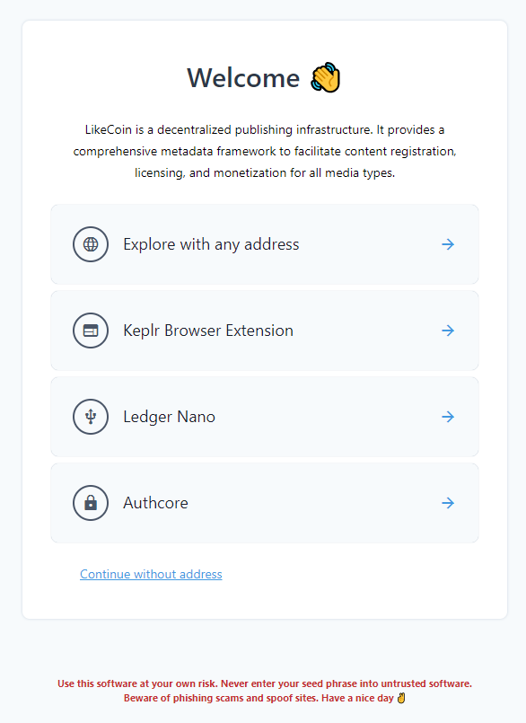
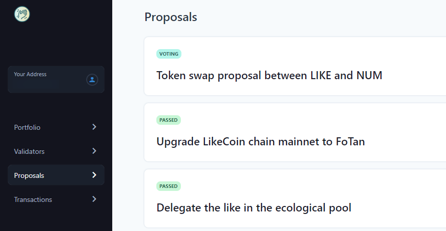
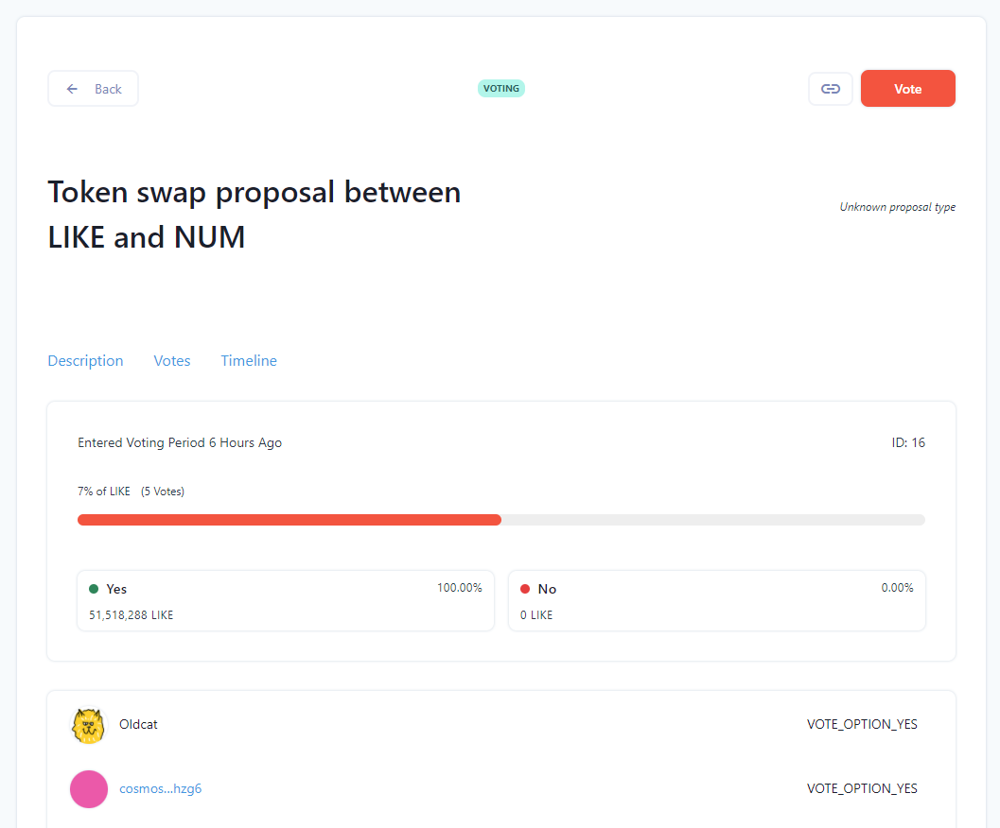
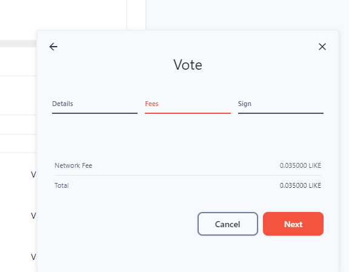
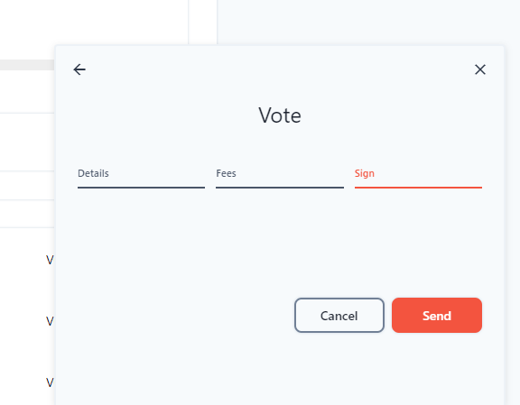
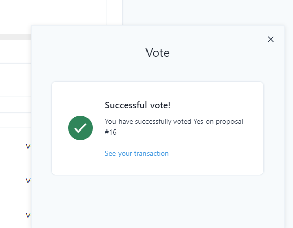
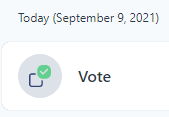

# Direct Voting

Since the LikeCoin chain upgraded to FoTan, Likers who delegate LikeCoin to validators can directly vote on proposals.

In the past validators represented likers to vote, but now you can vote for yourself. For example if your validator votes for "No", you can vote "Yes" based on the stake that you have. But if you do not cast your vote, your trusted validator is still representing you to vote.

## How to direct vote on proposal

### Step 1: Delegate LikeCoin

Before voting please delegate your LikeCoin to any one of the validators.



### Step 2. Login stake.like.co

Go to [stake.like.co](https://stake.like.co/welcome) and choose [Keplr Browser Extension](../../user-guide/liker-id/register-with-keplr.md), [Ledger Nano](../wallet/hardware-wallet.md) or [Authcore](../../user-guide/liker-id/register.md) to login.

### 
Step 3. Select the proposal to vote

Go to the left hand side menu and select "Proposal", click on the proposal which is on voting period.

### 
Step 4. Proposal detail page

The proposal page listed out the proposal content, current votes, etc. Only validators wil have a thumbnail when they vote.

### Step 5. Start voting

Click on the "Vote" on the top right hand corner, and the lower right hand corner will show choices of Yes, No, No with Veto and Abstain. Select one of the choices and click "Next".


Transaction fee is required, check it out and agree with "Next".


Confirmation is required. Authcore users directly click "Send", Keplr Browser Extension and Ledger Nano will need to accept a pop-up box or press a button to confirm it.


The vote has been casted, please wait for the transaction to finish.

Voting success.

### 
Step 6. Check voting record

Go to the left hand side menu and select "Transactions" and check out your past voting record.


If the stakeholder votes for a proposal for more than once, the last vote choice will be counted.


