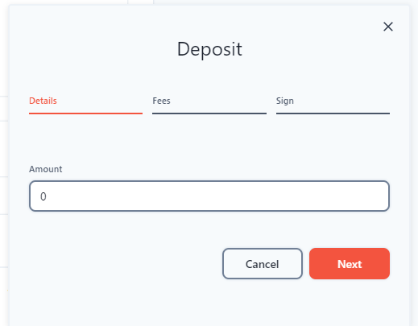
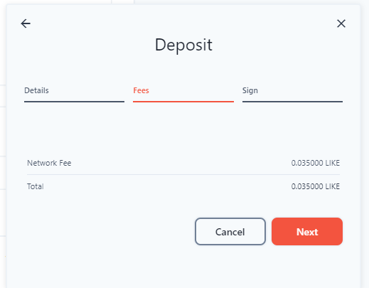
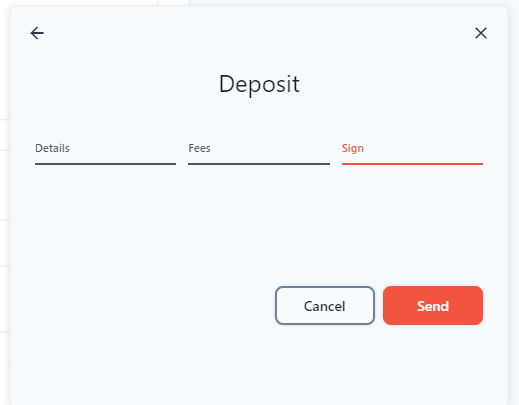
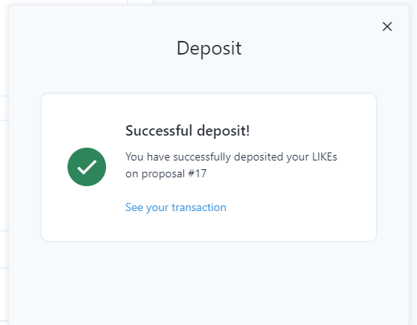
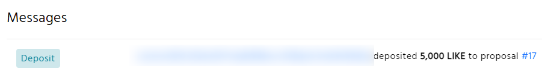

# Proposal Deposit

Since the [FoTan](https://cloudflare-ipfs.com/ipfs/Qmb7AYNsbRJ95dWXCYCkUbpypAVfuxMZwB1D8wFHfwrLyc/) upgrade, likers can directly deposit the likecoin required to click start proposal voting.&#x20;

Any validator can raise a proposal. In order to have a proposal to enter the voting period, 100k LikeCoin has to be deposited within 2 weeks. The deposit may come from other validators and Likers.

In case the proposal fails to get 100k LikeCoin deposit in 2-week time, the proposal will be abandoned and the deposit will be forfeit and go to the Community Pool. The usage of the pool is determined by further proposals.

Please note, if the proposal fails to achieve quorum, or gets more than 1/3 voting power as veto, then the proposal will be turned down and the deposited LikeCoin will be expropriated to the Community Pool; else the deposit will be transferred back to the owners.

There are multiple ways to deposit for a proposal, we suggest using [dao.like.co](https://dao.like.co/welcome) together with [Keplr Browser Extension](../wallet/keplr/), [Cosmostation Browser Extension](../wallet/cosmostation/) or [Authcore](../../user-guide/liker-id/register/) . You may also want to use:

* Omniflix: [https://likecoin.omniflix.co/](https://likecoin.omniflix.co/)
* BitSong: [https://wallet.bitsong.io/](https://wallet.bitsong.io/)
* Ping.Pub: [https://ping.pub/likecoin/](https://ping.pub/likecoin/)


How to deposit LikeCoin for a proposal&#x20;
--------------------------------------------

### Step 1: Login dao.like.co

Go to [dao.like.co](https://dao.like.co/) and choose [Keplr Browser Extension](../../user-guide/liker-id/register-with-keplr.md), [Cosmostation Browser Extension](../wallet/cosmostation/) or [Authcore](../../user-guide/liker-id/register/) to login.

### &#xD;&#xD;Step 2: Select the proposal to deposit

Go to the left hand side menu and select "Proposal", click on the proposal which is on deposit period.

### &#xD;Step 3: Proposal detail page

The proposal page outlined the proposal content, click "Deposit".

### Step 4: Deposit your LikeCoin to a proposal

Input the amount that you would like to deposit for the proposal.


Transaction fee is required, check it out and agree with "Next".



Confirmation is required. Keplr and Cosmostation users will need to approve a pop-up box to confirm the deposit after clicking "Send". Authcore users directly click "Send".



The deposit is on it's way, please wait for the transaction to finish.

Successful deposit for a proposal!

### &#xD;Step 5: Check deposit record

Go to the left hand side menu and select "Transactions" and check out your deposit record.


If the proposal passed or rejected not because the proposal fails to achieve quorum or gets more than 1/3 voting power as veto, the deposit will be transfer back to the likers.

