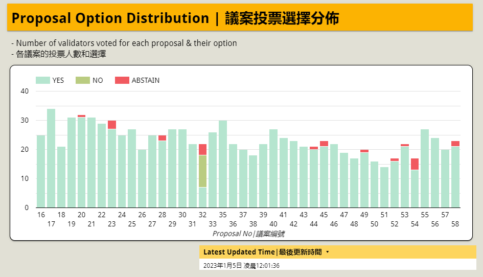

# Validator Reports

User @baoshin developed a [LikeCoin Validator Reports](https://datastudio.google.com/u/0/reporting/030ee2ed-d8b5-4cda-93fd-acdc4f346561/page/p\_pbb9skc0rc?s=kHOl5P2N7i0) that includes validators’ voting rate, voting options in every proposal, stake quantity of validators, etc. A great tool for analyzing LikeCoin governance status.

<figure><figcaption></figcaption></figure>

#### Read More

[【小程序】看看你的驗證人有沒有好好投票？進階版？](https://matters.news/@baoshin/239800)
