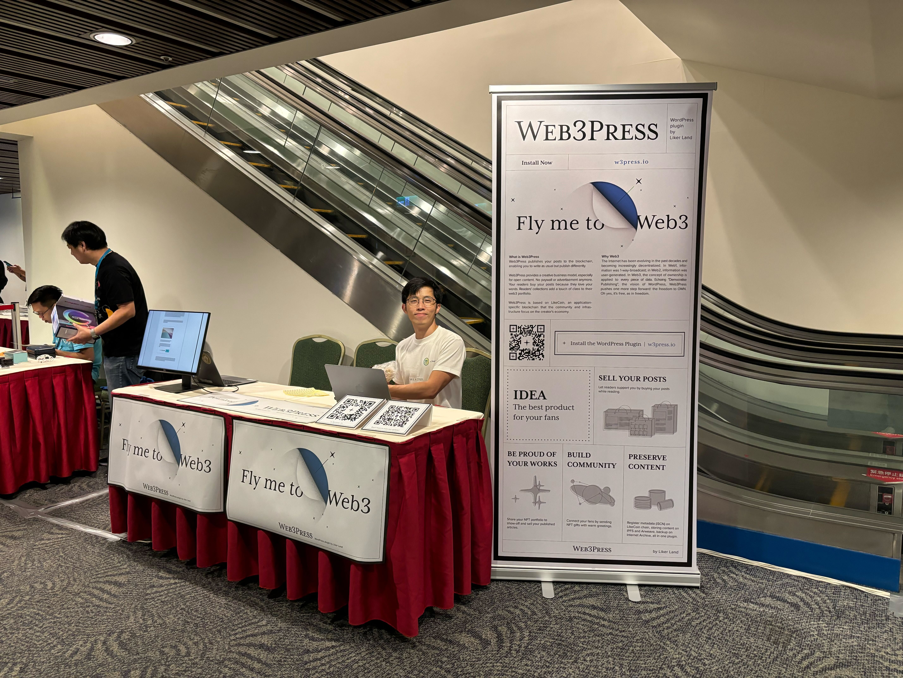
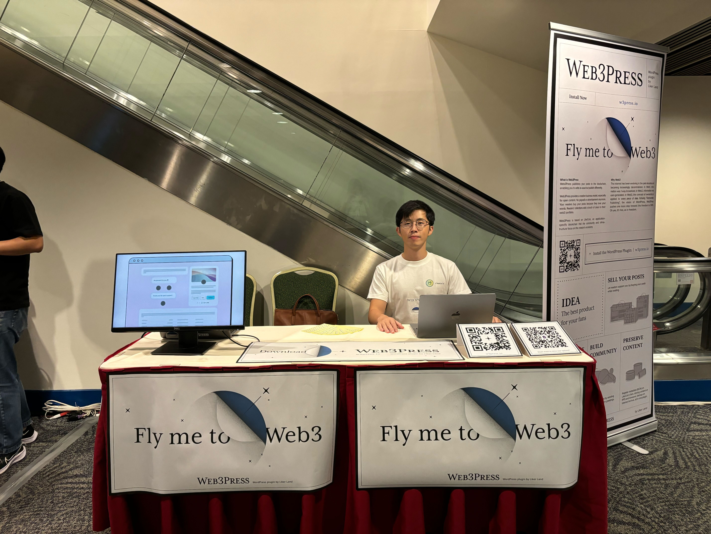
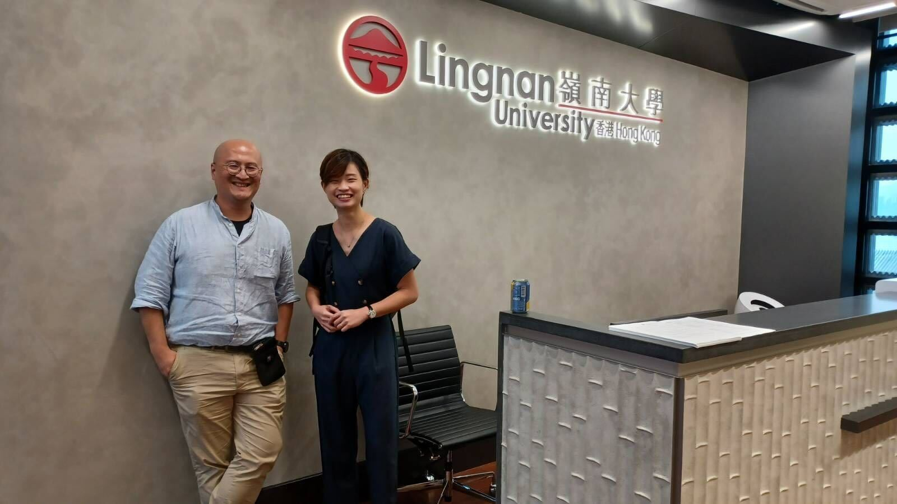
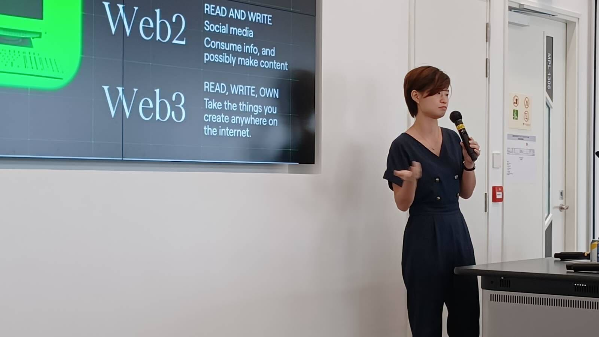
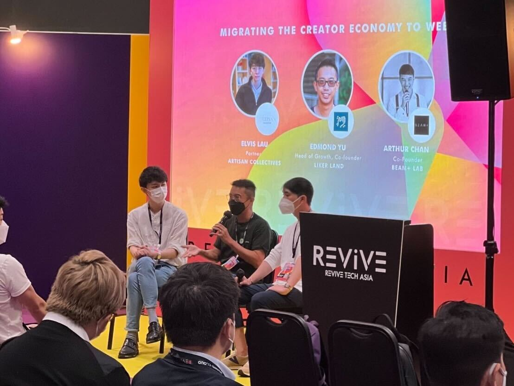

# Activites and Events



### 11/18 WordCamp Hong Kong 2023

[5年後還是新手 – WordPress Plugin開發大冒險](https://hongkong.wordcamp.org/2023/session/5%E5%B9%B4%E5%BE%8C%E9%82%84%E6%98%AF%E6%96%B0%E6%89%8B-wordpress-plugin%E9%96%8B%E7%99%BC%E5%A4%A7%E5%86%92%E9%9A%AA/)

### 11/6-7 HK Web3 Month Conference

[Sovereignty Blockchain: Abstracting Complexity for Seamless Building Experience for Consumer Products](https://www.hkweb3month.com/agenda)

[Speaker](https://twitter.com/HKWeb3Month/status/1716392722553348269)

### 11/02 RSS3 HKFINTECH Week Web3 Night

[HKFINTECH Week Web3 Night](https://lu.ma/qzdacuwm)

[Community Partner](https://twitter.com/rss3\_/status/1720387481978507317)

### 10/14 WordCamp Taiwan 2023

[Booth](https://taiwan.wordcamp.org/2023/sponsors/)

<figure><figcaption></figcaption></figure>

 

<figure><figcaption></figcaption></figure>

### 10/04 Lingnan University

[Guest Speaker of Digital Creativity class in the Master of Cultural Studies program of Lingnan University](https://www.linkedin.com/posts/james-chong-452540139\_thank-you-phoebe-poon-for-being-a-guest-speaker-activity-7115669440381284353-3rXe/)

<figure><figcaption></figcaption></figure>

 

<figure><figcaption></figcaption></figure>

### 09/14-15 留下書舍 Have A Nice Stay

[分散式出版工作坊](https://www.facebook.com/hans.bookstorehk/posts/pfbid022yGoyUmj8rTEB6ZLMpMRZ18eeerr9ds7FKX4K7XSDzZdc7MuSzVS4Sp1qmmZBuMal)

### 07/29 COSCUP 2023

[分散式出版面對的三道圍牆](https://coscup.org/2023/zh-TW/session/ZHVR7V)

### 06/09 Hong Kong Open Source Conference 2023

[分散式出版面對的三道圍牆](https://hkoscon.org/2023/topics/fensanshichubanmianduidesandaoweiqiang)

### 05/27 WordPress 20 週年慶典

[我使用的 6 個 WordPress 外掛 By Kin Ko (廣東話 Cantonese)](https://www.meetup.com/hong-kong-wordpress-meetup/events/293095406/)

[Photos](https://twitter.com/daisymarisfung/status/1662296857098489857)

### 05/09 飛地 nowhere

[【5月9日 #線上對談】顛覆遊戲規則 ♠️](https://www.facebook.com/nowherebookstore/posts/pfbid02R2gPy3z8w95Y1GX2xZq4MEFM1tKs7EHcifm8obV3vTxnVESRjEjVJTQ6uysS2LEXl)

[Video](https://www.youtube.com/watch?v=O0FtTFIyxIE)

### 05/04-05 留下書舍 Have A Nice Stay

[分散式出版工作坊](https://www.facebook.com/hans.bookstorehk/posts/pfbid02qevrrJmcK4CN5TCAEiWPk4gU4T6ZPtSXg6uFkrgxpbWgq4QxzbVgSc9EC9UYUV9Ml)

### 04/18 LikeCoin Discord

[《崩潰與重建：ChatGPT 衝擊下的人類未來》新書分享會](https://blog.like.co/zh/%E3%80%8A%E5%B4%A9%E6%BD%B0%E8%88%87%E9%87%8D%E5%BB%BA%EF%BC%9Achatgpt-%E8%A1%9D%E6%93%8A%E4%B8%8B%E7%9A%84%E4%BA%BA%E9%A1%9E%E6%9C%AA%E4%BE%86%E3%80%8B%E6%96%B0%E6%9B%B8%E5%88%86%E4%BA%AB%E6%9C%83/)

### 04/16 Cosmos Interchain Session@Web3 Festival

[如何促進應用專有鏈採用，將 Web2 用戶引入 Web3](https://twitter.com/Bianjie\_Global/status/1647131551807729664)

[香港掀起跨链旋风！「 2023 香港 Web3 嘉年华-跨链专场」圆满落幕](https://zhuanlan.zhihu.com/p/622931361)

### 04/13 - Cosmos HK Meetup

[Learnings Building in Cosmos: Bridging Web2 Users to Web3](https://www.facebook.com/Liker.Land/posts/pfbid02kjyvqfoNw29XiZCu3oDQkiScfoNkqzKtjt85xMTSAhjxxDu4eFGjUK7ecqAR61sZl)

### 03/23 - FOMO Asia Genesis Conference in HKCEC

[Booth and Talk](https://www.facebook.com/Liker.Land/posts/pfbid0zRhqhEtQLD5HEqRs1n5Amh5APSzVMawjBz7LSqx6wkXLAaN7DaS5tyBybH3KZgVTl)

### 03/21 - FOMO Asia Genesis Conference in HKG DAO

[NFT for media, bloggers, or writers](https://www.facebook.com/Liker.Land/posts/pfbid0CyUtjohaaYVTabkAxKCYom69cDCAGarpzQoMQGFjdQKU65bMvATwf3kCCBPRoxu3l)

### 03/21，23 IATC(HK) - 國際演藝評論家協會(香港分會)

[購買和出版我的第一個 Writing NFT](https://www.facebook.com/Liker.Land/posts/pfbid0z5pzb7tKXZEuwbiYhHCZ19N3bgiohnxe9z6xDFbk13YCNmz3HspiPxtHTt1XDwqKl)

### 03/18 **HK Startup DAO**

[\[Web3商業入門\] 區塊鏈Web3社區的力量 - 香港創業島 HK Startup DAO 首次線下知識分享研討日](https://www.eventbrite.com/e/web3-web3-hk-startup-dao-tickets-575295092107)

[Twitter Post](https://twitter.com/0xDevAnt/status/1637005643038208000)

### 03/11 飛地nowhere

[科技與人文書寫——在AI語言與NFT物件的時代寫小說](https://www.facebook.com/nowherebookstore/posts/pfbid077cXvaNRuF7NuucioVGB3RZ6ZdY62EJ4U9pTbWfBpoBVd9RGy3fsvKqFmjThqnrHl)

### 03/01 LikeCoin Discord

[【創作者聊天室】leafwind 「創作即生活」](https://blog.like.co/zh/%E5%89%B5%E4%BD%9C%E8%80%85%E7%B6%93%E6%BF%9F-%E7%9C%9F%E8%AA%A0%E5%AF%AB%E4%BD%9C-%E5%BB%BA%E7%AB%8B%E5%93%81%E7%89%8C%E6%89%8D%E6%98%AF%E7%8E%8B%E9%81%93/)

### 02/17-19 WordCamp Asia 2023

[Booth](https://www.facebook.com/Liker.Land/posts/pfbid02MJ4WjVyJUAS3MpFnTGEP48W3ggTfZXVyeK4nKFnFDh659Wafg6mJMJfBpWk4E3Eal)

Talk:[ "How I make a living with Writing NFT on my WordPress blog"](https://l.facebook.com/l.php?u=https%3A%2F%2Fwww.youtube.com%2Flive%2FvrDwB7iuHL8%3Ffeature%3Dshare%26t%3D4872%26fbclid%3DIwAR3f4L\_aWcsB06P00eEla0cKM3BXX34EDhewTUB9vVfQXV272IcbW0HPNNU\&h=AT34Kt3\_Iek6mb8RyMzPB73KMx0M4xKawPKKSugNsCHDWjk8vS1NKuNvRe\_MAl-tYGs605cLQXUbfi2uJZpfLiWNDo5Xqe4\_F5lcz31VSDvoZcDVK9pphSKAsz3WZeLtPA&\_\_tn\_\_=-UK-R\&c\[0]=AT1LxEv3njjcGPc2O3tJVErCExaC8JU-9bvPLL4hsHihwpIqNF2Jo3ObDC-NPX-sDZg6K0keruJU-6bIGDIOVRw65aRge-KWcCn2XRxbo9BCAMdRkFEjW\_BIPiJv20111\_KsqIUey8ciGs-rSrWJBvnfWZ\_EywkVv9EdZqUMoT\_iUKKuEXdnsSVmOVj-YqTs2Oda98zCunFhBVcu8uDzbszMoWCCulltV0O9cJA)

### 02/13 IATC(HK) - 國際演藝評論家協會(香港分會)

[【散點與連線．網上講座（一）】 🌟認識NFT的幾個重要概念](https://www.facebook.com/iatchongkong/posts/pfbid0xAdhk8ZZJittgJi3UdgnfGamPjPP1WHcSNm5xpYnReHwvWZygBT4s4UR1wsCWKmil)

:end:



### 12/10 GDG Cloud Hong Kong DevFest 2022

[以區塊鏈實現分散式出版](https://www.facebook.com/groups/gdgcloudhk/posts/8653775811314333/)

[Video](https://youtu.be/Tux\_jC4uIF0?t=7418)

[Photos](https://l.facebook.com/l.php?u=https%3A%2F%2Fphotos.app.goo.gl%2FhPKx7ZssQ1BC3beR9%3Ffbclid%3DIwAR1ooJRo0OrHxBXpt1MHimyLbupYaWW4vrD8QIUioCin9Iba3hLFiypFk9U\&h=AT2f01X94kquGma7-8GLIr7U2NoLQha3Y5BY1x508U61sFqaVoqabDbmWQ1nSyX\_IP5AOj7s1TwMXhl4GWJVf2VwhY4Fuk\_snP-KhB8IhWuxtYzoTUS9rblFfZzDfBXIaw&\_\_tn\_\_=-UK-R\&c\[0]=AT16ToQkbvuZEKXZyLl058k0L4hFzzsPhtmR6FXXBci9XVb2BQNY9PUn4DdATWSiGU2J1F\_YjYeAySaAc4aPxKEf3Wx6iwklFJX9ty1zmeWhjzQJciWQbKVovW22bksTYbkP-TqOJCQcIycCnQWw5r2ibVY3YkFr4hSSMPg9AwU7TaKouZ6eeDqWFW1mVhQmG9Tgg-ohMJ0dUO52vyZGX7k)

### 11/25 序言書室

[《所謂「我不投資」，就是 all in 在法定貨幣》NFT 書發布會](https://www.facebook.com/Liker.Land/posts/pfbid0CfWinG55wm6vbgYM6iEF35MEYNebKLi2AmiJjPMtpJ148F6uTAsXBXeg7wR8getgl)

[Video](https://www.youtube.com/watch?v=Adw1f83rC4Q)

[逐字稿：《所謂「我不投資」，就是 all in 在法定貨幣》NFT 書發布會@序言書室（上）](https://matters.news/@daisy/351840-%E9%80%90%E5%AD%97%E7%A8%BF-%E6%89%80%E8%AC%82-%E6%88%91%E4%B8%8D%E6%8A%95%E8%B3%87-%E5%B0%B1%E6%98%AF-all-in-%E5%9C%A8%E6%B3%95%E5%AE%9A%E8%B2%A8%E5%B9%A3-nft-%E6%9B%B8%E7%99%BC%E5%B8%83%E6%9C%83-%E5%BA%8F%E8%A8%80%E6%9B%B8%E5%AE%A4-%E4%B8%8A-bafyreigdhevroyd4uf73vc25qp5knohx7tqgynsasbaabdtxvso7dhdpdy)

[逐字稿：《所謂「我不投資」，就是 all in 在法定貨幣》NFT 書發布會@序言書室（下）](https://matters.news/@daisy/351841-%E9%80%90%E5%AD%97%E7%A8%BF-%E6%89%80%E8%AC%82-%E6%88%91%E4%B8%8D%E6%8A%95%E8%B3%87-%E5%B0%B1%E6%98%AF-all-in-%E5%9C%A8%E6%B3%95%E5%AE%9A%E8%B2%A8%E5%B9%A3-nft-%E6%9B%B8%E7%99%BC%E5%B8%83%E6%9C%83-%E5%BA%8F%E8%A8%80%E6%9B%B8%E5%AE%A4-%E4%B8%8B-bafyreibtgczv63pfj3nlvgednfxdh7mb6aqgjosj6mcf3cyvu4dwtac4tq)

### 11/25 社企民間高峰會

[共益元宇宙：教育 x 藝術 x 科技](https://www.ses.org.hk/tc-sessions/metaversal-good-edu-x-art-x-tech)

### 11/23 FABDAO@飛地nowhere

[新書分享會 - 《所謂「我不投資」，就是 all in 在法定貨幣》](https://www.facebook.com/FABDAOtw/posts/pfbid0KqVdtDre6rtaRZjK8j3bQqaKBFfg2AG61rxMhNDi6VTyJftxCnxJkvbeBhYjFtRKl)

[Photos](https://www.facebook.com/mashbean/posts/pfbid0BZdDqhYvr7KgXfGpBZpUE7BGXUEu792ikamBK2bnxHJdDPuT1mLvPjpfhHfk5KWUl)

### 11/22 北科大區塊鏈研究社 NTUT Blockchain

[《所謂「我不投資」，就是 all in 在法定貨幣》分享會](https://www.facebook.com/NTUTBlockchain/posts/pfbid0Fs4WAbNBFBcHqVCh8d3ucnJJXwUDKSrAPKXZ8Wi1ToPRyGGroRr7zZRqoZMqgJwRl)

[Photos](https://www.facebook.com/NTUTBlockchain/posts/pfbid0hUeSTV2RrUsNFJjU54daHLAy4UMt3CJ4K4DtQWvP5ghBFgeiks7KQqLPwP49E2zNl)

### 11/16 LikeCoin Discord

[文字《角醒》，遍地開花](https://www.facebook.com/Liker.Land/posts/pfbid0341ugcxmu5YAR3pyVuRnbcp7AT4BnSLYZhDTkPzsRAGPE2jP1ojbDZzuhcGdb3Qptl)

### 11/15 FAB DAO Discord

[《所謂「我不投資」，就是 all in 在法定貨幣》 新書分享會](https://www.facebook.com/Liker.Land/posts/pfbid02vQvGHpo4AQLt1VgVCzFqqJUzHhviG9MEGGEzv9M4amoWs1MqsLkJxXf5UtAB2WzFl)

### 10/28 IPFS Camp 2022

[Keynote: Decentralization and Human Rights Showcase](https://2022.ipfs.camp/#Keynotes)

[IPFS Camp 2022 Recap](https://blog.ipfs.tech/2022-11-22-ipfs-camp-22-recap/)

[Video](https://www.youtube.com/watch?v=OxmndRBGuUM\&t=2918s)

[The Future of Decentralized Publishing - Phoebe Poon ( Video )](https://www.youtube.com/watch?v=wMVP1Gw0UzI\&list=PLuhRWgmPaHtQ2w6a7Y-n6PP9M\_8pCvIiq)

[Decentralization and Human Rights - Jonathan Dotan, Phoebe Poon, Xavi Vives](https://www.youtube.com/watch?v=0gbMYNEIVZ8\&list=PLuhRWgmPaHtTQlocvCwd0gamK3ZgdRX0\_\&index=5)

### 10/28 Matters Discord

[Web3 學習會：發布之外 — 以 NFT 為量詞的出版可能性](https://blog.like.co/zh/%E3%80%90matters-web3-%E7%B7%9A%E4%B8%8A%E5%AD%B8%E7%BF%92%E6%9C%83%E3%80%91%E7%99%BC%E5%B8%83%E4%B9%8B%E5%A4%96%EF%BC%9A%E4%BB%A5-nft-%E7%82%BA%E9%87%8F%E8%A9%9E%E7%9A%84%E5%87%BA%E7%89%88%E5%8F%AF/)

### 10/19 LikeCoin Discord

[【作者聊天室】台東人的慢靈魂](https://www.facebook.com/Liker.Land/posts/pfbid0ThRj5YT5RbLh2KfhHTxTtBPQAHTEzH4haZrv2zVHn9FM19zQPf1m6h3s3ZkF3qEDl)

### 10/1 ICT Expo

[HKUST](https://www.facebook.com/Liker.Land/posts/pfbid0kUGf6udTLuuZGc9WVoCL7ntykswffw537SjKJMei1V2XDa1ZSWhV48vcxRanyjWFl)

### 10/11 ⚛️ 🧪Jonabel Belz 🧪⚛️

[AMA w/ LikeCoin](https://twitter.com/FrauBelz/status/1579753786180239360)

### 09/29 LikeCoin Discord

[【作者聊天室】城市探廢，時光定格](https://www.facebook.com/Liker.Land/posts/pfbid0FMzUKsBVg9fSkj49nC9kDmK2f2d4be4q13uJHm4hKeZRS6UnwuwEJ6g4gLsG51nMl)

### 09/21 LikeCoin Discord

[BlockTempo](https://www.facebook.com/Liker.Land/posts/pfbid02URTByXhWoFVgG5xmEihMbpztWU9chyd2VcamTqEVwhqZ62SKHyizxPGjUAypeQrJl)

### 09/16 LikeCoin Discord

[KiiTOS Galaxy：在人生的最後階段，我會以甚麼方式做記錄？](https://www.facebook.com/Liker.Land/posts/pfbid02na8Qq3b9MMzkctiKxZ1xrTuAaq9YA8pmdSnxAqbjX26SCDDFwUAP4ckG58knmMZWl)

### 09/07 LikeCoin Discord

[Writing NFT 你問我答](https://www.facebook.com/Liker.Land/posts/pfbid037TARyxvojGiWsCKBgVXer2TwJx6VyPJQa4xfpHUrV57tQLc5LApHMogdtbyFUYZpl)

### 08/30 LikeCoin Discord

[薯伯伯：把 "404" 的立場博客文章再出版成 Writing NFT](https://www.facebook.com/Liker.Land/posts/pfbid0ZPyJayDibUZEnWPg6qr52fCtsdojBwRuDujT38rJai423w6SeE3XC3TpL19gWgdvl)

### 08/25 Binance Live

[How Are Blockchain & NFTs Changing the Publishing Industry](https://www.binance.com/en/live/video?roomId=2107897)

<figure><figcaption></figcaption></figure>

### 08/24 Revive Tech Asia 2022

[Migrating the Creator Economy to Web3](https://revivetech.asia/Schedule/index/date/2022-08-24.html)

<figure><figcaption></figcaption></figure>

### 08/24 LikeCoin Discord

[許明恩：Writing NFT 與內容保育](https://www.facebook.com/Liker.Land/posts/pfbid02Mk4wWCdHeRKs3odvMGrQdckJSzx3uG11CkVpn8hMvUMEoCysbEiXhKMC4FtG7wmHl)

[【AMA】拆掉付費牆可行嗎？為何區塊勢要從 Web2 升級到 Web3？ ft. LikeCoin](https://blog.like.co/zh/likecoin-blocktrend-ama/)

### 8/24-28 DWeb Camp

[DWeb Camp 2022: Joy of Missing Out](https://ckxpress.com/dweb-camp-2022-jomo/)

### 08/17 台灣國際教育高峰會TIES

[第二場：透過Web 3.0在人文社會領域的應用，想像「無大台」教育的可能](https://www.facebook.com/ckxpress/posts/pfbid0ESzw12Fd62Gh5fMwH3Dti4qUbA4MapUWzbB4YE9EjJrpTkMtpkNHCPTgmHNJWWX6l)

### 08/11 LikeCoin Twitter

[Community Update: Writing NFT, DePub in Cosmos](https://twitter.com/likecoin/status/1557743919655399426)

### 07/27 Cosmos Club Twitter

[Cosmos Club with depub.space & LikeCoin](https://twitter.com/CosmosClub\_/status/1552294248925609985)

### 07/30-31 COSCUP 2022

[讓七百萬人透過分散式自治組織（DAO）協作，可能麼？](https://coscup.org/2022/zh-TW/session/Y3PFWD)

[NFT use cases on Cosmos Ecosystem](https://coscup.org/2022/en/session/8DNJXA)

### 07/28 文化按摩師 Cultural Masseur

[Talking Heads Podcast Series呈獻: Metaverse Party Night元宇宙派對!](https://www.facebook.com/Liker.Land/posts/pfbid0okEx3tVZCZHtp5YCqC1jjUgMpcLExifVftLfu9syxWo7JcYJSifvm7Nxo9wm96xFl)

### 07/27 LikeCoin Discord

[LikeCoin AMA：Sally Chong 莎莉斜槓人生提案](https://www.facebook.com/Liker.Land/posts/pfbid0PQikknTzgdbHXACRyUC3NKKZd4XaKeWfbBucXN4ZX3WdyqqZMzzsN2sqk8worMZCl)

### 07/26 LikeCoin Discord

[初創起步 Startup Readiness Bootcamp AMA](https://www.facebook.com/Liker.Land/posts/pfbid02hYXF5TRGP1qdR7qGEuUpCXLJtvmfkcaoCiooGY8wTEEdZSbX5KBks9yZukt31iFgl)

### 07/14 LikeCoin Discord

[Watershed HK X LikeCoin AMA: 「香港歷史與去中心出版」](https://www.facebook.com/Liker.Land/posts/pfbid0tLxCKBUgwP4kqj1GQrJnzJk5kew9pZjPErvHZmLqVzPdaoYbFLwpsfHts3a2Ex93l)

### 07/12 網絡星期二

[\[2022/07/12 網路星期二線上直播\] ：合作社 ＆ 去中心化自治組織 DAO -- 以人為本的治理解決了哪些問題，又面臨哪些困境？](https://www.youtube.com/watch?v=3OGTSRJK5mY\&feature=emb\_title)

### 07/10 Cosmos Spaces Twitter

[#Cosmos Pot luck w/ Likecoin & depub.space🎙Host: Cosmos HOSS](https://twitter.com/Cosmos\_Spaces/status/1545838770167201793)

### 06/15 私董會 OUR BOARD ROOM

[了解NFT相關的版權問題！訪問 LikeCoin 內容NFT 和 MonkeyKing 玩具NFT。](https://www.clubhouse.com/room/xpQaNVKv)



### 05/30【高峰論壇系列六】「新時代的使者？區塊鏈的激進潛能」總覽

[自由「三幅被」？區塊鏈與自由的實踐](https://www.ihs.ntu.edu.tw/web/news/news\_in.jsp?np\_id=NP1651110378181)

[Video](https://www.youtube.com/watch?v=K5EgDuy\_PIs)

### 04/19 LikeCoin Discord

[SCMP x LikeCoin 你問我答](https://matters.news/@daisy/273851-ama-%E8%A8%98%E9%8C%84-scmp-x-like-coin-%E4%BD%A0%E5%95%8F%E6%88%91%E7%AD%94-bafyreibdbsveil6bc5wakhlcicbf3d7eqpnphoyyb3fruuwbpwc6uarscq)

### 04/15 Numbers Protocol

[AMA with LikeCoin](https://twitter.com/numbersprotocol/status/1514921477304467461)

### 02/24 Impact Incubator 創匯點

[【社會企業專題研討會 – 區塊鏈 x 社會影響力】區塊鏈的社會創想](https://www.youtube.com/watch?v=wfDQ0FOeaGI\&feature=emb\_title)

:end:



### 12/18 第六届网络社会年会｜时刻互惠：合作生活的瞬间

[自由三幅被 The Saam Fuk Pei of Freedom](https://www.caa-ins.org/archives/8017)

[第六届网络社会年会｜高重建：自由三幅被](https://www.caa-ins.org/archives/8720)

[Video](https://youtu.be/YWHEzGaZicg?t=5421)

### 12/11 WordCamp Taiwan 2021

[Video - Lightning Talks](https://www.youtube.com/watch?v=xs3a4HaCtZo\&t=2474s)

### 11/30 Genesis Block 香港

[Video - Creators Meet Blockchain 為外行人及創作者而設的交流廳！](https://www.youtube.com/watch?v=0B4QspdOfUg)

### 11/21 中山銅鑼灣書店

[Video - 區塊鏈社會學 作者訪談會 完整版](https://www.youtube.com/watch?v=i6K5i7f4j\_M)

### 11/12 Arweave

[Video - Community Spotlight #3 | Open Web Foundry Fall 2021 Program](https://www.youtube.com/watch?v=r9z0NP0J2n8\&t=431s)

### 10/05  北科大區塊鏈研究社 NTUT Blockchain

[新生茶會](https://www.facebook.com/Liker.Land/posts/3376141575945863)

[Video](https://www.facebook.com/NTUTBlockchain/videos/553765389031360)

### 07/31 COSCUP 2021

[#decentralizehk - 分散式紀錄香港以至人類歷史，免被威權篡改](https://coscup.org/2021/zh-TW/session/HDH3NQ)

[Video](https://www.youtube.com/watch?v=onIK4tpCSh0)

[Cosmos生態系的NFT用例
](https://coscup.org/2021/zh-TW/session/WEQ8A3)

[Video](https://www.youtube.com/watch?v=hTV9MbQw4RA\&t=65s)

### 07/17 Hong Kong Open Souce Conference 2021

[備份香港：紀錄歷史（區塊鏈存檔技術的應用）](https://hkoscon.org/2021/topics/beifenxianggangjilulishiqukuailiancundangjishudeyingyong)

[Video](https://www.youtube.com/watch?v=ZGFDYlXGADI)

### 06/17 DeFi Summit

[Video - LikeCoin Showcase - DeFi Demo Day presented by Launchpool](https://www.youtube.com/watch?v=xh9xBh564lE)

### 05/28 DigiFinex - Cryptocurrency Exchange

[LikeCoin Giving Back to Creators with Repurposed Likes](https://www.facebook.com/digifinex.global/posts/1778613915645705)

[DigiFinex AMA Recap | Decentralized Publishing Infrastructure](https://web.archive.org/web/20210604080537/https://blog.digifinex.com/2021/06/04/digifinex-ama-recap-decentralized-publishing-infrastructure/)

[Video](https://www.youtube.com/watch?v=tY6oIrVvGLM)

### 05/03 Clubhouse CRYPTO 852

HK Crypto 30mins ep.11 | 艱難見證，見證難難；我們的獅子山

### 03/23 Clubhouse CRYPTO 852

HK Crypto 30 mins ep.10 | 創作有價，Likecoin創辦人同你句句真

### 03/12 MozFest 2021

[Business models on the web are broken! Let's fix them.](https://schedule.mozillafestival.org/session/FTCNBS-1)

### 03/11 HKBU TriAngle

[Blockchain Application Chaining up our Social Lives, the LikeCoin Experience💰
&#x20;/ 區塊鏈應用分享課: LikeCoin的化讚為賞社會學👍](https://www.facebook.com/HKBUTriAngle/posts/290607692396255)

[Video](https://www.youtube.com/watch?v=D8jv3NeTwME)

### 01/17 2020年新媒體節 網絡媒體高峰會及工作坊

[去中心化保存，公民共享記憶](https://www.cmef.org.hk/single-post/mediasummit2020)

[Video](https://www.youtube.com/watch?v=hb7H3gTl1rk)

### 01/13 UniDao Cosmos Demo day

[Video](https://www.youtube.com/watch?v=z4L8H2rQrKI)

### 01/13，19，26 Heinrich-Böll-Stiftung Asia Global Dialogue - Hong Kong

[Heinrich-Böll-Stiftung Asia Global Dialogue - Hong Kong](https://hk.boell.org/en/person/kin-ko)

:end:&#x20;



### 12/28 Taiwan Blockchain Annual VIP Night

[Facebook Post](https://www.facebook.com/BlockTempo/posts/1027656927644893)

### 12/03 FtO Tainan 面海松･台南 2020 × 午營咖啡 a break cafe × g0v Summit 2020

[Video - Short Talk — Decentralized content registry to blockchain 去中心內容登記 （LikeCoin） ／ ckxpress](https://www.youtube.com/watch?v=gf61JJvS1zI)

### 11/22 第五届网络社会年会”实践智慧之网”

[Panel4：加密主义](https://www.caa-ins.org/archives/6927)

[高重建 | LikeCoin链：去中心化出版基建
](https://www.caa-ins.org/archives/7782)

### 11/19-21 社企民間高峰會 2020

[講者高重建](https://web.archive.org/web/20210518174313/https://www.ses.org.hk/zh-hant/content/%E9%AB%98%E9%87%8D%E5%BB%BA) [亂中自有我所屬](https://web.archive.org/web/20210509202605/https://www.ses.org.hk/zh-hant/content/%E4%BA%82%E4%B8%AD%E8%87%AA%E6%9C%89%E6%88%91%E6%89%80%E5%B1%AC)

[LikeCoin化讚為賞, 用文字創富](https://web.archive.org/web/20210616100705/https://www.ses.org.hk/content/likecoin%E5%8C%96%E8%AE%9A%E7%82%BA%E8%B3%9E-%E7%94%A8%E6%96%87%E5%AD%97%E5%89%B5%E5%AF%8C)

[Video](https://www.youtube.com/watch?v=W3GLR1C4Cac)

### 10/16 &#xD;IPFS Virtual Meetup

[Video - Connecting Cosmos SDK Based Blockchain to IPFS with Chung Wu](https://www.youtube.com/watch?v=xFTelpMw9Uc)

### 09/05 g0v.hk

反潮流，零AI內容政策展
（1:21:00 開始）





### 08/01 COSCUP 2020

[針對數位內容的公共區塊鏈 - LikeCoin chain](https://coscup.org/2020/zh-TW/agenda/W3SFGQ)

[Video](https://www.youtube.com/watch?v=oeSzWL5KphA)



### 07/14 Elementor HK Meetup&#xD;

[Elementor HK Meetup #3: Content monetisation by creation and curation (English)](https://www.meetup.com/Elementor-Hong-Kong)

### 06/13 Hong Kong Open Source Conference 2020

[Decentralized content registry: expanding IPFS functionality with cosmos based blockchain](https://hkoscon.org/2020/topics/decentralized-content-registry-expanding-ipfs-functionality-cosmos-based-blockchain)

[Video](https://www.youtube.com/watch?v=mS2i2ptqJM8)



### 06/12 Hong Kong Open Source Conference 2020

[Open by default: trying to run a startup with open source culture in mind](https://hkoscon.org/2020/topics/open-default-trying-run-startup-open-source-culture-mind)

[Video (Cantonese)](https://www.youtube.com/watch?v=o\_U3JaNgzVk)

[Video (English)](https://www.youtube.com/watch?v=PL4GuVw2AKI)



### 05/23 g0v tw hackath39n

[g0v tw hackath39n — 提案 — LikeCoin 狂想曲 ／ Phoebe — 又在家黑客松](https://g0v.hackmd.io/c/g0v-hackath39n)

[Video](../../)

[Video](https://www.youtube.com/watch?v=Qyapcuur6Lk)

### 05/21 北科大-葛如鈞 － 區塊鏈技術與應用（通識）2020/05/21

[Video - \[錄影\] 區塊鏈技術與應用（通識）2020/05/21（影音不同步😢）](https://www.youtube.com/watch?v=oXnFTgy7NRQ\&t=1757s)

### 05/08 北科大-葛如鈞 － 你還不知道「區塊鏈」是什麼？區塊鏈技術與兩大應用解析

[Facebook Post](https://www.facebook.com/TaipeiTech.aca/photos/a.1322614154541871/1833528753450406/?type=3)

### &#xD;

[Video - 北科大 2020/05/08 區塊鏈講座錄影（完整版）- 高重建x徐嘉凱x葛如鈞](https://www.youtube.com/watch?v=i4IOJrnutXU)

### 05/06 LikeCoin Foundation － Likerthon 讚客松分享會：想法很便宜？點子很廉價？

[Video](https://www.youtube.com/watch?v=bfg96upeDt8)

### 04/29 LikeCoin Foundation － LikeCoin 101

[LikeCoin 101](https://www.facebook.com/events/765676927540120/)

### 04/27 LikeCoin Foundation － 讚客松簡介會 Likerthon Introduction

[讚客松簡介會 Likerthon Introduction](https://www.facebook.com/events/684752365669706/)

### 04/22 LikeCoin Foundation － Liker Land發展藍圖的線上分享會(國語)

[Video](https://www.youtube.com/watch?v=XjogARunD44\&t=619s)

### 04/15 LikeCoin Foundation － GitHub Action 使用經驗分享

[GitHub Action 使用經驗分享](https://www.facebook.com/events/562560387975230/)

### 04/08 LikeCoin Foundation － 線上參與 Liker Land 發展

[線上參與 Liker Land 發展](https://www.facebook.com/events/1135178743494284/)

[Video](https://www.youtube.com/watch?v=C8MNiZBzadE)

### 03/14 g0v tw hackath38n

[g0v tw hackath38n — 中場短講 — 讚賞公民共和國 Republic of Liker Land ／ kin ko — 在家黑客松](https://g0v.hackmd.io/c/g0v-hackath38n/)

[Video](https://www.youtube.com/watch?v=\_m\_k\_2Yc8fM)

[Video](https://www.youtube.com/watch?v=-T5Qb6XXZm8)

### 03/18 LikeCoin Foundation － LikeCoin chain 節點設定教學 Validator node tutorial

[LikeCoin chain 節點設定教學 Validator node tutorial](https://www.facebook.com/events/251386609195639/)

### 02/10 CBA亞洲區塊鏈學院 － 區塊鏈x社群媒體【奪回你的話語權！讓流量變現】CBA區塊鏈小聚#7

[區塊鏈x社群媒體【奪回你的話語權！讓流量變現】CBA區塊鏈小聚#7](https://www.accupass.com/event/2001070344522135805323)

[區塊鏈與社群媒體](https://dylanparis53.pixnet.net/blog/post/3936992-%E5%8D%80%E5%A1%8A%E9%8F%88%E8%88%87%E7%A4%BE%E7%BE%A4%E5%AA%92%E9%AB%94)

[Facebook Post](https://www.facebook.com/CollegeBlockchainAsia/photos/a.1492569984242512/1492571327575711/?type=3)

### 01/15 數位時代【創業小聚】－【創業小聚#109】萬物上鏈時代！？ 與生活接軌的區塊鏈應用！

&#x20;[【創業小聚#109】萬物上鏈時代！？ 與生活接軌的區塊鏈應用！](https://www.accupass.com/event/1912161013158109562610)

### 01/03 路向四肢傷殘人士協會 LikeCoin工作坊

[LikeCoin工作坊](https://www.4limb.org/2019/12/17/likecoinworkshop/)

:end:&#x20;



### 12/28 WordCamp Taipei 2019

[Kin Ko: 404 Not found 遇得多；402 有見過麼？探討現有的網上內容流通性和網頁的收入模式。 / “404 Not Found” is Common, But Have You Seen “402
](https://2019.taipei.wordcamp.org/session/404-not-found-is-common-but-have-you-seen-402-payment-required/)

[Video](https://wordpress.tv/2020/06/16/kin-ko-404-not-found-%E9%81%87%E5%BE%97%E5%A4%9A%EF%BC%9B402-%E6%9C%89%E8%A6%8B%E9%81%8E%E9%BA%BC%EF%BC%9F%E6%8E%A2%E8%A8%8E%E7%8F%BE%E6%9C%89%E7%9A%84%E7%B6%B2%E4%B8%8A%E5%85%A7%E5%AE%B9%E6%B5%81/)

### 12/14 2019網絡媒體高峰會 － LIHKG，Telegram與網媒，我們的知與未知

[資訊戰中，事實核查該如何做好？](https://www.cmef.org.hk/post/2019%E7%B6%B2%E7%B5%A1%E5%AA%92%E9%AB%94%E9%AB%98%E5%B3%B0%E6%9C%83)

[Video](https://www.facebook.com/standnewshk/videos/465604741021383/)

[Video](https://www.facebook.com/Liker.Land/videos/%E9%A6%99%E6%B8%AF%E6%B4%BB%E5%8B%95%E7%8F%BE%E5%A0%B4%E7%9B%B4%E6%92%AD%E7%B6%B2%E7%B5%A1%E5%AA%92%E9%AB%94%E9%AB%98%E5%B3%B0%E6%9C%83-%E5%B7%A5%E4%BD%9C%E5%9D%8A%E4%BA%8C-%E8%AE%9A%E8%B3%9E%E5%85%AC%E6%B0%91%E5%85%B1%E5%92%8C%E5%9C%8B/461855731402800)

### 11/03 鏈上生活節 2019

[鏈上生活節 2019（電影欣賞、生活創意市集、百萬大問答、專業講堂）
](https://www.accupass.com/event/1910040534498487578350)

[送你人生第一個比特幣！週末去華山｢鏈上生活節 2019｣，用比特幣暢飲啤酒、看電影!](https://www.abmedia.io/blockchain-event/)

[Photo](https://www.facebook.com/LifeOnChain/photos/a.128571291881989/137603950978723/?type=3)

[Video](https://www.facebook.com/LifeOnChain/videos/3286585588079952/)

### 11/02 Matters － 好內容獲得回報之後，我們的下一步是？

[【Matters & LikeCoin 台北活動報名】好內容獲得回報之後，我們的下一步是？](https://matters.news/@hi176/matters-and-like-coin-%E5%8F%B0%E5%8C%97%E6%B4%BB%E5%8B%95%E5%A0%B1%E5%90%8D-%E5%A5%BD%E5%85%A7%E5%AE%B9%E7%8D%B2%E5%BE%97%E5%9B%9E%E5%A0%B1%E4%B9%8B%E5%BE%8C-%E6%88%91%E5%80%91%E7%9A%84%E4%B8%8B%E4%B8%80%E6%AD%A5%E6%98%AF-zdpuAsK7Vcv4QNTzJs6sbgc3KD2xABLw2AFxnBfXBzSyeYeMr)

[【感想 Matters x LikeCoin活動】「讓99%的創作者實現價值」vs. Winners Take All
](https://matters.news/@fide/%E6%84%9F%E6%83%B3-matters-x-like-coin%E6%B4%BB%E5%8B%95-%E8%AE%9399-%E7%9A%84%E5%89%B5%E4%BD%9C%E8%80%85%E5%AF%A6%E7%8F%BE%E5%83%B9%E5%80%BC-vs-winners-take-all-zdpuAsqPnzojL1p9nSt4Bsu7GHhMDCKDGBEDGxmVp2BpMuUbp)

[Video](https://www.facebook.com/MattersLab2018/videos/436842663685441)

### 10/31 區塊客 Blockcast － 2019 Q4 季敘： 新北區塊新動能&#xD;

[2019 Q4 季敘： 新北區塊新動能](https://www.accupass.com/event/1909200208204486024680)

[Photo](https://www.facebook.com/blockcast.it/photos/a.967244173660648/967245956993803/?type=3)

### 10/21 區塊客 Blockcast － 深入認識 IPFS 及動手實作技術小聚

[深入認識 IPFS 及動手實作技術小聚
](https://www.accupass.com/event/1910020715311900809277)

[Video](https://www.facebook.com/blockcast.it/videos/715009185670826/)



### 10/16 區塊客 Blockcast － 【區塊客學堂】區塊鏈社會學與實踐✍️

[ 【區塊客學堂】區塊鏈社會學與實踐✍️](https://www.accupass.com/event/1910160816541336051904)

### 10/12 WordCamp Hong Kong 2019

[Edmond Yu: 404 Not Found遇得多；402有見過麼？](https://2019.hongkong.wordcamp.org/files/2019/10/06-404-Not-Found%E9%81%87%E5%BE%97%E5%A4%9A%EF%BC%9B402%E6%9C%89%E8%A6%8B%E9%81%8E%E9%BA%BC%EF%BC%9F-Edmond-Yu.pdf)

[Video](https://wordpress.tv/2019/10/25/edmond-yu-404-not-found%E9%81%87%E5%BE%97%E5%A4%9A%EF%BC%9B402%E6%9C%89%E8%A6%8B%E9%81%8E%E9%BA%BC%EF%BC%9F/)

### 10/11 《鏈結新世界：區塊鏈落地應用》《聖人大盜》特映會

[區塊鏈商戰電影《聖人大盜》特映會](https://eatgether.com/meal/203060)

[全球領先數位資產交易所BitAsset「鏈結新世界：區塊鏈落地應用」論壇圓滿落幕 從電影看未來、窺探產業新趨勢](https://www.cna.com.tw/postwrite/Detail/262532.aspx)

[Video](https://www.youtube.com/watch?v=Bd3kSy8fTw0)

### 09/23 SayIt

[張潔平及高重建拜會
唐鳳](https://sayit.pdis.nat.gov.tw/2019-09-23-%E5%BC%B5%E6%BD%94%E5%B9%B3%E5%8F%8A%E9%AB%98%E9%87%8D%E5%BB%BA%E6%8B%9C%E6%9C%83)

[與唐鳳談流動民主
](https://ckxpress.com/liquid-democracy-with-audrey-tang/)

[民主的再想像 —與唐鳳談流動民主 II
](https://ckxpress.com/on-liquid-democracy/)

[當基進市場遇上區塊鏈——與唐鳳談流動民主 III
](https://ckxpress.com/radicalmarkets-x-blockchain/)

### 08/18 COSCUP 2019

[區鏈塊如何幫助打擊虛假訊息（假新聞） BoF](https://coscup.org/2019/programs/02074a14-c171-42e8-895a-f000e2959c18/)

[HackMD Note](https://hackmd.io/oF80EGROQB2F0ka5yrc0Aw)

[Video](https://www.youtube.com/watch?v=EJs99IFiLfA\&t=583s)

### 08/17 COSCUP 2019

[How we develop LikeChain using Cosmos SDK](https://coscup.org/2019/programs/how-likechain-communicates-with-ethereum/)

[Hack MD Note](https://hackmd.io/@coscup/HyeAAzgNr/%2F%40coscup%2FBkQ2CGeVB)

[Video](https://www.youtube.com/watch?v=cMessqiYKs4)

### 07/06 LikeCoin Hong Kong Meetup － 點樣將 LikeCoin 變返做港幣？ － 香港讚賞公民小聚

[點樣將 LikeCoin 變返做港幣？ － 香港讚賞公民小聚](https://www.facebook.com/events/1133334446853952/)

### 06/15 Hong Kong Open Source Conference 2019&#xD;

[Random number generation for simulation, blockchain and cryptography](https://hkoscon.org/2019/topics/random-number-generation-simulation-blockchain-and-cryptography)

[Video](https://www.youtube.com/watch?v=wej1eAWB3Is)

### 06/04 AppWorks Demo Day #18

[AppWorks Demo Day #18 精彩登場，25 支大東南亞新創讓人驚艷！AppWorks 生態系突破千位創業者、創造上萬份工作機會](https://appworks.tw/demo-day-18/)

[台湾AppWorks（之初創投）、AI・IoT・ブロックチェーン・仮想通貨に特化した第18期のデモデイを開催——25組中18組を海外勢が占める](https://thebridge.jp/2019/06/appworks-demo-day\_18)

[林之晨接台灣大總經理後，首場AppWorks #18有哪些潛力新創？](https://www.bnext.com.tw/article/53524/appworks-demoday-18)

[這些新創正在服務「真實用戶」，AppWorks 第 18 期發表會，台灣區塊鏈創業走向多元成熟](https://www.blocktempo.com/appworks-demo-day-18-these-blockchain-startup-gain-real-user/)

[第18屆AppWorks 至少有9支新創隊伍以區塊錬或加密貨幣為創業主題](https://forum.bitcoin-tw.com/t/topic/21207)

[直擊！AppWorks Demo Day＃18， 10分鐘看完25支新創團隊項目 本次亮點：超過７成的海外新創團隊](https://www.barneystalk.taipei/appworks-demo-day-18/)

[【AppWorks Demo Day #18】25 支 AI／區塊鏈新創團隊，創造毫無冷場的新創盛會](https://buzzorange.com/techorange/2019/06/04/appworks-demo-day\_18/)

[Video](https://www.facebook.com/Liker.Land/videos/kin-ko-64-%E6%96%BC-appworks-demo-day-18-%E7%9A%84-7-%E5%88%86%E9%90%98%E8%B6%B3%E6%9C%AC%E6%BC%94%E8%AC%9B%E5%BD%B1%E7%89%87%E7%82%BA%E4%BB%80%E9%BA%BC%E4%BE%86%E5%8F%B0%E7%81%A3%E5%9B%A0%E7%82%BA%E9%80%99%E8%A3%A1%E6%B0%91%E4%B8%BB%E5%A4%9A%E5%85%83%E6%8A%8A%E6%96%87%E5%89%B5%E5%92%8C%E7%A7%91%E6%8A%80%E7%B5%90%E5%90%88%E5%BE%97%E5%BE%88%E5%A5%BD%E4%BD%9C%E8%80%85%E9%80%99%E5%80%8B%E8%81%B7%E6%A5%AD%E5%9C%A8%E5%8F%B0%E7%81%A3%E6%94%BF/689971981436774)

[Video](https://www.youtube.com/watch?v=WN7mV9nCR7I)



### 5/21 讚賞公民基金會 － 網媒的未來：免費和訂閱制以外的第三條路

[網媒的未來：免費和訂閱制以外的第三條路](https://www.facebook.com/events/1062184973905791/)

[\[活動筆記\] 網媒的未來：免費和訂閱制以外的第三條路](https://matters.news/@mingnhsu/%E6%B4%BB%E5%8B%95%E7%AD%86%E8%A8%98-%E7%B6%B2%E5%AA%92%E7%9A%84%E6%9C%AA%E4%BE%86-%E5%85%8D%E8%B2%BB%E5%92%8C%E8%A8%82%E9%96%B1%E5%88%B6%E4%BB%A5%E5%A4%96%E7%9A%84%E7%AC%AC%E4%B8%89%E6%A2%9D%E8%B7%AF-zdpuAyQCnxBLC8b58TBNdbceBmktnSmXZM91sCZ5swKaUAwNc)

[Video](https://www.youtube.com/watch?v=FOMbZ-GpirU)

### 05/11 Creative Commons Global Summit 2019

[Meet CC: The 2019 Creative Commons Global Summit Scholarships](https://creativecommons.org/2019/05/08/meet-cc-scholarships/)

[Civic Liker - a movement to reward CC licensed contents with a monthly budget](https://ccglobalsummit2019lisbonportugal.sched.com/event/MjIM/civic-liker-a-movement-to-reward-cc-licensed-contents-with-a-monthly-budget)

[Slides](https://static.sched.com/hosted\_files/ccglobalsummit2019lisbonportugal/e8/Civic%20Liker%20CC%20Summit%202019.pdf)

[Notes](https://docs.google.com/document/d/1z2tsMGZWZnOIiUbutHe7pWoB5-1paCGaOt9-L5B9kLY/edit)

[共享創意全球峰會 2019 隨筆](https://ckxpress.com/cc-global-summit-2019-lisbon/)

[左而不膠 淺談開放商業模式
](https://ckxpress.com/creative-commons-likecoin/)

### 04/28 WordPress 台中小聚 #10 - Blogathon #1&#xD;

[LikeCoin 簡介](https://wp-meetups.com/likecoin-%E7%B0%A1%E4%BB%8B/)

[Video](https://www.youtube.com/watch?v=j4rhPqnemMo\&t=7068s)

### 03/29 Deloitte HK



### 03/23 嶺南大學商科碩士班分享

### 03/23 BitAsset － 透過區塊鏈技術創造數位內容新價值&#xD;

[透過區塊鏈技術創造數位內容新價值](https://www.accupass.com/event/1902270300001410408830)

[強棒出擊！透過區塊鏈創造數位內容新價值強勢登場 - 快來報名 利用區塊鏈技術將「創作當飯吃」可行嗎？讚賞幣 (LikeCoin) 創辦人跨海來台分享 來聽就對](https://www.cna.com.tw/postwrite/Detail/250351.aspx)





### 03/13 Asia Crypto Week&#xD; \- Ethereum Supermeetup!

[Token2049: Ethereum Supermeetup!](https://www.facebook.com/Liker.Land/posts/2559758537584175)

### 03/12 LikeCoin Hong Kong Meetup － 廣東話大哂！

[讚賞公民 - 香港用戶組聚會 - 廣東話大哂！
](https://www.facebook.com/events/317910845534260/)

### 03/09 香港中文大學動漫畫研究社 － 次文化業界分享會：探討區塊鏈與ACG作品 以「LikeCoin」回饋創作

[次文化業界分享會：探討區塊鏈與ACG作品 以「LikeCoin」回饋創作](https://hkdoujin.com/2019/03/8992/)

### 02/27 序言書室 － 從面書社群到讚賞公民 暨LikeCoin一周年聚會&#xD;

[從面書社群到讚賞公民 暨LikeCoin一周年聚會](https://www.facebook.com/Liker.Land/posts/2549752591918103)

### 02/25&#xD; LikeCoin Hong Kong Meetup － Civic Liker Community Meetup

[Civic Liker Community Meetup (paid in LikeCoin!)](https://www.facebook.com/Liker.Land/photos/a.2358370647722966/2549288198631209/)

### 02/16 TEDxYouth VictoriaHarbour

[Facebook Post](https://www.facebook.com/TEDxYouthvictoriaharbour/posts/2585104528182886)

[Facebook Post](https://www.facebook.com/TEDxYouthvictoriaharbour/posts/2520884851271521)

[Video](https://www.facebook.com/TEDxYouthvictoriaharbour/videos/529309280912177/)

[Video](https://www.facebook.com/TEDxYouthvictoriaharbour/videos/233176147489859/)

### 01/28 9up.io&#xD; \- 9up.io Blockchain Seminar Series - BC1110 Blockchain Everyday Application&#xD;

[BC1110 BLOCKCHAIN EVERYDAY APPLICATION](https://www.facebook.com/cityu.dietcode/photos/a.1975690915810822/2070479752998604/?type=3)

[9up.io Blockchain Seminar Series - BC1110 Blockchain Everyday Application
](https://www.eventbrite.com/e/9upio-blockchain-seminar-series-bc1110-blockchain-everyday-application-tickets-54397023963)

### 01/22 LikeCoin Taipei Meetup － 網路寫作者交流小聚：分享 WordPress、Medium、Vocus 等使用的經驗分享與討論

[網路寫作者交流小聚：分享 WordPress、Medium、Vocus 等使用的經驗分享與討論](https://www.facebook.com/events/762421520800549)

:end:&#x20;



### 12/20 eCoinomy Blockchain And Cryptocurrency Platform[&#xD;](https://www.eventbrite.hk/e/48019296007) - eCoinomy開講: 2019 x 中國 x 香港 x 加密貨幣&#xD;

[eCoinomy開講: 2019 x 中國 x 香港 x 加密貨幣
](https://www.meetup.com/eCoinomy-Blcokchain-And-Cryptocurrency-Platform)

### 12/17 EASY.ONE 2018 BLOCKCHAIN SUMMIT

[2018 BLOCKCHAIN SUMMIT 台北區塊鏈產官學高峰會
](https://www.accupass.com/event/1811270640381142655124)

[2018 台北區塊鏈產官學高峰會，近百位海內外重量級人士與會](http://technews.tw/2018/12/19/2018-blockchain-summit/)

[2018台北區塊鏈產官學高峰會 12月17日圓滿落幕
](https://zombit.info/2018%E5%8F%B0%E5%8C%97%E5%8D%80%E5%A1%8A%E9%8F%88-%E7%94%A2%E5%AE%98%E5%AD%B8%E9%AB%98%E5%B3%B0%E6%9C%83-%E5%9C%93%E6%BB%BF%E8%90%BD%E5%B9%95/)

### 12/16 9up.io Regular Meetup - December

[9up.io Regular Meetup - December](https://www.eventbrite.com/e/9upio-regular-meetup-december-tickets-52932094319)

[HIGHLIGHTS OF 9UP.IO REGULAR MEETUP – DECEMBER](https://www.9up.io/news/highlights-of-9up-io-regular-meetup-december/)





### 12/08 Creative Commons Hong Kong 10th Anniversary Celebration with Online Civic Engagement and Creativity Award 2018

[香港共享創意十周年慶祝典禮 暨 網絡公民獎2018](https://hk.creativecommons.org/blog/2018)

[香港共享創意十周年慶祝典禮 檢閱豐盛成果](https://medium.com/internet-meme/%E9%A6%99%E6%B8%AF%E5%85%B1%E4%BA%AB%E5%89%B5%E6%84%8F%E5%8D%81%E5%91%A8%E5%B9%B4%E6%85%B6%E7%A5%9D%E5%85%B8%E7%A6%AE-%E6%AA%A2%E9%96%B1%E8%B1%90%E7%9B%9B%E6%88%90%E6%9E%9C-ce00608cdb75)



### 12/01 LikeCoin Taipei Meetup － 12/01 (六) 微小說工作坊（免費活動）

[12/01 (六) 微小說工作坊（免費活動）](https://www.facebook.com/events/2242495909367502/permalink/2251014871848939/)

[Facebook Post](https://www.facebook.com/Jingrandesign/photos/gm.2251014871848939/1227837970732738/?type=3)

### 11/23 LikeCoin Hong Kong Meetup － 化 Talk 為 Coin 談談創作

[化 Talk 為 Coin 談談創作](https://zerozone.co/portfolio/%E5%8C%96-talk-%E7%82%BA-coin-%E8%AB%87%E8%AB%87%E5%89%B5%E4%BD%9C/)

### 11/17 JavaScript Developer Conference JSDC 2018

[初嘗去中化應用 - Web3.js入門](https://2018.jsdc.tw/agenda.html)

### 11/05 The Hong Kong General Chamber of Commerce - The Chamber’s Crypto Marketplace @ Happy Hour

[The Chamber’s Crypto Marketplace @ Happy Hour](https://www.chamber.org.hk/en/information/the-bulletin\_detail.aspx?id=259)



### 10/28 WordCamp Manchester 2018

Kin Ko: Generating Passive Income With LikeCoin Blockchain Plugin

[Video](https://wordpress.tv/2019/06/25/kin-ko-generating-passive-income-with-likecoin-blockchain-plugin/)

### 10/21 WordCamp Taipei 2018&#xD;

[讚賞幣 (LikeCoin) 基金會
](https://2018.taipei.wordcamp.org/sponsor/likecoin-foundation-limited/)





### 10/08 LikeCoin Hong Kong Meetup － 如何以 LikeCoin 拿回朱X伯格偷去的報酬？

[Facebook Post](https://www.facebook.com/zerozoneglobal/posts/288431221762537)

### 10/07 2018 零時政府高峰會



### 10/06 LikeCoin Taipei Meetup － 寫作者交流會：寫作者怎麼創造收入？

[寫作者交流會：寫作者怎麼創造收入？](https://www.facebook.com/events/323479321752885/)

### 09/29 SITCON x HK 2018

[Turning "Likes" into Reward by LikeCoin](https://hk.sitcon.org/2018/#/timetable)

[Video](https://www.youtube.com/watch?v=fUgusBwYKLE)

### 09/16 oice － 「你點讚我賞LIKE」台北交流會

[「你點讚我賞LIKE」台北交流會](https://oice.kktix.cc/events/oicelikecoin)

[Facebook Post](https://www.facebook.com/oiceapp/posts/618011825259964)

### 09/15 BarCamp Hong Kong 2018

[一步一點讚，窺探 #Likecoin 的藍圖](https://docs.google.com/spreadsheets/d/1ZmeLhRy3sDTb9yoL6l2kNOkY0Hx0hORXQK8iuxZtC9M/htmlview)（1:30:00 開始）

[Video](https://www.facebook.com/BarCampHongKong/videos/2647168362176209/)

### 09/11 Hong Kong WordPress Meetup

[WordPress Meetup #22: 「點讚成金」- 如何靠Like賺取收入 & Banner 位置優化 (Cantonese 廣東話)](https://www.meetup.com/Hong-Kong-WordPress-Meetup/events/254113246/)

[Facebook Post](https://www.facebook.com/zerozoneglobal/posts/280695525869440)

[Facebook Post](https://www.facebook.com/HKWPmeetup/posts/924525001064907)

[Video](https://www.youtube.com/watch?v=gxI6iZycPUg)

### 09/09 比持財經網 － 牛市共享课

[【牛市共享课】赞赏币创始人高重建（Kin ko）：《 化赞为赏，回馈创作》](https://www.btcmoney.cc/detail/37383.html)

### 08/23 Matters － 台北討論會：區塊鏈如何幫助內容產業？以 Matters 跟 LikeCoin 為例

[【邀請參與】台北討論會：區塊鏈如何幫助內容產業？以 Matters 跟 LikeCoin 為例
](https://matters.news/@yingshinlee/%E9%82%80%E8%AB%8B%E5%8F%83%E8%88%87-%E5%8F%B0%E5%8C%97%E8%A8%8E%E8%AB%96%E6%9C%83-%E5%8D%80%E5%A1%8A%E9%8F%88%E5%A6%82%E4%BD%95%E5%B9%AB%E5%8A%A9%E5%85%A7%E5%AE%B9%E7%94%A2%E6%A5%AD-%E4%BB%A5-matters-%E8%B7%9F-like-coin-%E7%82%BA%E4%BE%8B-zdpuAoU7gyRJez9tcruYDHRSkCbXqU5njJSxmCRsWAykAdddB)

[【討論精華】區塊鏈如何幫助內容產業？以 Matters 跟 LikeCoin 為例
](https://matters.news/@yingshinlee/%E8%A8%8E%E8%AB%96%E7%B2%BE%E8%8F%AF-%E5%8D%80%E5%A1%8A%E9%8F%88%E5%A6%82%E4%BD%95%E5%B9%AB%E5%8A%A9%E5%85%A7%E5%AE%B9%E7%94%A2%E6%A5%AD-%E4%BB%A5-matters-%E8%B7%9F-like-coin-%E7%82%BA%E4%BE%8B-zdpuAmByi15PWvjUHZe53LLVGNN7xCABvtFXkfedo9B3SVuLN)

### 08/21 LikeCoin 角川國際動漫教育 － 「化讚為賞 ─ 為創作者帶來被動收入」台北交流會&#xD;

[「化讚為賞 ─ 為創作者帶來被動收入」台北交流會](https://oice.kktix.cc/events/likecoin)

[讚賞幣基金會與角川國際動漫教育聯合座談會「為創作者帶來被動收入」圓滿落幕](https://gnn.gamer.com.tw/detail.php?sn=167437)

[角川 x oice 視覺小說座談會－簡錄](https://v.oice.com/oice-kadokawa-visualnovel-a6315f0371ff)

[Facebook Post](https://www.facebook.com/oiceapp/posts/604316089962871)

[Video](https://www.facebook.com/oiceapp/videos/232865874007784/)

### 07/21&#xD; TiDeal － 港日區塊鏈研討會： 各國區塊鏈技術如何應用落地？

[港日區塊鏈研討會： 各國區塊鏈技術如何應用落地？](https://www.eventbrite.hk/e/48019296007)

[Facebook Post](https://www.facebook.com/TiDeal.official/posts/294554014631245)

### 07/18 World Blockchain Conference&#xD;

[Reinventing the Like. Reward contents by Proof of Creativity](https://medium.com/likecoin/likecoin-world-blockchain-conference-singapore-july-17-18-bfbe00556209)

### 07/13 DRC金融科技 － 直播|创始人面对面：DRC-LikeCoin

[直播|创始人面对面：DRC-LikeCoin](https://www.jianshu.com/p/1883bdb216f7)

[LikeCoin创始人高重建：相信价值投资的 DRC 社群](https://mp.weixin.qq.com/s?\_\_biz=MzU1NTM1ODc1MQ==\&mid=2247485082\&idx=3\&sn=d5cfb383151d6714ab4c95b2108dc684\&chksm)

### 06/28 Design Incubation Programme

[7+1 Entrepreneurship for Design & Creative Business Certificate Programme 2018](https://www.hkdesignincubation.org/?route=happening-detail\&id=Incubatees%20joining%207plus1%20Programme%202018-06-28)

[Facebook Post](https://www.facebook.com/dip.hkdc/posts/1905857209481566)

### 06/22 DRC金融科技 － DRC尽调 LikeCoin 赞赏币

[千聊直播|LikeCoin项目分享会](https://twitter.com/communitydrc/status/1010150430616125440)

### 06/17 Hong Kong Open Source Conference 2018

[Blockchain for creative contents- What we do in LikeCoin](https://hkoscon.org/2018/topic/blockchain-creative-contents-what-we-do-likecoin/)

[Blockchain for creative contents
](https://medium.com/likecoin/blockchain-for-creative-contents-9fac60c38230)

[Video](https://www.youtube.com/watch?v=vTEV85VVh8s)



### 06/16 Hong Kong Open Source Conference 2018

[Dapp: a new approach to combine blockchain and cryptography into web application](https://hkoscon.org/2018/topic/dapp-new-approach-combine-blockchain-and-cryptography-web-application/)

[How to write a DApp
](https://medium.com/likecoin/how-to-write-a-dapp-352d3316b6cf)

[如何編寫 DApp](https://medium.com/likecoin/how-to-write-a-dapp-1d4a58c57efa)

[Video](https://www.youtube.com/watch?v=WmPNapXj1Ig)



### 05/19 Osaka



### 05/15 Korean Government Talk



### 05/11 中大創業日 2018

[「中大創業日 2018」展示創業創新 一起發掘無限可能 ](https://www.cpr.cuhk.edu.hk/resources/press/pdf/5af12b1659f26.pdf)

### 05/09 True Global Ventures 4 Plus -  **Disruption in Financial Services**

[LikeCoin opensource projects](https://www.tgv4plus.com/hong-kong-9-10-may-2018.html)





### 05/05 ZEROZONE - LikeCoin 技術原理與經濟模型

[ZEROZONE x LikeCoin | 化Like為Coin：LikeCoin 技術原理與經濟模型](https://zerozone.co/portfolio/zerozone-x-likecoin-%E5%8C%96like%E7%82%BAcoin/)

### 04/21 區塊客 Blockcast － 《區塊客SHOWTIME》- 探討ICO標準化與項目分享

[《區塊客SHOWTIME》- 探討ICO標準化與項目分享](https://www.accupass.com/event/1804111103131401034333)

[Video](https://www.facebook.com/blockcast.it/videos/593934814324921/)

### 04/21 CUHK Opportunity Conference 2018





### 04/20 Tidebit LikeCoin sharing session



### 04/13 Creative Commons Global Summit 2018

[LikeCoin: Reinventing the Like. Rewarding Creative Commons Contents With Proof of Creativity](https://ccglobalsummit2018.sched.com/event/E6zv/likecoin-reinventing-the-like-rewarding-creative-commons-contents-with-proof-of-creativity)

[FB地球以外的共享創意授權](https://ckxpress.com/cc-summit-2018/)



### 03/25 Blockcamp 區塊邦 區塊客 blockcast.it － LikeCoin 以創造力證明回饋創意內容 創造力證明機制 Proof of Creativity 台北場說明會

[Like Coin Meetup](https://www.facebook.com/events/clbc/like-coin-meetup/1614965941886074/)

[Video](https://www.facebook.com/blockcast.it/videos/likecoin%E6%B4%BB%E5%8B%95%E9%96%8B%E5%A7%8B%E5%9B%89likecoin%E5%89%B5%E8%BE%A6%E4%BA%BA%E9%AB%98%E9%87%8D%E5%BB%BAkin%E7%82%BA%E5%A4%A7%E5%AE%B6%E8%AA%AA%E6%98%8E%E5%8D%80%E5%A1%8A%E9%8F%88%E6%8A%80%E8%A1%93%E8%83%BD%E5%A6%82%E4%BD%95%E5%B9%AB%E5%8A%A9%E5%89%B5%E4%BD%9C%E4%BA%BA%E7%8D%B2%E5%BE%97%E4%BB%96%E5%80%91%E8%A9%B2%E6%9C%89%E7%9A%84%E6%AC%8A%E8%B7%9F%E5%88%A9/580260412359028)

### 03/22 FOSSASIA Summit 2018

[Reinventing the "Like" - Rewarding contents with Proof of Creativity](https://2018.fossasia.org/event/schedule.html)

[Video](https://www.youtube.com/watch?v=lRaqnbDRgLg)

### 03/20 廣告狂人 － LikeCoin 傳媒界研討會



[Video](https://www.youtube.com/watch?v=W5T05Xbv3kk)

### 03/09 Cointelegraph Blockshow X MrBlock

[Blockshow Cointelegraph x Mr.Block: 區塊鏈與比特幣](https://www.accupass.com/event/1802251255491941418397)

[【活動回顧 Episode 4\_BlockShow x Mr. Block — Taipei Meetup】](https://medium.com/mrblock-tw/%E6%B4%BB%E5%8B%95%E5%9B%9E%E9%A1%A7-episode-4-blockshow-x-mr-block-taipei-meetup-adf152a46823)



[Video](https://www.youtube.com/watch?v=edu235Cytks)

### 03/08 創夢市集 － 媒體與獨立創作者如何透過區塊鏈合作共贏

[媒體與獨立創作者如何透過區塊鏈合作共贏](https://www.accupass.com/event/1803030534252010918200)

[媒體與獨立創作者如何透過區塊鏈合作共贏 － 座談會簡錄](https://medium.com/likecoin/likecoin-blocktrend-ditlabs-9461d9758c1b)

[Facebook Post](https://www.facebook.com/oiceapp/posts/494373780957103)

[Video](https://www.youtube.com/watch?v=5y1y9t1fxwo)

### 03/01 Open Source Hong Kong － Open Source Developer Meetup #12&#xD;

[Open Source Developer Meetup #12](https://opensource.hk/developer-meetup-12/)

[以太坊代幣付款委託
](https://medium.com/likecoin/ethereum-payment-proxy-755d7eae3db0)

[Video](https://www.youtube.com/watch?v=jQZKeLAkgaE)



### 03 PolyU InnoHub&#xD; \- FinTech Training

[FinTech Training (March – April 2018)](https://www.polyu.edu.hk/ife/corp/en/publications/entre\_newsletter.php?eeid=19877)

### 02/28 序言書室 － 區塊鏈如何為創意帶來回報

[區塊鏈如何為創意帶來回報](https://www.facebook.com/events/%E5%BA%8F%E8%A8%80%E6%9B%B8%E5%AE%A4-hong-kong-reader-bookstore/%E5%8D%80%E5%A1%8A%E9%8F%88%E5%A6%82%E4%BD%95%E7%82%BA%E5%89%B5%E6%84%8F%E5%B8%B6%E4%BE%86%E5%9B%9E%E5%A0%B1/138132753665073/)

[Video](https://www.facebook.com/hkreaders/videos/809296619272316)

### 02/26 Cityu Apps Lab - Workshop on Blockchain - Case Study: LikeCoin

[Blockchain - LikeCoin Workshop](https://cityu-hall2.github.io/it/feb2018/poster.jpeg)

[Facebook Post](https://www.facebook.com/CityuAppsLab/photos/a.698457616848001/2098139120213170/?type=3)

[Facebook Post](https://www.facebook.com/CityuAppsLab/photos/a.698457616848001/2098030580224024/?type=3)





### 02/23 BLOOM - \[Cantonese] The Story of LikeCoin: Applying Blockchain Technology on Creative Contents&#xD;

[\[Cantonese\] The Story of LikeCoin: Applying Blockchain Technology on Creative Contents](https://www.whub.io/events/cantonese-the-story-of-likecoin-applying-blockchain-technology-on-creative-contents-1518425757)

[MEET THE FOUNDER SERIES #3: LIKE COIN](https://www.bloom.work/meet-the-founder-series-3-like-coin/)

[LikeCoin Sharing by kin ko at BLOOM](https://medium.com/likecoin/likecoin-sharing-by-kin-ko-at-bloom-1e5865386ac6)

[LikeCoin x BLOOM 分享會
](https://medium.com/likecoin/likecoin-bloom-62c1b275acb1)





:end:&#x20;



### 12/16 BarCamp Hong Kong 2017

[Decentralised Attribution Protocol for Creative Contents](https://docs.google.com/spreadsheets/d/1frvQsjB2svLFZvw4IWY22qdm6W647Pfo8lG3GxP\_qWg/edit#gid=0)（1:27:00 開始）



### &#xD;12/03 2017網絡媒體高峰會－－圍城下的網媒能如何守住新聞自由&#xD;

[網媒如何透過資訊科技合作共贏](https://www.hkcnews.com/article/8746/%E5%8D%80%E5%A1%8A%E9%8F%88-%E5%8A%A0%E5%AF%86%E8%B2%A8%E5%B9%A3-likecoin-8746/%E7%B6%B2%E5%AA%92%E5%A6%82%E4%BD%95%E9%80%8F%E9%81%8E%E8%B3%87%E8%A8%8A%E7%A7%91%E6%8A%80%E5%90%88%E4%BD%9C%E5%85%B1%E8%B4%8F)

### 11/27 Incu-Lab - DCC 6.0：Emigration from Facebook and the Rise of Writer-Rewarded Contents

[\[Event Review\] DCC 6.0：Emigration from Facebook and the Rise of Writer-Rewarded Contents / 「數碼社區聚腳點」6.0：從臉書外移潮到寫手有賞內容之崛起](http://www.cdiorg.hk/event-review-dcc-6-0%EF%BC%9Aemigration-from-facebook-and-the-rise-of-writer-rewarded-contents-%E3%80%8C%E6%95%B8%E7%A2%BC%E7%A4%BE%E5%8D%80%E8%81%9A%E8%85%B3%E9%BB%9E%E3%80%8D6-0%EF%BC%9A/)

[Facebook Post](https://www.facebook.com/IncuLab/posts/872907196203117)



### 11/13 CUHK School of Journalism and Communication - Monday.COME "寫故仔可以當飯食麼？"

[Monday.COME "寫故仔可以當飯食麼？"](http://www.com.cuhk.edu.hk/zh-TW/news/events/monday-come/icalrepeat.detail/2017/11/13/1313/-/-)



:end:&#x20;


