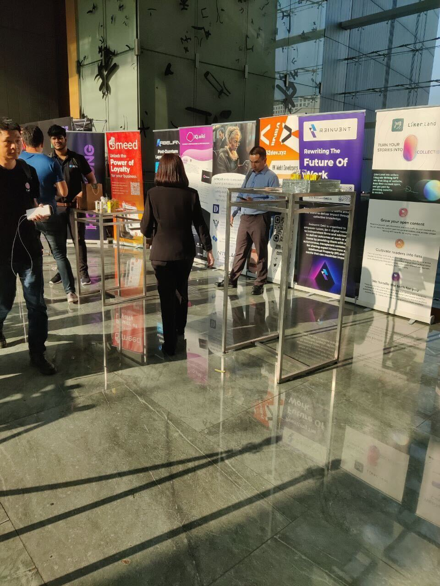

# Activities and Events



### 11/18 WordCamp Hong Kong 2023

[5年後還是新手 – WordPress Plugin開發大冒險](https://hongkong.wordcamp.org/2023/session/5%E5%B9%B4%E5%BE%8C%E9%82%84%E6%98%AF%E6%96%B0%E6%89%8B-wordpress-plugin%E9%96%8B%E7%99%BC%E5%A4%A7%E5%86%92%E9%9A%AA/)

### 11/6-7 HK Web3 Month Conference

[Sovereignty Blockchain: Abstracting Complexity for Seamless Building Experience for Consumer Products](https://www.hkweb3month.com/agenda)

[Speaker](https://twitter.com/HKWeb3Month/status/1716392722553348269)

<figure><figcaption></figcaption></figure>

### 11/02 RSS3 HKFINTECH Week Web3 Night

[HKFINTECH Week Web3 Night](https://lu.ma/qzdacuwm)

[Community Partner](https://twitter.com/rss3\_/status/1720387481978507317)

### 10/14 WordCamp Taiwan 2023

[Booth](https://taiwan.wordcamp.org/2023/sponsors/)

<figure><figcaption></figcaption></figure>

 

<figure><figcaption></figcaption></figure>

### 10/04 Lingnan University

[Guest Speaker of Digital Creativity class in the Master of Cultural Studies program of Lingnan University](https://www.linkedin.com/posts/james-chong-452540139\_thank-you-phoebe-poon-for-being-a-guest-speaker-activity-7115669440381284353-3rXe/)

<figure><figcaption></figcaption></figure>

 

<figure><figcaption></figcaption></figure>

### 09/14-15 留下書舍 Have A Nice Stay

[分散式出版工作坊](https://www.facebook.com/hans.bookstorehk/posts/pfbid022yGoyUmj8rTEB6ZLMpMRZ18eeerr9ds7FKX4K7XSDzZdc7MuSzVS4Sp1qmmZBuMal)

### 07/29 COSCUP 2023

[分散式出版面對的三道圍牆](https://coscup.org/2023/zh-TW/session/ZHVR7V)

### 06/09 Hong Kong Open Source Conference 2023

[分散式出版面對的三道圍牆](https://hkoscon.org/2023/topics/fensanshichubanmianduidesandaoweiqiang)

### 05/27 WordPress 20 週年慶典

[我使用的 6 個 WordPress 外掛 By Kin Ko (廣東話 Cantonese)](https://www.meetup.com/hong-kong-wordpress-meetup/events/293095406/)

[Photos](https://twitter.com/daisymarisfung/status/1662296857098489857)

### 05/09 飛地 nowhere

[【5月9日 #線上對談】顛覆遊戲規則 ♠️](https://www.facebook.com/nowherebookstore/posts/pfbid02R2gPy3z8w95Y1GX2xZq4MEFM1tKs7EHcifm8obV3vTxnVESRjEjVJTQ6uysS2LEXl)

[Video](https://www.youtube.com/watch?v=O0FtTFIyxIE)

### 05/04-05 留下書舍 Have A Nice Stay

[分散式出版工作坊](https://www.facebook.com/hans.bookstorehk/posts/pfbid02qevrrJmcK4CN5TCAEiWPk4gU4T6ZPtSXg6uFkrgxpbWgq4QxzbVgSc9EC9UYUV9Ml)

### 04/18 LikeCoin Discord

[《崩潰與重建：ChatGPT 衝擊下的人類未來》新書分享會](https://blog.like.co/zh/%E3%80%8A%E5%B4%A9%E6%BD%B0%E8%88%87%E9%87%8D%E5%BB%BA%EF%BC%9Achatgpt-%E8%A1%9D%E6%93%8A%E4%B8%8B%E7%9A%84%E4%BA%BA%E9%A1%9E%E6%9C%AA%E4%BE%86%E3%80%8B%E6%96%B0%E6%9B%B8%E5%88%86%E4%BA%AB%E6%9C%83/)

### 04/16 Cosmos Interchain Session@Web3 Festival

[如何促進應用專有鏈採用，將 Web2 用戶引入 Web3](https://twitter.com/Bianjie\_Global/status/1647131551807729664)

[香港掀起跨链旋风！「 2023 香港 Web3 嘉年华-跨链专场」圆满落幕](https://zhuanlan.zhihu.com/p/622931361)

### 04/13 - Cosmos HK Meetup

[Learnings Building in Cosmos: Bridging Web2 Users to Web3](https://www.facebook.com/Liker.Land/posts/pfbid02kjyvqfoNw29XiZCu3oDQkiScfoNkqzKtjt85xMTSAhjxxDu4eFGjUK7ecqAR61sZl)

### 03/23 - FOMO Asia Genesis Conference in HKCEC

[Booth and Talk](https://www.facebook.com/Liker.Land/posts/pfbid0zRhqhEtQLD5HEqRs1n5Amh5APSzVMawjBz7LSqx6wkXLAaN7DaS5tyBybH3KZgVTl)

### 03/21 - FOMO Asia Genesis Conference in HKG DAO

[NFT for media, bloggers, or writers](https://www.facebook.com/Liker.Land/posts/pfbid0CyUtjohaaYVTabkAxKCYom69cDCAGarpzQoMQGFjdQKU65bMvATwf3kCCBPRoxu3l)

### 03/21，23 IATC(HK) - 國際演藝評論家協會(香港分會)

[購買和出版我的第一個 Writing NFT](https://www.facebook.com/Liker.Land/posts/pfbid0z5pzb7tKXZEuwbiYhHCZ19N3bgiohnxe9z6xDFbk13YCNmz3HspiPxtHTt1XDwqKl)

### 03/18 **HK Startup DAO**

[\[Web3商業入門\] 區塊鏈Web3社區的力量 - 香港創業島 HK Startup DAO 首次線下知識分享研討日](https://www.eventbrite.com/e/web3-web3-hk-startup-dao-tickets-575295092107)

[Twitter Post](https://twitter.com/0xDevAnt/status/1637005643038208000)

### 03/11 飛地nowhere

[科技與人文書寫——在AI語言與NFT物件的時代寫小說](https://www.facebook.com/nowherebookstore/posts/pfbid077cXvaNRuF7NuucioVGB3RZ6ZdY62EJ4U9pTbWfBpoBVd9RGy3fsvKqFmjThqnrHl)

### 03/01 LikeCoin Discord

[【創作者聊天室】leafwind 「創作即生活」](https://blog.like.co/zh/%E5%89%B5%E4%BD%9C%E8%80%85%E7%B6%93%E6%BF%9F-%E7%9C%9F%E8%AA%A0%E5%AF%AB%E4%BD%9C-%E5%BB%BA%E7%AB%8B%E5%93%81%E7%89%8C%E6%89%8D%E6%98%AF%E7%8E%8B%E9%81%93/)

### 02/17-19 WordCamp Asia 2023

[Booth](https://www.facebook.com/Liker.Land/posts/pfbid02MJ4WjVyJUAS3MpFnTGEP48W3ggTfZXVyeK4nKFnFDh659Wafg6mJMJfBpWk4E3Eal)

Talk:[ "How I make a living with Writing NFT on my WordPress blog"](https://l.facebook.com/l.php?u=https%3A%2F%2Fwww.youtube.com%2Flive%2FvrDwB7iuHL8%3Ffeature%3Dshare%26t%3D4872%26fbclid%3DIwAR3f4L\_aWcsB06P00eEla0cKM3BXX34EDhewTUB9vVfQXV272IcbW0HPNNU\&h=AT34Kt3\_Iek6mb8RyMzPB73KMx0M4xKawPKKSugNsCHDWjk8vS1NKuNvRe\_MAl-tYGs605cLQXUbfi2uJZpfLiWNDo5Xqe4\_F5lcz31VSDvoZcDVK9pphSKAsz3WZeLtPA&\_\_tn\_\_=-UK-R\&c\[0]=AT1LxEv3njjcGPc2O3tJVErCExaC8JU-9bvPLL4hsHihwpIqNF2Jo3ObDC-NPX-sDZg6K0keruJU-6bIGDIOVRw65aRge-KWcCn2XRxbo9BCAMdRkFEjW\_BIPiJv20111\_KsqIUey8ciGs-rSrWJBvnfWZ\_EywkVv9EdZqUMoT\_iUKKuEXdnsSVmOVj-YqTs2Oda98zCunFhBVcu8uDzbszMoWCCulltV0O9cJA)

### 02/13 IATC(HK) - 國際演藝評論家協會(香港分會)

[【散點與連線．網上講座（一）】 🌟認識NFT的幾個重要概念](https://www.facebook.com/iatchongkong/posts/pfbid0xAdhk8ZZJittgJi3UdgnfGamPjPP1WHcSNm5xpYnReHwvWZygBT4s4UR1wsCWKmil)

:end:


