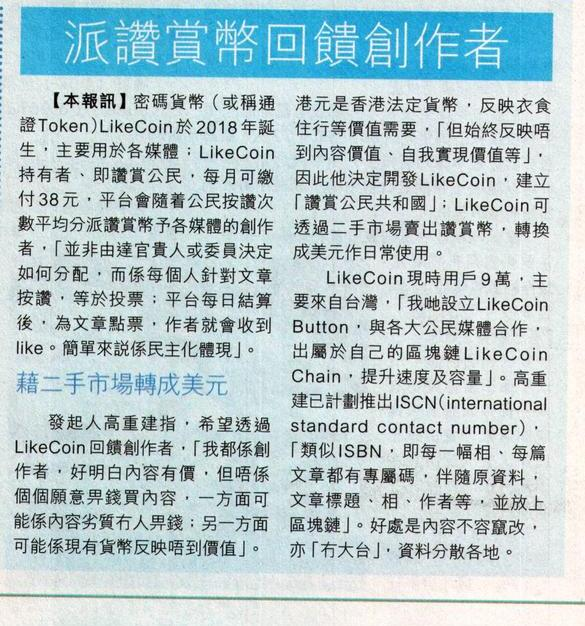

# Interviews and Features

## 2025 

#### 01/20 OPEN Book 閱讀誌

[話題》區塊鏈關出版什麼事？數位出版2.0—絕版經典共榮再生計畫](https://www.openbook.org.tw/article/p-70258)

## 2023 

#### 08/07 852Dev 

[點{解,樣}做去中心化出版 #DePub ft. @ckxpress @wtpoons - web3任我dev💻 #16](https://twitter.com/852devxyz/status/1686724316279488512)

[Video](https://www.youtube.com/watch?v=uMJzrK8fjdk\&t=524s)

#### 07/31 Viu TV 

[【Fintech全方位】發掘金融以外的應用層面📝區塊鏈技術提升創作者經濟生態](https://www.youtube.com/watch?v=pwtf_OyV_0o)

#### 06/08 RTHK 

[鏗鏘集：虛擬資產新機遇](https://digitalrepository.lib.hku.hk/catalog/0c489m376)

[Video](https://www.youtube.com/watch?v=IKX3_YIPOO0)

#### 05/26 Hostinger Blog 

[WordPress Turns 20: Empowering People to Success Online](https://www.hostinger.com/blog/wordpress-20th-anniversary)

#### 05/10 Unwire 

[一個 Web3 救出版業的故事：香港作家董啟章及其 NFT 書出版實驗](https://unwire.pro/2023/05/10/web3-and-nft-book-in-hk/feature/)

#### 05/09 OPENBOOK 閱讀誌 

[話題》宇宙尺規的香港交錯書寫：駱以軍評董啟章NFT版《天工開物．栩栩如真》](https://www.openbook.org.tw/article/p-67548)

#### 05/08 𝐀𝐑𝐓𝐈𝐒𝐀𝐍 𝐂𝐨𝐥𝐥𝐞𝐜𝐭𝐢𝐯𝐞 | 𝐃𝐀𝐎 

[Web3 是孤離，是記憶，是文藝復興？](https://twitter.com/artisan_xyz/status/1655145749938860032)

#### 04/28 聯合新聞網 

[董啟章「天工開物」發行NFT 為出版尋找新可能](https://udn.com/news/story/7266/7130501)

#### 04/26 U 港生活 

[董啟章絕版小說《天工開物．栩栩如真》再面世 NFT書增全新章節+生成藝術封面](https://unwire.pro/2023/05/10/web3-and-nft-book-in-hk/feature/)

#### 04/25 虛詞 

[《天工開物》復刻出版NFT書 董啟章盼新模式開出自由之路](https://p-articles.com/heteroglossia/3742.html)

#### 04/02 REUTERS 

[Preserving trust in photojournalism through authentication technology](https://www.reutersagency.com/authenticity-poc) - [Authenticated Camera Photo ISCN](https://app.like.co/view/iscn:%2F%2Flikecoin-chain%2Fq83YLCFopweK50d-oB03q0gC-HnLU3ef16mBlkRcq-s%2F1)

#### 01/20 歪腦讀 

[如何以NFT方式出版一本书？一场去中心化的出版实验](https://www.wainao.me/wainao-reads/decentralized-book-publishing-NFT-01202023)

#### 01/12 Citizen Web3 

[The Economics for Success according to Phoebe Poon from LikeCoin](https://www.youtube.com/watch?v=pZY3QnPFFIs)

## 2022

#### 12/30 財科暗戰 

[【財科暗戰】高重建即場示範mint NFT書籍《所謂「我不投資」就是all in在法定貨幣》為什麼需要限時限量賣出？實驗證明靠寫作維生仍是可行的（按CC看中文字幕）丨章濤丨區塊鏈丨去中心化出版](https://www.youtube.com/watch?v=QFjKvOCN9V4)

#### 12/29 Citizen Cosmos 

[PHOEBE POON, PUBLISHING, DEMOCRATS & COMMUNITY](https://www.citizencosmos.space/likecoin)

#### 12/28 財科暗戰 

[NFT 又一新應用 高重建出NFT書籍《所謂「我不投資」就是all in在法定貨幣》限量發售！只發售 1000本 最後20本以下網站有售！（按CC看中文字幕）丨章濤丨區塊鏈丨去中心化出版](https://www.youtube.com/watch?v=irMUSECyMTg)

#### 12/14 區塊勢 

[區塊勢人造的稀缺、版權意識的三個層次、數位出版的獎勵邏輯 ft. 《我不投資》作者高重建](https://blocktrend.substack.com/p/ep191#details)

#### 11/19 寶博朋友說 

[擁有人生中第一本NFT 書！FT. LikeCoin創辦人Kin 高重建](https://open.spotify.com/episode/7hVfw9eza4YAE4YQ9DRO1S)

#### 11/03 區塊勢 

[《我不投資》：以 NFT 重新定義數位出版](https://blocktrend.substack.com/p/488)

#### 10/01 群島 

[Archived and Alive: Interview with Kin Ko on Writing NFT](https://www.heath.tw/nml-article/archived-and-alive-interview-with-kin-ko-on-writing-nft/)

#### 09/20 BlockTempo 

[LikeCoin推出「Writing NFT 計畫」一鍵轉文章為NFT收藏、推動去中心化出版](https://www.blocktempo.com/likecoin-launches-writing-nft-project/)

#### 09/05 好青年荼毒室 

[【哲學係咁傾】ep. 31 甚麼是 NFT？｜嘉賓：高重建](https://www.youtube.com/watch?v=xJ7g45oFU04)

[【哲學係咁傾】甚麼是 NFT？｜嘉賓：高重建](https://ckxpress.com/what-is-nft/)

#### 08/22 ViuTV 99 智富通 FinTech 全方位 

[【Fintech全方位】 DePub 將文章轉成NFT📝以「讚賞」實質支持創作者👍🏻 何謂「幣本位」？以加密貨幣作為幣本位有何不同？](https://iwealthfin.com/blog.php?blog_id=308)

#### 08/18 財科暗戰 

[【財科暗戰】Likerland 推出writing NFT，讓創作有價！ 即場示範如何買下喜愛的作品（按CC看中文字幕）丨章濤丨Phoebe丨加密貨幣丨礦工費丨高重建丨LikeCoin](https://www.youtube.com/watch?v=wpfS5G6rKGg\&feature=emb_title)

#### 08/18 區塊勢 

[Writing NFT：不到 1 元，就能以出書的規格發行數位創作](https://blocktrend.substack.com/p/470#details)

#### 08/12 ViuTV 99 智富通 FinTech 全方位 

[【Fintech全方位】何謂「DePub」、「去中心出版」？區塊鏈技術如何應用於文章創作？](https://iwealthfin.com/blog.php?blog_id=301)

#### 07/07 財科暗戰 

[【財科暗戰】熊市下要學會「Zoom out」！LikeCoin最新發展之一：將文章變成NFT丨章濤丨高重建丨加密貨幣丨DHK丨NFT](https://www.youtube.com/watch?v=gQKeFeB7HHo)

[【財科暗戰】熊市下區塊鏈團隊如何生存？](https://www.youtube.com/watch?v=3tIImnAvxVc)

[【財科暗戰】 高重建分享對ETH的看法！DHK Token Airdrop可長達5年？（按CC看中文字幕）丨章濤丨高重建丨加密貨幣丨NFT丨Ethereum丨以太幣](https://www.youtube.com/watch?v=32408koE7Lg)

#### 06/11 AI BUSINESS 

[Russian war crimes in Ukraine documented on blockchain](https://aibusiness.com/responsible-ai/russian-war-crimes-in-ukraine-documented-on-blockchain)

#### 05/24 風傳媒 

[華爾街日報》NFT在中國有了新用途：在疫情中對抗審查](https://www.storm.mg/article/4347313?page=2)

#### 05/24 The Wall Street Journal 

[NFTが中国で急増、検閲かいくぐる新手法](https://jp.wsj.com/articles/nfts-are-put-to-new-use-in-china-countering-censorship-during-pandemic-11653345896)

#### 05/23 The Wall Street Journal 

[NFT在中国有了新用途：在疫情中对抗审查](https://cn.wsj.com/articles/nft%E5%9C%A8%E4%B8%AD%E5%9B%BD%E6%9C%89%E4%BA%86%E6%96%B0%E7%94%A8%E9%80%94-%E5%9C%A8%E7%96%AB%E6%83%85%E4%B8%AD%E5%AF%B9%E6%8A%97%E5%AE%A1%E6%9F%A5-11653306611)

#### 05/21 The Wall Street Journal 

[NFTs Are Put to New Use in China, Countering Censorship During Pandemic](https://www.wsj.com/articles/nfts-are-put-to-new-use-in-china-countering-censorship-during-pandemic-11653134403)

#### 05/21 Blockchain Journalism 

[#1 Episode: The Missing Archive](https://soundcloud.com/sanathe8journo/blockchainjournalism-hongkongmedia-themissingarchive)

#### 05/21 @beincrypto 

[Arweave Attracts More Chinese Content Creators in Fight Against Censorship](https://beincrypto.com/arweave-attracts-more-chinese-content-creators-in-censorship-battle/)

#### 05/14 unwire.pro 

[「去中心化」偽命題抑或真革命？ 初創冀優化 Web3 用戶體驗](https://unwire.pro/2022/05/14/web3-2/feature/)

#### 04/30 尹思哲 

[「如何一鍵 Wordpress 變 NFT」 - Likecoin Phoebe Poon #26](https://www.youtube.com/watch?v=OLx5WOJiN0A)

#### 04/26 Crypto Conscious 

[Cosmos interview - LikeCoin Team (Likerland creator and Co-founder)](https://www.youtube.com/watch?v=wC51ym1-ghM)

#### 04/21 信報 優雅生活 

[【Blockchain鏈出個未來】高重建：鏈上追求三種自由](https://lj.hkej.com/lj2017/artculture/article/id/3108283/%E3%80%90Blockchain%E9%8F%88%E5%87%BA%E5%80%8B%E6%9C%AA%E4%BE%86%E3%80%91%E9%AB%98%E9%87%8D%E5%BB%BA%EF%BC%9A%E9%8F%88%E4%B8%8A%E8%BF%BD%E6%B1%82%E4%B8%89%E7%A8%AE%E8%87%AA%E7%94%B1)

#### 04/12 Openbook 

[出版NFT移民．典範轉移》重新省思數位世界：LikeCoin創辦人高重建談分散式出版](https://www.openbook.org.tw/article/p-66082)

#### 04/12 好青年荼毒室 

[【哲學係咁傾】ep. 11 密碼貨幣（Cryptocurrency）與哲學 | 錢，唔淺！｜嘉賓：高重建](https://www.youtube.com/watch?v=yYxmVYOMA4s)

#### 03/30 Web2.5 時代 

[\[Web2.5 時代\] KZ x 高重建@ LikeCoin和 decentralizehk發起人](https://www.youtube.com/watch?v=gncp9cIuMrc)

#### 03/05 創業與自由

[「如何一鍵 Wordpress 變 NFT」 - Likecoin Phoebe Poon #27](https://podcasts.apple.com/nz/podcast/%E5%A6%82%E4%BD%95%E4%B8%80%E9%8D%B5-wordpress-%E8%AE%8A-nft-likecoin-phoebe-poon-27/id1540520661?i=1000559361299)

[Video](https://www.youtube.com/watch?v=OLx5WOJiN0A)

#### 01/15 職人故事 

[LikeCoin發起人高重建 由無到有的創造過程](https://craftsmanbio.com/2022/01/15/kinko-likecoin/)

#### 01/14 C基金 

[【C基金直播】美聯儲急急腳加息︱供樓惡夢開始?︱美業績期，有邊啲值得留意?︱高重建介紹何為LikeCoin?︱台積電TSMC業績報佳音(CFundLive20220114)](https://www.youtube.com/watch?v=HUCmPNn2Oko\&t=967s)

## 2021

#### 12/26 明報 

[未來城市：元宇宙之DAO 無大台社群 投票話事](https://news.mingpao.com/pns/%E5%89%AF%E5%88%8A/article/20211226/s00005/1640456257406/%E6%9C%AA%E4%BE%86%E5%9F%8E%E5%B8%82-%E5%85%83%E5%AE%87%E5%AE%99%E4%B9%8Bdao-%E7%84%A1%E5%A4%A7%E5%8F%B0%E7%A4%BE%E7%BE%A4-%E6%8A%95%E7%A5%A8%E8%A9%B1%E4%BA%8B)

#### 12/19 明報 

[未來城市：元宇宙「咁假」點解有價值？ 加密貨幣誕生的啟示](https://ol.mingpao.com/ldy/cultureleisure/culture/20211219/1639851408826/%E6%9C%AA%E4%BE%86%E5%9F%8E%E5%B8%82-%E5%85%83%E5%AE%87%E5%AE%99%E3%80%8C%E5%92%81%E5%81%87%E3%80%8D%E9%BB%9E%E8%A7%A3%E6%9C%89%E5%83%B9%E5%80%BC-%E5%8A%A0%E5%AF%86%E8%B2%A8%E5%B9%A3%E8%AA%95%E7%94%9F%E7%9A%84%E5%95%9F%E7%A4%BA)

#### 12/18 財科暗戰 

[【財科暗戰】 香港人創辦的LikeCoin！去中心化出版讓創作有價（按CC看中文字幕）丨章濤丨高重建丨區塊鏈丨LikerID丨讚好](https://www.youtube.com/watch?v=xIchXGKpBuU)

[【財科暗戰】什麼是DAO？民主的體現還是獨裁的手段？答問題贏1000個LikeCoin（按CC看中文字幕）丨章濤丨高重建 丨分布式自治組織丨區塊鏈丨加密貨幣](https://www.youtube.com/watch?v=S49QC7tS50A)

[【財科暗戰】LikeCoin發起人高重建你問我答！LikeCoin的未來發展！答問題贏1000個LikeCoin（按CC看中文字幕）丨章濤丨高重建 丨區塊鏈](https://www.youtube.com/watch?v=PVGuLRo_fAE)

[【財科暗戰】LikeCoin發起人高重建看好2.5隻幣？ AR、OSMO 還有半隻是什麼？答問題贏1000個LikeCoin（按CC看中文字幕）丨章濤丨高重建丨Osmosis](https://www.youtube.com/watch?v=RoYcwapRVOM)

#### 12/14 立場新聞 

[黃宇軒 X 高重建詳細解釋元宇宙　生活的立場 圍爐長知識](https://www.youtube.com/watch?v=XvhNtoO934Y)

#### 12/14 中廣新聞 

[10 分鐘「新書快報」周詳 《區塊鏈社會學》](https://www.youtube.com/watch?v=gVkYUHtpvcU)

#### 11/02 forkast 

[Back up Hong Kong: How blockchain has quietly become history’s hard drive](https://forkast.news/how-blockchain-quietly-becoming-history-hard-drive/)

#### 10/25 投資花二姐 

[S2: Ep6 區塊鏈帶來財務自由 & LikeCoin ISCN](https://anchor.fm/abfinwisdom/episodes/S2-Ep6---LikeCoin-ISCN-e1994i3)

#### 10/21 投資花二姐 

[S2: EP5 加密貨幣DeFi - 免被剝奪的財務自由](https://anchor.fm/abfinwisdom/episodes/S2-EP5-DeFi---e193jgg)

#### 10/17 投資花二姐 

[S2：Ep4 加密貨幣和法定貨幣的差異](https://anchor.fm/abfinwisdom/episodes/S2Ep4-e18thh6)

#### 09/15 信報 徐家健 

[沒有大台，出版還意味着什麼?](https://www1.hkej.com/dailynews/investment/article/2913449/%E6%B2%92%E6%9C%89%E5%A4%A7%E5%8F%B0%EF%BC%8C%E5%87%BA%E7%89%88%E9%82%84%E6%84%8F%E5%91%B3%E7%9D%80%E4%BB%80%E9%BA%BC%3F)

#### 07/29 財科暗戰 

[【財科暗戰】區塊鏈社會學 - 第三集： 兩個ETH大好友怎樣看待後市？| 章濤](https://www.youtube.com/watch?v=V1S3M9V2t9Y)

#### 07/25 財科暗戰 

[【財科暗戰】區塊鏈社會學 - 第二集： 區塊鏈可以用來出版！？| 章濤](https://www.youtube.com/watch?v=1r1WVu9retk)

#### 07/21 財科暗戰 

[【財科暗戰】區塊鏈社會學 - 第一集： 區塊鏈除了炒幣，還能做什麼？| 章濤](https://www.youtube.com/watch?v=OfbJa7lBK-s)

#### 07/21 區塊勢 

[EP.124 去中心化出版的基礎建設 ft. LikeCoin 創辦人高重建](https://podcasts.apple.com/us/podcast/ep-124-%E5%8E%BB%E4%B8%AD%E5%BF%83%E5%8C%96%E5%87%BA%E7%89%88%E7%9A%84%E5%9F%BA%E7%A4%8E%E5%BB%BA%E8%A8%AD-ft-likecoin-%E5%89%B5%E8%BE%A6%E4%BA%BA%E9%AB%98%E9%87%8D%E5%BB%BA/id1441274280?i=1000529520896\&l=ru)

#### 07/19 unwire.pro 

[「萬物代幣化時代」降臨！用 NFT 交易房地產又如何？](https://unwire.pro/2021/07/19/nft-property/feature/)

#### 07/08 HK01 

[IPFS｜將會取代現有 HTTP 架構？可以永久保存內容與檔案的技術](https://www.hk01.com/sns/article/648037)

#### 06/26 cointribune 

[Quand la blockchain contourne la censure d’Hong-Kong](https://www.cointribune.com/blockchain/ecosysteme/quand-la-blockchain-contourne-la-censure-dhong-kong/)

#### 06/25 REUTERS 

[Hong Kong's Apple Daily to live on in blockchain, free of censors](https://www.reuters.com/world/asia-pacific/hong-kongs-apple-daily-live-blockchain-free-censors-2021-06-24/)

#### 06/25 Taipei Times 

[HK’s ‘Apple Daily’ to live on in blockchain](https://www.taipeitimes.com/News/world/archives/2021/06/25/2003759792)

#### 06/25 The Business Times 

[Queues form for final issue as Apple Daily closes](https://www.businesstimes.com.sg/government-economy/queues-form-for-final-issue-as-apple-daily-closes)

#### 06/25 區塊客 

[香港《蘋果》停刊、網站熄燈！網友自發備份「上鏈永存」](https://blockcast.it/2021/06/25/cyber-activists-are-backing-up-articles-from-apple-daily-using-blockchain/)

#### 06/25 動區 BlockTempo 

[香港蘋果日報停刊，歷年報導被放上區塊鏈：不因為喜歡，因是需要做的事！](https://www.blocktempo.com/apple-daily-news-was-put-on-blockchain/)

#### 06/24 聯合早報 

[香港网民将苹果文章上传至区块链平台](https://www.zaobao.com/realtime/china/story20210624-1160475)

#### 06/24 鏈新聞 

[香港蘋果日報最終章！支持者利用去中心化平台保護「新聞自由」](https://www.abmedia.io/20210624-using-blockchain-to-preserve-apple-daily)

#### 06/24 Bitcoin Mexico 

[El diario Apple Daily se convierte en Blockchain](https://www.boursorama.com/bourse/actualites/hong-kong-les-contenus-d-apple-daily-transferes-sur-des-serveurs-decentralises-0fab802ad878fc61f1a7272dcf9a524f)

#### 06/24 Bourse 

[Hong Kong-Les contenus d'Apple Daily transférés sur des serveurs décentralisés](https://www.boursorama.com/bourse/actualites/hong-kong-les-contenus-d-apple-daily-transferes-sur-des-serveurs-decentralises-0fab802ad878fc61f1a7272dcf9a524f)

#### 06/24 Les Echos 

[A Hong Kong, ruée sur le dernier numéro du quotidien pro démocratie « Apple Daily »](https://www.lesechos.fr/monde/asie-pacifique/a-hong-kong-ruee-sur-le-dernier-numero-du-quotidien-pro-democratie-apple-daily-1326489)

#### 06/24 Objetivo Famosos 

[A Hong Kong, ruée sur le dernier numéro du quotidien pro démocratie « Apple Daily »](https://www.objetivofamosos.com/apple-daily-en-hong-kong-para-vivir-en-blockchain-sin-censura/)

#### 06/24 Business World 

[Apple Daily to live on in blockchain, free of censors](https://www.bworldonline.com/apple-daily-to-live-on-in-blockchain-free-of-censors/)

#### 06/24 RTHK 

[Cyber activists race to back up Apple Daily articles](https://news.rthk.hk/rthk/en/component/k2/1597503-20210624.htm)

#### 06/24 CNBC 

[Hong Kong’s Apple Daily to live on in blockchain, free of censors](https://www.cnbc.com/2021/06/24/hong-kongs-apple-daily-to-live-on-in-blockchain-free-of-censors.html)

#### 06/23 明報 

[網民備份《蘋果》報道 IT界倡開放CC授權](https://news.mingpao.com/pns/%E6%B8%AF%E8%81%9E/article/20210623/s00002/1624385871098/%E7%B6%B2%E6%B0%91%E5%82%99%E4%BB%BD%E3%80%8A%E8%98%8B%E6%9E%9C%E3%80%8B%E5%A0%B1%E9%81%93-it%E7%95%8C%E5%80%A1%E9%96%8B%E6%94%BEcc%E6%8E%88%E6%AC%8A)

#### 06/23 HK01 

[《蘋果日報》網站即將停運　民間倡內容共享創意授權保存未有下文](https://www.hk01.com/%E7%A4%BE%E6%9C%83%E6%96%B0%E8%81%9E/641736/%E8%98%8B%E6%9E%9C%E6%97%A5%E5%A0%B1-%E7%B6%B2%E7%AB%99%E5%8D%B3%E5%B0%87%E5%81%9C%E9%81%8B-%E6%B0%91%E9%96%93%E5%80%A1%E5%85%A7%E5%AE%B9%E5%85%B1%E4%BA%AB%E5%89%B5%E6%84%8F%E6%8E%88%E6%AC%8A%E4%BF%9D%E5%AD%98%E6%9C%AA%E6%9C%89%E4%B8%8B%E6%96%87)

#### 06/20 城寨 x Yolo 街 

[城寨 x Yolo 街 - 科技與香港人身份證同行動(1)：海外香港人網絡與科技創新](https://twitter.com/bonkat/status/1406443103179837444)

#### 05/27 CryptoPotato 

[People in Hong Kong Use The Blockchain To Fight Against Media Censorship](https://cryptopotato.com/people-hong-kong-use-blockchain-fight-media-censorship/)

#### 05/27 Decrypt 

[Hong Kong Media Turns to Blockchain to Preserve Protest Archives](https://decrypt.co/72057/hong-kong-media-turns-blockchain-preserve-protest-archives)

#### 05/27 Business AM 

[Hoe Hongkong de geschiedenis wil censureren en blockchain-technologie de oplossing werd](https://businessam.be/hoe-hongkong-de-geschiedenis-wil-censureren-en-blockchain-technologie-de-oplossing-werd/)

#### 05/27 Cointelegraph 

[Hong Kongers use blockchain to save evidence of anti-authoritarian struggles](https://cointelegraph.com/news/hong-kongers-use-blockchain-to-save-evidence-of-anti-authoritarian-struggles)

[Los habitantes de Hong Kong usan blockchain para guardar evidencia de luchas antiautoritarias](https://es.cointelegraph.com/news/hong-kongers-use-blockchain-to-save-evidence-of-anti-authoritarian-struggles)

[Gli abitanti di Hong Kong usano la blockchain per salvare le prove della lotta anti-autoritaria](https://it.cointelegraph.com/news/hong-kongers-use-blockchain-to-save-evidence-of-anti-authoritarian-struggles)

#### 05/28 QUARTZ 

[Hong Kongers are using blockchain archives to fight government censorship](https://qz.com/2008673/hong-kongers-use-blockchain-to-fight-government-censorship/)

#### 05/21 眾新聞 

[【NFT拍賣熱潮】蕭雲作品《我們的獅子山》2.8萬元賣出　競投者：相片代表港人重要記憶](https://www.hkcnews.com/article/41482/%E4%BD%99%E5%AE%B6%E9%BD%8A_edmond_yu-nft-41542/nft)

#### 05/15 城寨 Singjai 

[區塊鏈生態：無大台但有共識 和平分手機制 ETH2.0 PoS Likecoin Chain Cosmos - 15/05/21 「YOLO街」長版本](https://www.youtube.com/watch?v=7qZJWlCNGAE)

#### 05/15 theDesk Hong Kong 

[加密貨幣與法定貨幣是「取代」還是「補完」？｜LikeCoin及#decentralizehk 發起人高重建](https://www.youtube.com/watch?v=Acta5luxVGM)

#### 05/09 堅離地傾 · 沈旭暉 

[【堅離地傾・沈旭暉 139 💻】高重建：全民區塊鏈・Backup真香港](https://www.youtube.com/watch?v=BTvpACIVMIg)

#### 04/29 台灣事實查核中心 

[【共享讚賞幣理念】LikeCoin創辦人高重建買下查核中心首份NFT藏品](https://tfc-taiwan.org.tw/articles/5348)

#### 02/05 The News Lens 關鍵評論網 

[專訪LikeCoin創辦人高重建：政府自言支持區塊鏈發展，但新監管制度自相矛盾](https://www.thenewslens.com/feature/crypto-hk/146508)

#### 02/04 【菲妮莫屬】區塊鏈人才說 Proof of Talents 

[第二季 海外人才篇 #9 探討區塊鏈對價值、媒體、民主的再想像 -《區塊鏈社會學》作者 高重建](https://www.youtube.com/watch?v=A6A7BknIpyQ)

## 2020

#### 12/23 寶博朋友說 

[有些創新，是希望守護歷史ft. LikeCoin 創辦人高重建](https://open.spotify.com/episode/3VgEUb0vP97y3bZtjCEAaw?go=1\&sp_cid=dbcfb495bc98c587f9106bc72de4f25b\&utm_source=embed_player_p\&utm_medium=desktop\&nd=1)

#### 11/28 科創社工學會 Society for Innovation and Technology in Social Work 

[區塊鏈社會學與社會工作分享會](https://www.facebook.com/SITSWHK/posts/381713766500377)



#### 11/14 信報財經新聞 

[LikeCoin用區塊鏈為文字創富](https://www1.hkej.com/dailynews/article/id/2635378/)

#### 10/14 Hour of Code Hong Kong Meetup Group 

[HoCHK Webinar: Kin Ko, Entrepreneur, Founder, LikeCoin](https://www.meetup.com/Hong-Kong-Hour-of-Code-Meetup-Group/events/273470964/)

[Video](https://www.youtube.com/watch?v=u6KARzk7vok\&t=595s)

#### 10/07 IPFS 

[Case study: LikeCoin](https://docs.ipfs.io/concepts/case-study-likecoin/#overview)

#### 08/26 掌舖 x VSMedia 網上書展 

【#掌舖xVSMedia網上書展 - 尹思哲時間：區塊鏈塑造新香港？】



#### 08/17 香港蘋果日報 

[派讚賞幣回饋創作者](https://web.archive.org/web/20201023121939/https://hk.appledaily.com/finance/20200817/BYQBDVDNPVCFPIZQFMAGIYXEIA/)

[LikeCoin發起人：區塊鏈可還權於民](https://web.archive.org/web/20210508192953/https://hk.appledaily.com/finance/20200817/MDJN6LLEHVCMVDSSFCAFTIQY2E/)

<figure><figcaption></figcaption></figure>

<figure><figcaption></figcaption></figure>

#### 08/07 香港無線電視財經 ‧ 資訊台 看出個未來 

[未來發幤人](https://programme.tvb.com/info/futurescope/episode/17/)

#### 23/07 Lighthouse Consultant Limited 

[Lighthouse Presents: NExT - How Event Professionals Make the Comeback Stronger than the Setback](https://www.lighthouse.hk/Lighthouse%20Presents%3A%20NExT%20%232)

[Virtual Book Fair](https://www.linkedin.com/posts/lighthouse-consultant-limited_lighthouseconsultant-eventplanning-eventmanagement-activity-6698471598539845632-1hFO)



#### 07/15 區塊勢 

[EP72. 區塊鏈社會學 ft. 讚賞公民基金會創辦人高重建](https://podcasts.apple.com/us/podcast/ep72-%E5%8D%80%E5%A1%8A%E9%8F%88%E7%A4%BE%E6%9C%83%E5%AD%B8-ft-%E8%AE%9A%E8%B3%9E%E5%85%AC%E6%B0%91%E5%9F%BA%E9%87%91%E6%9C%83%E5%89%B5%E8%BE%A6%E4%BA%BA%E9%AB%98%E9%87%8D%E5%BB%BA/id1441274280?i=1000484946425)

#### 05/15 港故仔 



#### **03/10 寶博士** 

[【寶博朋友說】區塊鏈打賞: 按讚就能讓人賺幣致富?! - 專訪 讚賞公民共和國 LikeCoin 創辦人 高重建 Kin Ko｜EP23](https://www.youtube.com/watch?v=P69AS9ORPmM)

#### 02/19 Meet 創業小聚 

[【創業新聲帶】EP4 LikeCoin｜按讚有錢賺！LikeCoin 用區塊鏈打造創作者生態系，實現創作可當飯吃｜Meet 創業小聚](https://www.youtube.com/watch?v=Ev-1DQ-F7Ho)

#### 02/10 Meet 創業小聚 

創業之星 - LikeCoin 一分鐘快問快答！



#### 02/05 Meet 創業小聚 

[\[創業小聚NO.109\] 區塊鏈的N種應用：打造超有感的生活體驗！](https://meet.bnext.com.tw/articles/view/46021)

#### 01/14 Meet 創業小聚 

[按讚有錢賺！LikeCoin 用區塊鏈打造創作者生態系，實現創作可當飯吃](https://meet.bnext.com.tw/articles/view/45970)

#### 01/02 CUHK Engineering Faculty Alumni Association (ERGAA). 

中大工程校友「你問我答」第一回：區塊鏈



## 2019

#### 12/7 区块链研究院 

[AMA回顾| 一个赞赏共和国的诞生](https://zhuanlan.zhihu.com/p/98662833)

#### 11/13 FINDIT 

[【新興領域：11月焦點7】去中心化的Blog？MattersＸLikecoin打造創作者理想國](https://web.archive.org/web/20210509014313/https://www.findit.org.tw/researchPageV2.aspx?pageId=1275)

#### 10/9 AIre VOICE 

[コンテンツの価値をクリエイターに還元。無料コンテンツの大きなリスク](https://aire-voice.com/interview/5428/)

#### 09/06 香港獨立媒體網 

[香港獨立媒體網 x LikeCoin Foundation 成為「讚賞公民」 獎勵創作](https://www.inmediahk.net/node/1067055)

#### 09/05 WP Builds 

[144 – Get paid with likes… the Like Coin with Kin Ko](https://wpbuilds.com/2019/09/05/144-get-paid-with-likes-the-like-coin-with-kin-ko/)

[Video](https://www.youtube.com/watch?v=OBnVs3nPPgQ)

#### 7/31 CIBS節目：區塊鏈與你 (Blockchain and You) 

第四集



#### 06/14 區塊勢 

[EP.25 媒體在免費與付費之間的第三條路－專訪讚賞公民基金會創辦人高重建](https://podcasts.apple.com/tw/podcast/ep-25-%E8%AE%9A%E8%B3%9E%E5%85%AC%E6%B0%91-%E5%AA%92%E9%AB%94%E5%9C%A8%E5%85%8D%E8%B2%BB%E8%88%87%E4%BB%98%E8%B2%BB%E4%B9%8B%E9%96%93%E7%9A%84%E7%AC%AC%E4%B8%89%E6%A2%9D%E8%B7%AF/id1441274280?i=1000441160196)

#### 06/04 Global Voices 

[Turning ‘likes’ into rewards: Hong Kong citizen media outlets launch ‘Civic Likers’ campaign](https://globalvoices.org/2019/06/04/turning-likes-into-rewards-hong-kong-citizen-media-outlets-launch-civic-likers-campaign/)

#### 05/24 iMoney 智富雜誌 

[「創作可以當飯吃」 港人推LikeCoin望聚集讚賞公民](https://web.archive.org/web/20210517102556/https://imoney.hket.com/article/2360745/%E3%80%8C%E5%89%B5%E4%BD%9C%E5%8F%AF%E4%BB%A5%E7%95%B6%E9%A3%AF%E5%90%83%E3%80%8D%20%E6%B8%AF%E4%BA%BA%E6%8E%A8LikeCoin%E6%9C%9B%E8%81%9A%E9%9B%86%E8%AE%9A%E8%B3%9E%E5%85%AC%E6%B0%91)

#### 05/24 明報 

[「讚賞公民」運動 化讚賞為作者收入](https://www.mpfinance.com/fin/daily2.php?node=1558639282687\&issue=20190524)

#### 05/22 眾新聞 

[「讚賞公民」計劃啟動　網媒的未來：有like就有coins？](https://www.hkcnews.com/article/20686/%E8%AE%9A%E8%B3%9E%E5%85%AC%E6%B0%91-likecoin-%E7%9C%BE%E6%96%B0%E8%81%9E-20686/%E3%80%8C%E8%AE%9A%E8%B3%9E%E5%85%AC%E6%B0%91%E3%80%8D%E8%A8%88%E5%8A%83%E5%95%9F%E5%8B%95-%E7%B6%B2%E5%AA%92%E7%9A%84%E6%9C%AA%E4%BE%86%EF%BC%9A%E6%9C%89like%E5%B0%B1%E6%9C%89coins%EF%BC%9F)

#### **05/21 立場新聞** 

[LikeCoin 是網媒出路？　創始人高重建：望化讚為賞　讓公民支持創作者](https://web.archive.org/web/20190604014459/https://www.thestandnews.com/media/likecoin-%E6%98%AF%E7%B6%B2%E5%AA%92%E5%87%BA%E8%B7%AF-%E5%89%B5%E5%A7%8B%E4%BA%BA%E9%AB%98%E9%87%8D%E5%BB%BA-%E6%9C%9F%E6%9C%9B%E5%8C%96%E8%AE%9A%E7%82%BA%E8%B3%9E-%E8%AE%93%E5%85%AC%E6%B0%91%E6%94%AF%E6%8C%81%E5%89%B5%E4%BD%9C%E8%80%85/)

#### 05/13 眾新聞 

[眾新聞參與【讚賞公民計劃】——一場讓創作可以當飯吃的運動](https://www.hkcnews.com/article/20226/%E8%AE%9A%E8%B3%9E%E5%85%AC%E6%B0%91-likecoin-%E7%9C%BE%E6%96%B0%E8%81%9E-20490/%E7%9C%BE%E6%96%B0%E8%81%9E%E5%8F%83%E8%88%87%E3%80%90%E8%AE%9A%E8%B3%9E%E5%85%AC%E6%B0%91%E8%A8%88%E5%8A%83%E3%80%91%E2%80%94%E2%80%94%E4%B8%80%E5%A0%B4%E8%AE%93%E5%89%B5%E4%BD%9C%E5%8F%AF%E4%BB%A5%E7%95%B6%E9%A3%AF%E5%90%83%E7%9A%84%E9%81%8B%E5%8B%95)

#### 01/01 新頭殼 Newtalk 

[創夢實驗室》oice 視覺小說：區塊鏈讓賦予故事血肉的創作者都被看見(下)](https://newtalk.tw/news/view/2019-01-01/187217)

## 2018

#### 12/29 新頭殼 Newtalk 

[創夢實驗室》oice 視覺小說：用區塊鏈打破創作困境 讓故事有價(上)](https://newtalk.tw/news/view/2018-12-29/187188)

#### 09/24 ZEEK 玩家誌 

[\[一文搞懂\] 給內容創作者的《LikeCoin》讚賞幣 含WordPress加入「LikeButton」教學](https://zeekmagazine.com/archives/77926)

#### 09/20 港台電視31 

[講錢。講呢啲：21世紀揾錢搞革命都靠條鏈?](https://podcast.rthk.hk/podcast/item.php?pid=1353\&eid=121516\&year=2018\&lang=zh-CN)

#### **08/17 HK01** 

[【專訪】創意有價！網民按LikeCoin鍵　可助創作者日進千金](https://www.hk01.com/%E5%B0%88%E9%A1%8C%E4%BA%BA%E8%A8%AA/222574/%E5%B0%88%E8%A8%AA-%E5%89%B5%E6%84%8F%E6%9C%89%E5%83%B9-%E7%B6%B2%E6%B0%91%E6%8C%89likecoin%E9%8D%B5-%E5%8F%AF%E5%8A%A9%E5%89%B5%E4%BD%9C%E8%80%85%E6%97%A5%E9%80%B2%E5%8D%83%E9%87%91)

[【LikeCoin專訪】高重建：新幣普及不易　最重要有明確定位](https://www.hk01.com/%E5%B0%88%E9%A1%8C%E4%BA%BA%E8%A8%AA/222576/likecoin%E5%B0%88%E8%A8%AA-%E9%AB%98%E9%87%8D%E5%BB%BA-%E6%96%B0%E5%B9%A3%E6%99%AE%E5%8F%8A%E4%B8%8D%E6%98%93-%E6%9C%80%E9%87%8D%E8%A6%81%E6%9C%89%E6%98%8E%E7%A2%BA%E5%AE%9A%E4%BD%8D)

[【LikeCoin專訪】借網民舉報抄襲行為　高重建：難禁絕但比現況好](https://www.hk01.com/%E5%B0%88%E9%A1%8C%E4%BA%BA%E8%A8%AA/222575/likecoin%E5%B0%88%E8%A8%AA-%E5%80%9F%E7%B6%B2%E6%B0%91%E8%88%89%E5%A0%B1%E6%8A%84%E8%A5%B2%E8%A1%8C%E7%82%BA-%E9%AB%98%E9%87%8D%E5%BB%BA-%E9%9B%A3%E7%A6%81%E7%B5%95%E4%BD%86%E6%AF%94%E7%8F%BE%E6%B3%81%E5%A5%BD)

#### 08/05 D100 

[《對沖人生路》主持：錢志健 『 Likecoin』 嘉賓：高重建、Bonita Wang](https://web.archive.org/web/20180807191736/https://www.d100.net/%E3%80%8A%E5%B0%8D%E6%B2%96%E4%BA%BA%E7%94%9F%E8%B7%AF%E3%80%8B%E4%B8%BB%E6%8C%81%EF%BC%9A%E9%8C%A2%E5%BF%97%E5%81%A5-%E3%80%8E-likecoin%E3%80%8F-%E5%98%89%E8%B3%93%EF%BC%9A%E9%AB%98%E9%87%8D%E5%BB%BA/)

#### **08/01 突破書誌 054期 搵真銀** 

[價值重組實驗](https://like.co/pdf/articles/breakazine.pdf)

<figure><figcaption></figcaption></figure>

#### 06/11 Cryptocurrency Satellite 

[【LikeCoin(ライクコイン)】Kin(キン)CEOへインタビュー](https://web.archive.org/web/20180724091850/https://cryptocurrency-sat.com/topic/interview/likecoin-ceo/)

#### 06/06 HK01 

[港產ICO LikeCoin集資逾4000萬　冀「化Like為Coin」回饋創作人](https://www.hk01.com/%E8%B2%A1%E7%B6%93%E5%BF%AB%E8%A8%8A/196190/%E6%B8%AF%E7%94%A2ico-likecoin%E9%9B%86%E8%B3%87%E9%80%BE4000%E8%90%AC-%E5%86%80-%E5%8C%96like%E7%82%BAcoin-%E5%9B%9E%E9%A5%8B%E5%89%B5%E4%BD%9C%E4%BA%BA)

#### 06/01 Liquid 

[QUOINE x LikeCoin: The Future of the Like](https://www.youtube.com/watch?v=zi8H0U-TdF8)

#### 05/23 **壹**周刊 

[【港產加密貨幣】LikeCoin創辦人: 將創意和回報掛鈎 向fb施壓](https://web.archive.org/web/20200328233133/https://hk.nextmgz.com/article/2_588342_0)

[【與中央分權】區塊鏈帶來革命? LikeCoin創辦人: 唔會徒勞無功](https://web.archive.org/web/20200328233134/https://hk.nextmgz.com/article/2_588463_0)

[【已集資四千萬】LikeCoin創辦人：香港人唔係咁孤寒](https://web.archive.org/web/20200328233118/https://hk.nextmgz.com/article/2_588408_0)

[Video](https://www.youtube.com/watch?v=b8ra392rlCM)

#### 05/14 opensource.com 

[LikeCoin, a cryptocurrency for creators of openly licensed content](https://opensource.com/article/18/5/likecoin)

#### 05/10 Crypto Times 

[「いいね」がお金になる!? Likecoin(ライクコイン) CEOへインタビュー](https://crypto-times.jp/likecoin/)

#### **05/02 彭博商業周刊/中文版 第114期** 

[ICO 狂想曲](http://hk.bbwc.cn/avxzbp.html) [PDF](https://www2.deloitte.com/content/dam/Deloitte/cn/Documents/financial-services/deloitte-cn-fs-bloomberg-business-megazine-ico-zh-180518.pdf)

<figure><figcaption></figcaption></figure>

#### 05/01 Cryptoground 

[LikeCoin Founder - Kin Ko Presents An Opportunity for Artists to Earn](https://www.cryptoground.com/a/likecoin-founder-kin-ko-presents-an-opportunity-for-artists-to-earn)

[Video](https://www.youtube.com/watch?v=VcAOnpquTB0)

#### 04/19 區塊客 

[與高重建談 LikeCoin — 媒體群創不再空洞 創意共享新生態](https://blockcast.it/2018/04/19/blockcast-interview-likecoin-founder-kin-ko/)

#### 04/16 techapple 

[LikeCoin 預售金額突破 120%，目標化 Like 為 Coin！](https://www.techapple.com/archives/21590)

#### 04/09 信報財經新聞 

[首隻港產加密幣點讚成金 創辦人冀改網絡歪風](http://startupbeat.hkej.com/?p=57661)

<figure><figcaption></figcaption></figure>

#### 04/09 ejinsight 

[HK-based LikeCoin uses token to reward online content creators](https://www.ejinsight.com/eji/article/id/1811904/20180409-hk-based-likecoin-uses-token-to-reward-online-content-creators)

#### 04/02 香港電台普通話台 AM621 CIBS 節目 - 追趕科技世界 (The World towards Information Technology) 科技Band房 

[科技Band房 第十三集 Part 1](https://www.youtube.com/watch?v=ZkliYqFnhc0)

[科技Band房 第十三集 Part 2](https://www.youtube.com/watch?v=6wj1MmQaydA)

#### 03/30 文化土豆 

[042 爱国我说不出口【張潔平, 高重建】](https://www.youtube.com/watch?v=OEpvchhkJnY)

#### 03/23 香港無線電視財經台 「錢」進新世代 

[以「Like」維生？](https://programme.tvb.com/news/freshmanfinance/episode/20180323/)



#### 03/21 區塊客 

[區塊鏈如何解放創作自由 讓數位內容產業重生](https://blockcast.it/2018/03/21/how-blockchain-reinvents-rewarding-digital-content-creation/)

#### 03/19 明周 

[【當金錢變成數碼】高重建：擁抱觸不到的付款方法 化like成coin支持創作](https://www.mpweekly.com/culture/%E9%9B%BB%E5%AD%90%E8%B2%A8%E5%B9%A3-%E9%9B%BB%E5%AD%90%E6%94%AF%E4%BB%98-%E6%94%AF%E4%BB%98%E5%AF%B6-69230)

<figure><figcaption></figcaption></figure>

<figure><figcaption></figcaption></figure>

#### **03/18 INSIDE** 

[怎麼把讚變現？這間 ICO，想讓媒體與獨立創作者透過區塊鏈雙贏](https://www.inside.com.tw/article/12259-like-to-coin)

#### **03/17 iMoney 智富** 

[首隻港產加密貨幣 化Like為Coin](https://imoney.hket.com/article/2031727/%E9%A6%96%E9%9A%BB%E6%B8%AF%E7%94%A2%E5%8A%A0%E5%AF%86%E8%B2%A8%E5%B9%A3%20%E5%8C%96Like%E7%82%BACoin)

<figure><figcaption></figcaption></figure>

#### 03/09 Mr.Block 區塊先生 

Winnier of Mr.Block x Blockshow Taipei Meetup

[LikeCoin - Founder Kin Ko](https://www.youtube.com/watch?v=x4_-UY1baT8)

[專訪 LikeCoin創辦人 - 高重建【BlockShow】（國語）](https://www.youtube.com/watch?v=Acw3C5O29H8)

[LikeCoin is the winner of Blockshow Taiwan 2018](https://www.youtube.com/watch?v=Acw3C5O29H8)

#### 03/05 香港蘋果日報 

[金融中心：ICO籌幾千萬？港產加密貨幣誕生](https://web.archive.org/web/20200808001955/https://hk.appledaily.com/finance/20180305/HBHYRDIFNDKOXIV2RYX4CJAJHU/)

<figure><figcaption></figcaption></figure>

#### **01/01 903** 

高重建 為明日革命

<figure><figcaption></figcaption></figure>

## 2017

#### 11/29 香港無線電視財經台 創科導航 

[熱炒以太幣](https://programme.tvb.com/news/innovationgps/episode/20171129/)



#### **10/08 明報** 

[科網世代﹕LikeCoin將Like變成錢有可能？ 直落創作人口袋](https://news.mingpao.com/pns/%E5%89%AF%E5%88%8A/article/20171008/s00005/1507399895326/%E7%A7%91%E7%B6%B2%E4%B8%96%E4%BB%A3-likecoin%E5%B0%87like%E8%AE%8A%E6%88%90%E9%8C%A2%E6%9C%89%E5%8F%AF%E8%83%BD-%E7%9B%B4%E8%90%BD%E5%89%B5%E4%BD%9C%E4%BA%BA%E5%8F%A3%E8%A2%8B)

<figure><figcaption></figcaption></figure>

🔚
