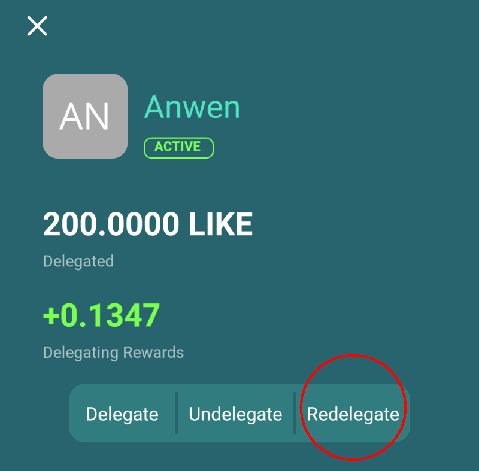

# Redelegation of LikeCoin

## Re**delegate via dao.like.co**

### Step 1: Login dao.like.co

Go to [dao.like.co](https://dao.like.co/) and select [Keplr Browser Extension](broken-reference), [Cosmostation Browser Extension](../wallet/cosmostation/) or [Authcore](../../user-guide/liker-id/register/) to login.

<figure><figcaption></figcaption></figure>

### **Step 2: Select the validator with delegation**

Click "Portfolio" on the left hand side menu, on Your Stake click on the validator that you delegated.

Click "Restake" on the upper right corner of the validator to redelegate.

### Step 3: Select the new validator to delegate

The Restake page appears, on To: field select the validator that you want to redelegate to and enter the amount of LikeCoin you want to redelegate, and click "Next".

### Step 4: Confirm redelegation

Confirmation is required. Keplr and Cosmostation users will need to approve a pop-up box to confirm it after clicking "Send". Authcore users directly click "Send".

After the "Sent and confirming", "Successfully restaked!" appears, redelegation is completed.

 

## **Redelegate via Liker Land**

[Liker Land app](https://liker.land/getapp) \[Redelegate] function helps users to transfer the delegated LikeCoin from one validator to another. LikeCoin will be transferred immediately after confirmation, voting power of the validator is affected too. The newly delegated LikeCoin receives rewards according to the rewards percentage of the new validator.

Steps for Redelegation:

### **Step 1: Select the validator with delegation**

Click on the validator that you delegated (displayed as green) and select \[Redelegate].

### Step 2: Select the new validator to delegate

The app pops up a list of validators, select the validator to transfer your LikeCoin.&#x20;

### Step 3: Confirm redelegation

Details of redelegation are displayed, check them carefully, click \[Confirm] and wait for the transfer to complete, it usually takes a few seconds.

## **Beware of cooling-off period**

The transferred LikeCoin got a 21 days cooling-off period, they cannot be used in any way. Please note.


Attention: If you previously delegated some LikeCoin to your new validator, the newly transferred LikeCoin will freeze the total LikeCoin amount for 21 days. Please make your decision carefully.



[Transaction fee](../wallet/transaction-fee.md) is required for ‌Redelegate LikeCoin.

