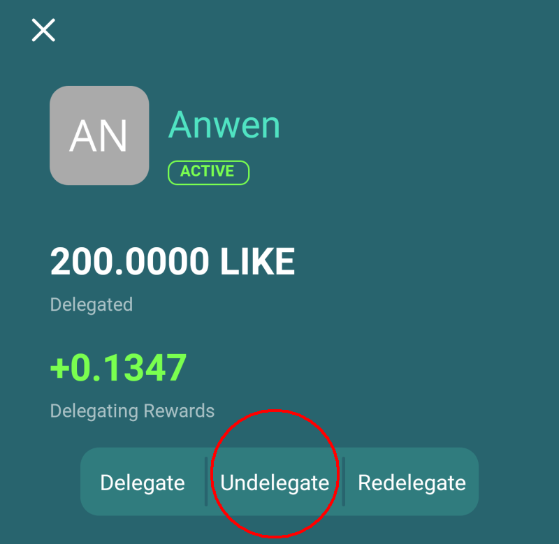

# Undelegation of LikeCoin

## Important note **regarding Undelegation**

Once you've confirmed your undelegation, the following happens:

1. It takes 21 days cooling-off period to undelegate and get back the LikeCoin to your own wallet, the LikeCoin cannot be redelegated, rewarded or transferred as well.
2. Validator lost his/her voting power of the amount the LikeCoin withdrew.


[Transaction fee](../wallet/transaction-fee.md) is required for ‌Undelegate LikeCoin.



If you find that your LikeCoin undelegated was less than what you delegated to the validator, it may be the case that your validator [cannot validate the transaction properly](../../user-guide/background.md#9e68) and was penalized. Therefore, please choose your validator wisely.


## **Undelegate via dao.like.co**

### Step 1: Login dao.like.co

Go to [dao.like.co](https://dao.like.co/) and select [Keplr Browser Extension](../wallet/keplr/), [Cosmostation Browser Extension](../wallet/cosmostation/) or [Authcore](../../user-guide/liker-id/register/) to login.

<figure><figcaption></figcaption></figure>

### **Step 2: Select the validator with delegation**

Click "Portfolio" on the left hand side menu, on Your Stake and click on the validator that you need to undelegate.

### **Step 3: Unstake**

Click "Unstake" on the upper right corner of the validator to undelegate.

### Step 4: Decide the amount to undelegate

The Unstake page appears, enter the amount of LikeCoin you want to undelegate, and click "Next".

### Step 5: Confirm undelegation

Confirmation is required. Keplr and Cosmostation users will need to approve a pop-up box to confirm the undelegation after clicking "Send". Authcore users directly click "Send".

After the "Sent and confirming", "Successfully unstaked!" appears, undelegation is completed.

 

## **Undelegate via Cosmostation app**

### Step 1: Login Cosmostation app

On the [Cosmostation app](../wallet/cosmostation-app/), click「Delegate」.

<figure><figcaption></figcaption></figure>

### Step 2: Select the validator with delegation

On the "My" of the Validator List click the validator that you have to undelegate.

<figure><figcaption></figcaption></figure>

### Step 3: Undelegate

Click "UNDELEGATE".

<figure><figcaption></figcaption></figure>

### Step 4: Decide the amount to undelegate

The UNDELEGATE page appears, enter the amount of LikeCoin you want to undelegate, and click "Next" then confirm ( **** Follow the [Step 4-7 in Delegate via Cosmostation app](delegation-of-likecoin.md#step-4-decide-the-amount-to-delegate-1) ) to undelegate.

<figure><figcaption></figcaption></figure>

## **Undelegate via Liker Land**

If you delegated LikeCoin to a validator but you want to get them back, you can utilize the \[Undelegate] function of [Liker Land app](../../user-guide/liker-land/download.md). Please follow the steps:

### **Step 1: Select the validator with delegation**

In the LikeCoin wallet page, click on the validator that you delegated (displayed as green).

### Step 2: Undelegate

Go to the validatior page, click \[Undelegate].

### **Step 3: Input the amount of LikeCoin to undelegate**

Input the number of LikeCoin that you have to undelegate, click \[Confirm].
