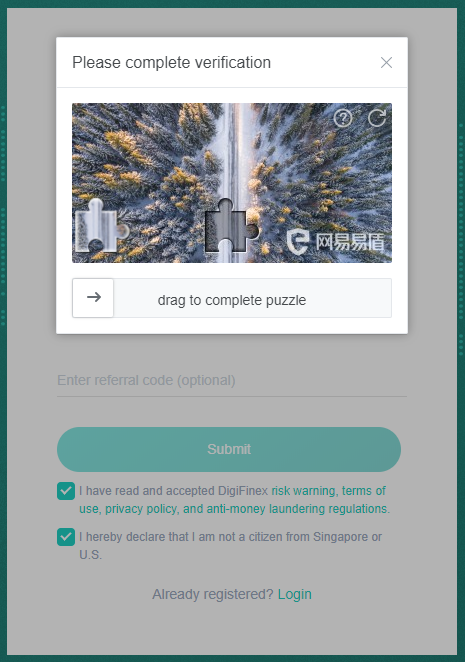
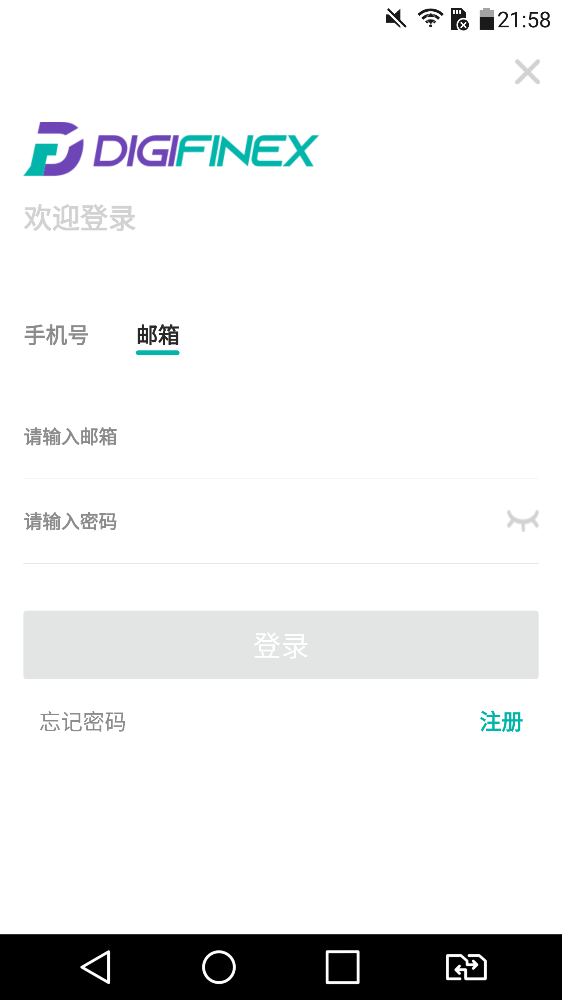

# Registering on DigiFinex

Buy and Sell LikeCoin on DigiFinex requires an account, please go to [DigiFinex website](https://www.digifinex.com/zh-cn/?ts=1597115837) and follow these steps to register a account:

### Step 1: Confirm password and email or mobile phone number

On the right hand corner of the website, click "Register"


Please note that you have to declare that you are not a citizen from Singapore or the US. Starting in June 2021, DigiFinext is not available in China.


Fill in your email, password and referral code (Optional). You may also choose to register by mobile phone number, check on the switch below in red

No matter if you are using email or phone, you have to click the "Send Code'' (indicated by the red arrow above) and complete verification to get your verification code. After receiving the code from your email or phone, enter it and click "Submit" and your account is created. When you set up your account, you are required to provide verification code all the time, and validity of the code just lasts for 10 minutes, therefore please ensure that your internet connection is good during registration.

When the account is created, the system will bring you back to the DigiFinex website frontpage, click on the top right hand corner avatar icon and click "User Center"

Then go into the "Basic Information" page, you have to proceed with Real-name verification and 2FA in order to use the service of DigiFinex

#### DigiFinex Official Tutorial

> [【New User Guide】- How to register an account
> ](https://digifinex.zendesk.com/hc/en-us/articles/360006576493--New-User-Guide-How-to-register-an-account)

### Step 2: Real-name verification 

On the "Basic Information" page "Real-name verification", click on the "Unverified" and the following page appears. Scan QR Code or go to [https://download.digifinex.xyz/](https://download.digifinex.xyz/) and download DigiFinex app

Open the app, click on the top right hand corner bell icon (circled in red) and login your account

Enter your email or mobile phone number and password then click \[Login]

Click \[Send] and get the verification code from email or phone, enter the code and click \[Confirm]

For the first time using DigiFinex app, you have to set up the "connect-the-dots" grid password (or other authentication method, depend on the model of your phone), then you don't have to enter password for accessing the app, please remember what pattern you have created

Click on the top left hand corner avatar and a menu appears, click the \[Security] setting

Click on \[Unverified] of the \[Real-name verification]&#x20;

Fill in your real-name verification information, select China or Non-China user and click \[Next]

Fill in the details, you have to provide nationality, legal name on the documents, type of national ID,  ID number, etc

Upload a photo of your ID (make sure the ID is in HD). Then upload a photo of a handheld ID Card + White paper write "digifinex.com"

Hand-held photo requires ID card + Note with handwritten DigiFinex + date of upload. Make sure the uploaded photos are clear and consistent.&#x20;

Picture formats must be in JPG, PNG f and the size must not exceed 2MB


Scan for facial recognition and complete the process

If the approval is failed the system will show an error message. You may resubmit real-name verification again or contact [customer service](https://digifinex.zendesk.com/hc/en-us/articles/360000525241-How-to-get-help-for-the-Customer-Service) for manual approval (a dialogue box will appear if the approval is failed)

After the upload is completed, wait for approval. Review will be completed in 1-3 business days.

#### DigiFinex Official Tutorial

> [How to do ID-verification (a.k.a KYC)
>
> ](https://digifinex.zendesk.com/hc/en-us/articles/360006473334--How-to-do-ID-verification-a-k-a-KYC-)

### Step 3: Set up 2-Factor Authentication&#xD; (2FA) 

You have to set up 2-Factor Authentication otherwise you are not able to withdraw from DigiFinex, please download Google Authenticator on your mobile

[Google Play Download](https://play.google.com/store/apps/details?id=com.google.android.apps.authenticator2\&hl=zh\_TW)\
[App Store Download](https://apps.apple.com/hk/app/google-authenticator/id388497605)

On the "Basic Information" page "2FA", click on the "Off" and the following page appears, click "Next Step"

Use Google Authenticator to scan the QR Code and click "Next Step" again

Click "Send Code" to acquire verification code, and fill in the 6-digit 2FA code from Google Authenticator, then click "Activate". If you want to use 2FA during login, select "Use 2FA to login", or you can go to "2FA" on "Security" to turn it on

#### DigiFinex Official Tutorial

> [How to set up 2FA？
> ](https://digifinex.zendesk.com/hc/en-us/articles/360007869553-How-to-set-up-2FA-)[
> ](https://digifinex.zendesk.com/hc/en-us/articles/360000518802-FAQ-about-2FA)

### If you experience difficulties, contact DigiFinex Help Desk

If you have any questions about using DigiFinex and their products,  please check [DigiFinex Help Center](https://digifinex.zendesk.com/hc/en-us) or contact [DigiFinex customer service](https://digifinex.zendesk.com/hc/en-us/articles/360000525241-How-to-get-help-for-the-Customer-Service). Click on the bubble at the lower right hand corner of DigiFinex website and find support.
