# Registering on DigiFinex

Buying and selling LikeCoin on DigiFinex requires an account. Please go to the [DigiFinex website](https://www.digifinex.com/zh-hk/?ts=1597115837) and follow these steps to register an account:

## Step 1: Confirm password and email or mobile phone number

On the right-hand corner of the website, click "Sign up".

<figure><figcaption>
Click "Sign up" on the right-hand corner of the website
</figcaption></figure>

\
Please note that you have to declare that you are not a citizen of Singapore or the US. Starting in June 2021, DigiFinex is not available in China.&#x20;

Fill in your email or mobile phone number.

<figure>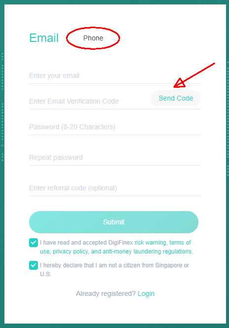<figcaption>
Fill in your email and click "->" to get the verification code
</figcaption></figure>

<figure>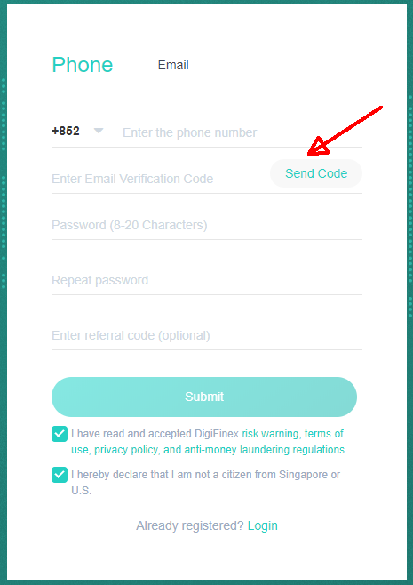<figcaption>
Fill in your mobile number and click "->" to get the verification code
</figcaption></figure>

No matter if you are using email or phone, you have to click the "->'' and complete verification to get your verification code. After receiving the code from your email or phone, enter it and fill in the password, and your account will be created. When you set up your account, you are required to provide a verification code all the time, and the validity of the code lasts for only 10 minutes. Therefore, please ensure that your internet connection is good during registration.

<figure>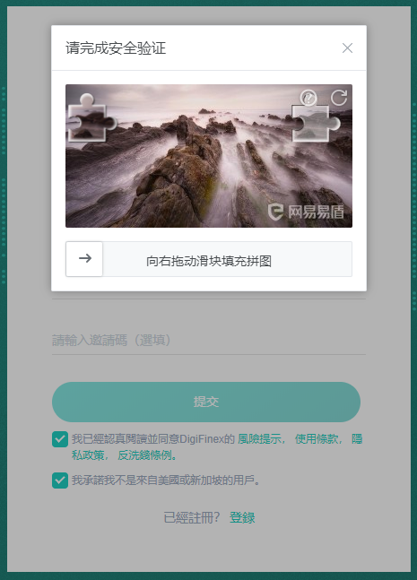<figcaption>
Play a jigsaw puzzle to get a verification code
</figcaption></figure>

When the account is created, the system will bring you back to the DigiFinex website front page. Click on the top right-hand corner avatar icon and click "User Center".

<figure><figcaption>
click "User Center"
</figcaption></figure>

Then go to the "Basic Information" page. You have to proceed with Real-name verification and 2FA to use the service of DigiFinex.

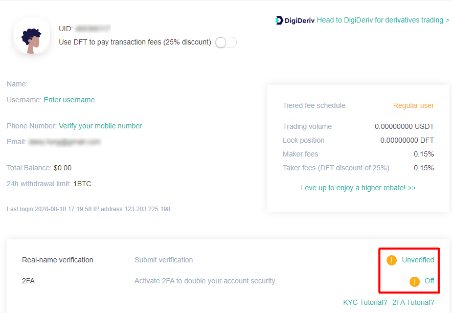

#### DigiFinex Official Tutorial

> [【New User Guide】- How to register an account
> ](https://digifinex.zendesk.com/hc/en-us/articles/360006576493--New-User-Guide-How-to-register-an-account)

## Step 2: Real-name verification 

On the "Basic Information" page "Real-name verification," click on the "Unverified," and the following page appears. Scan the QR Code or go to [https://download.digifinex.xyz/](https://download.digifinex.com/) and download the DigiFinex app.

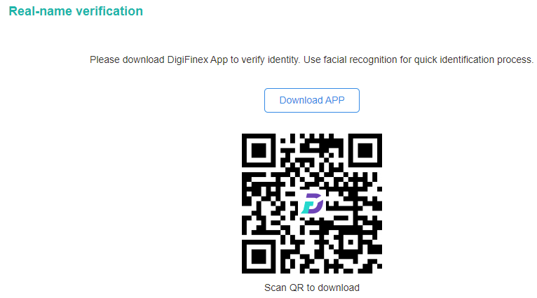

Open the app, click on the top right-hand corner bell icon (circled in red) and log in to your account.

Enter your email or mobile phone number and password, then click \[Login]

![Enter your email or mobile phone number and password, then click \[Login\]](../../.gitbook/assets/digifinex-mobile-2.png)

Click \[Send] and get the verification code from email or phone, enter the code, and click \[Confirm].

![Click \[Send\] and get the verification code from email or phone, enter the code, and click \[Confirm\]](../../.gitbook/assets/digifinex-mobile-3.png)

For the first time using the DigiFinex app, you have to set up the "connect-the-dots" grid password (or other authentication method, depending on the model of your phone), then you don't have to enter a password for accessing the app. Please remember what pattern you have created.

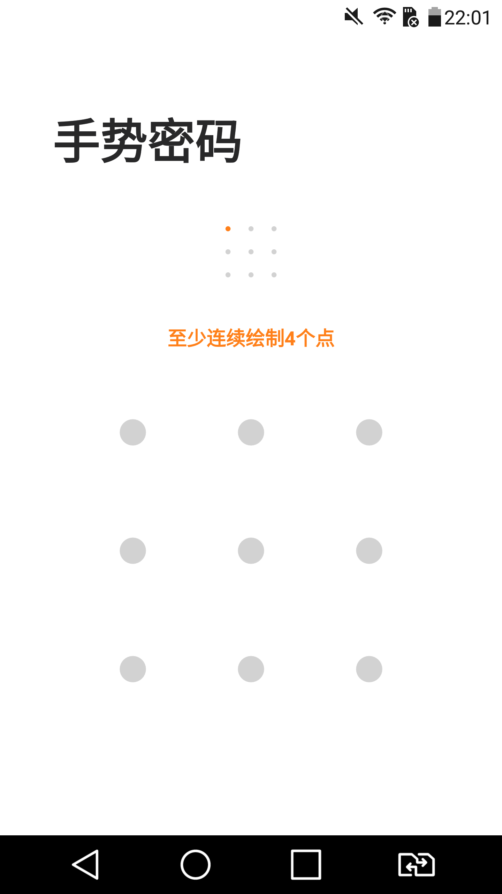

Click on the top left-hand corner avatar, and a menu appears, click the \[Security] setting.

![Click the \[Security\] setting](../../.gitbook/assets/digifinex-mobile-5.png)

Click on \[Unverified] of the \[Real-name verification].

![Click on \[Unverified\] of the \[Real-name verification\]](../../.gitbook/assets/digifinex-mobile-6.png)

Fill in your real-name verification information, select China or Non-China user, and click \[Next].

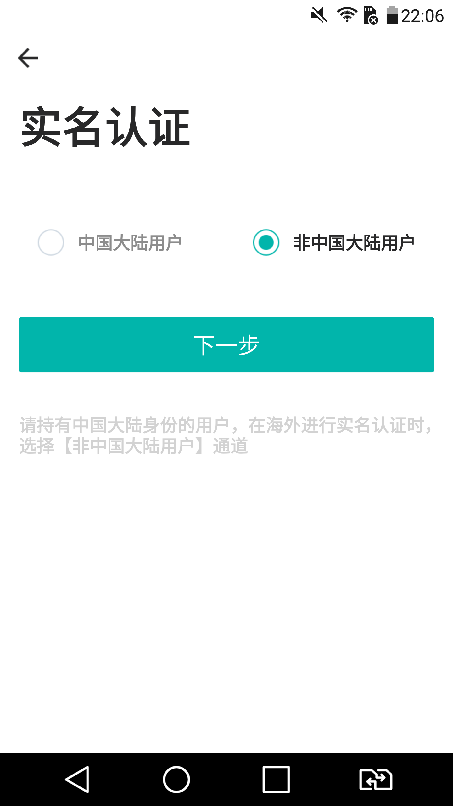

Fill in the details, and you have to provide nationality, legal name on the documents, type of national ID, ID number, etc.

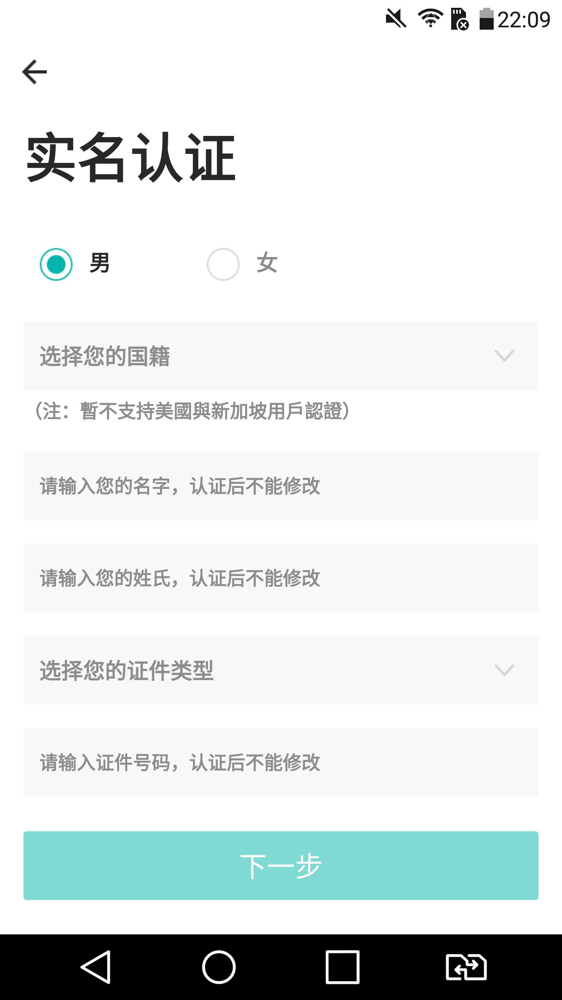

Upload a photo of your ID (make sure the ID is in HD). Then upload a photo of a handheld ID Card + White paper written "digifinex.com".


The hand-held photo requires ID card + Note with handwritten DigiFinex + date of upload. Make sure the uploaded photos are clear and consistent.

Picture formats must be in JPG, PNG, and the size must not exceed 2MB.

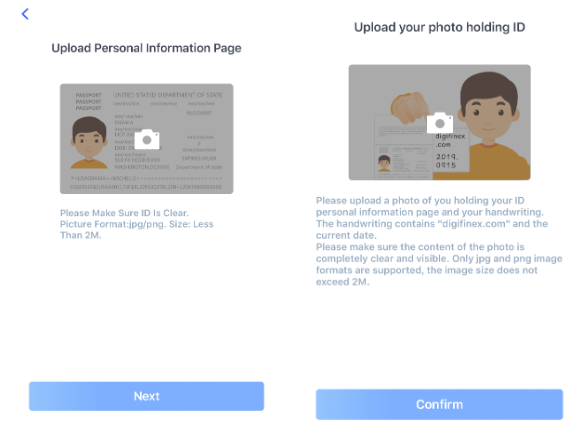


Scan for facial recognition and complete the process.

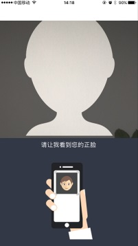

f the approval fails, the system will show an error message. You may resubmit real-name verification again or contact [customer service](https://support.digifinex.com/hc/en-us/articles/360000525241-How-to-get-help-for-the-Customer-Service) for manual approval (a dialogue box will appear if the approval fails).

After the upload is completed, wait for approval. The review will be completed in 1-3 business days.

#### DigiFinex Official Tutorial

> [How to do ID-verification (a.k.a KYC)
>
> ](https://digifinex.zendesk.com/hc/en-us/articles/360006473334--How-to-do-ID-verification-a-k-a-KYC-)

Step 3: Set up 2-Factor Authentication
&#x20;(2FA) 
--------------------------------------------------

You have to set up 2-Factor Authentication; otherwise, you will not be able to withdraw from DigiFinex. Please download Google Authenticator on your mobile device.

[Google Play Download](https://play.google.com/store/apps/details?id=com.google.android.apps.authenticator2\&hl=zh\_TW)\
[App Store Download](https://apps.apple.com/hk/app/google-authenticator/id388497605)

On the "Basic Information" page, click on "2FA" and then click "Off". The following page will appear. Click "Next Step".

Use Google Authenticator to scan the QR Code and click "Next Step" again.

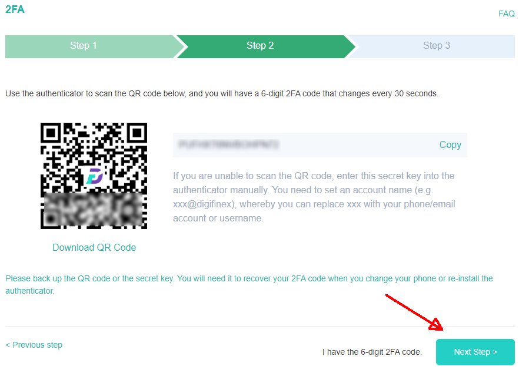

Click "Send Code" to acquire the verification code and fill in the 6-digit 2FA code from Google Authenticator, then click "Activate". If you want to use 2FA during login, select "Use 2FA to login", or you can go to "2FA" under "Security" to turn it on.

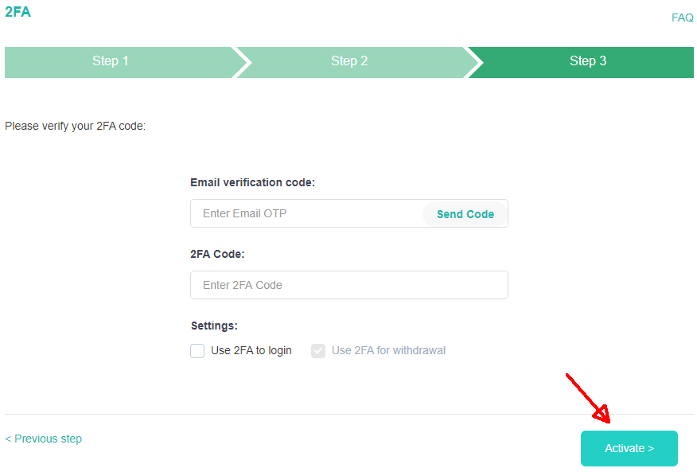

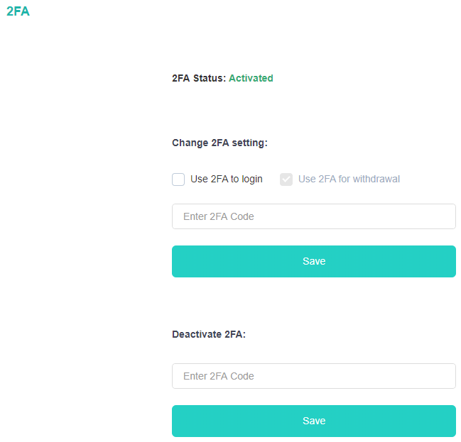

#### DigiFinex Official Tutorial

> [How to set up 2FA？
> ](https://digifinex.zendesk.com/hc/en-us/articles/360007869553-How-to-set-up-2FA-)[
> ](https://digifinex.zendesk.com/hc/en-us/articles/360000518802-FAQ-about-2FA)

#### If you experience any difficulties, please contact the DigiFinex Help Desk

If you have any questions about using DigiFinex and its products, please check the [DigiFinex Help Center](https://support.digifinex.com/hc/en-us) or contact [DigiFinex customer service](https://support.digifinex.com/hc/en-us/articles/360000525241-How-to-get-help-for-the-Customer-Service). Click on the chat bubble at the lower right-hand corner of the DigiFinex website to find support.
