# Trade in DigiFinex


Reminder: Suggest to try with a small amount before making any large transactions


DigiFinex is a top 20+ exchange in CoinMarketCap, trade and exchange volume are on top level, providing LIKE/USDT trading pairs. If you do not have a DigiFinex account, please take a look at [this](registering-on-digifinex.md). Moreover, you have to download the [Keplr](../wallet/keplr/) wallet or [Liker Land app](https://liker.land/getapp) to send/receive LikeCoin. The following instructions are based on DigiFinex web, you may also use [DigiFinex app](https://digifinex.zendesk.com/hc/en-us/articles/360000603862-How-to-download-APP) to trade LikeCoin.

### Step 1: Create your LikeCoin wallet on DigiFinex

First of all you have to create your wallet address on DigiFinex so as to transfer LikeCoin to the exchange. Click on the top right hand corner avatar icon and click "User Center", then click "My Balance". On the search box, input "Like", then click "Deposit"

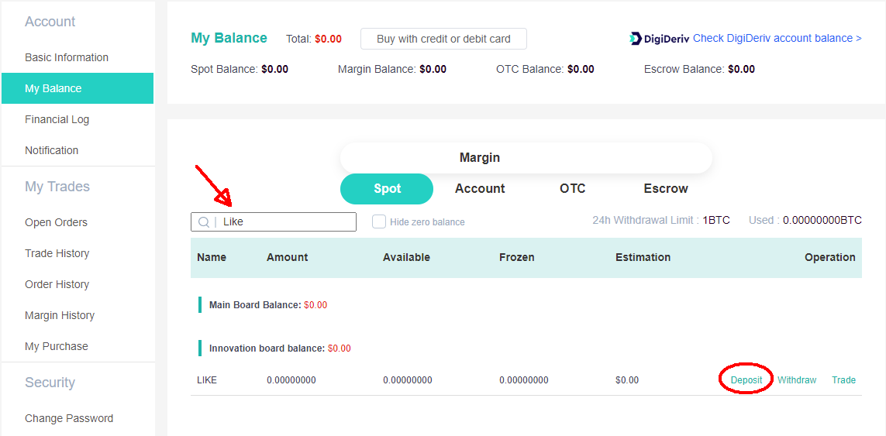

This action brings you to the page "LikeCoin (LIKE) Deposit", click "Generate deposit address". You can also check your "Deposit History" underneath

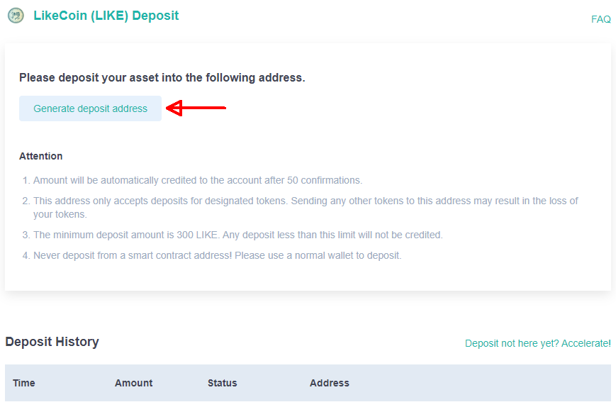

The address that starts with cosmos is your DigiFinex LikeCoin wallet just created, click on the "Show QR Code" so that you don't have to input the cosmos address manually. **Tag/Memo is very important** because it is mandatory for DigiFinex to identify your deposit

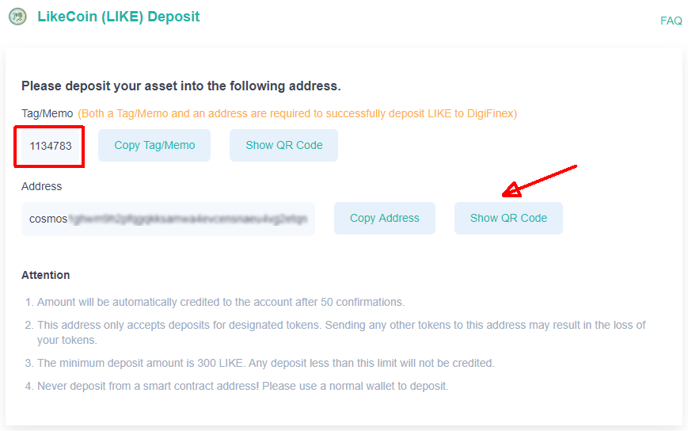

Click on the "Show QR Code" button to show your LikeCoin wallet QR Code.

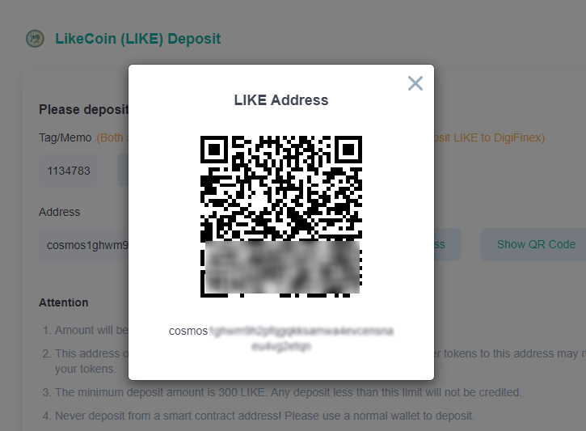


DigiFinex has a minimum deposit amount of **100 LikeCoin**, **a single deposit which is less than the minimum will disappear!** Please make sure that you deposit the correct amount.


### Step 2: Transfer LikeCoin to DigiFinex

Open the [Liker Land app](https://liker.land/getapp), click on "My Wallet. Then, click on the \[Send] button (circled in red below)

![On Liker Land app select \[Send\] (circled in red)](../../.gitbook/assets/like-pay-1-en.png)

Go to the next page, click on the QR Code icon circled in red, the app will open camera mode for you to scan the QR Code, please scan the QRCode that you have on Step 1, cause you have to transfer LikeCon to DigiFinex

Input the Tag/Memo number into the "Input memo (optional)" field (**Very Important!**)

.png>)

Input the amount of LikeCoin that you want to transfer, then click \[Confirm]

Next step is to wait for DigiFinex to confirm the transfer.

If you are using [Keplr](../wallet/keplr/), please insert the memo in "Memo (Optional)" field.


DigiFinex requires you to input your "Tag/Memo" into the chain during deposit. If you do not fill in the "Tag/Memo" will result in not being able to deposit into DigiFinex. They will have to find a technician to assist you and require 7-21 days to fix it and a 10 USDT service fee. Your DigiFinext account needs to have such an amount of fee.
&#x20;Please contact [DigiFinex Customer Service](https://digifinex.zendesk.com/hc/en-us/articles/360000525241--New-User-Guide-How-to-Find-the-Customer-Service) for handling.


#### &#xD;DigiFinex Official Tutorial

> [【Deposit】- How to Deposit in Website
> ](https://digifinex.zendesk.com/hc/en-us/articles/360000519282--Deposit-How-to-Deposit-in-Website)

> [【Deposit】- How to Deposit in APP
> ](https://digifinex.zendesk.com/hc/en-us/articles/360002689614--Deposit-How-to-Deposit-in-APP)

### Step 3: Confirm the transfer to DigiFinex

You can check your wallet balance in "My Balance" following Step&#x20;
1\.

### Step 4: Buy or Sell&#xD;

On the top left corner of DigiFinex website there are "Market" and "Spot" on the menu

Click "Market", on the search box input "Like" will show the chart (As LikeCoin is just into the market, there is no line graph at the moment)

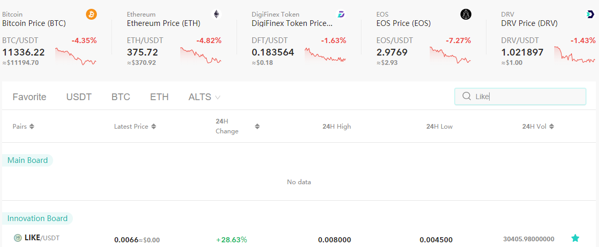

Click "Spot", input "Like" to the search box on the left, click LIKE/USDT and goes into the exchange panel

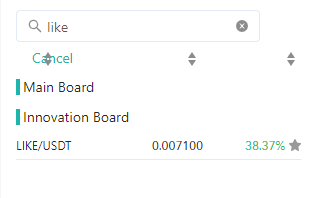

Take a look at the order book on the right hand side. The figures in red are those orders who want to "Sell", for example below there are people who want to sell 424.57 LikeCoin at the price of 0.007200 USDT/LIKE, and then some other people want to sell 417.44 LikeCoin at 0.007300 USDT/LIKE. If you want to buy 500 LikeCoin, you can buy them all at 0.007300 USDT/LIKE

If you want to sell your LikeCoin, you have to monitor the seller in green. For example below if you want to sell 100 LikeCoin, it is guaranteed to be sold at 0.006600 USDT/LIKE because the highest selling price is 0.006600 to buy 151.07 LikeCoin

To make it simple, if you want to sell, check out the orders in green; if you want to buy, check out the orders in red
. You can also take a look at the "Latest" transaction statistic

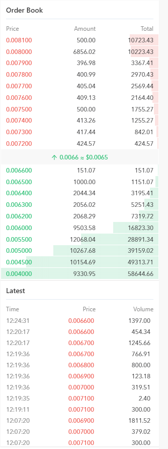

Once you decide the price and amount to buy or sell, go to the "Spot" to confirm. Let use "Limit Price" as an example

You have to input 3 parameters:

* Select the right action for "Buy LIKE" or "Sell LIKE
* Input "Price": using the order book above as an example, fill in 0.006600 for selling LikeCoin
* Input "Amount": Fill in 200 for selling 200 LikeCoin, or adjust the percentage e.g. 100%, 50%, etc

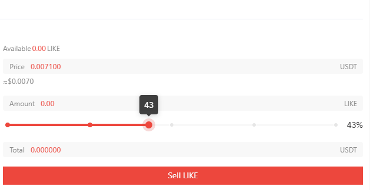

The system will calculate "Total", confirm if they are correct or not, then click "Sell LIKE" to complete the transaction.&#x20;

#### DigiFinex Official Tutorial

> [Spot Trading Tutorial - DigiFinex Guide
>
> ](https://www.youtube.com/watch?v=o3aV16hrDt0)[
> ](https://digifinex.zendesk.com/hc/en-us/articles/360007599713-How-to-Start-Spot-Trading-In-APP-)

### Step 5: Check Transaction details

Go to the bottom of the screen and find "Trade History" to check out the transaction details, your wallets reflect new balances as well.

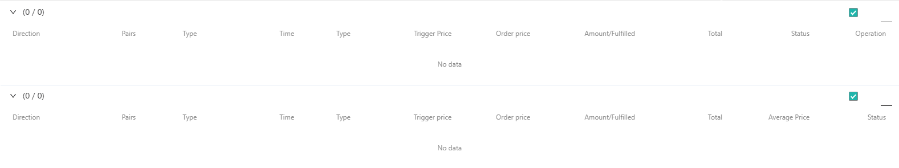

### Step 6: Withdrawal


About the minimum withdrawal requirement and withdrawal free, you can check out [【Contract List】- Fees](https://digifinex.zendesk.com/hc/en-us/articles/360000328422--Contract-List-Fees)
. Please also note that you have to complete [2FA](registering-on-digifinex.md#3-google-) before withdrawal.


Going back to "My Balance" page in Step 1, select USDT or LIKE and click "Withdrawal", then click "Add withdraw address" to add your USDT or LikeCoin address for transfer, and follow the steps to complete withdrawal.

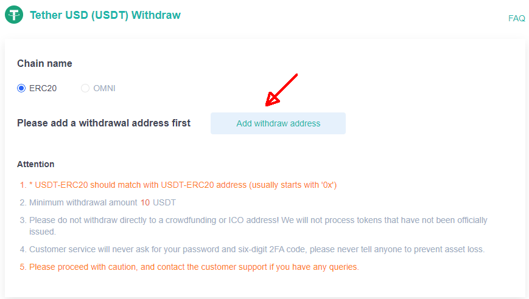

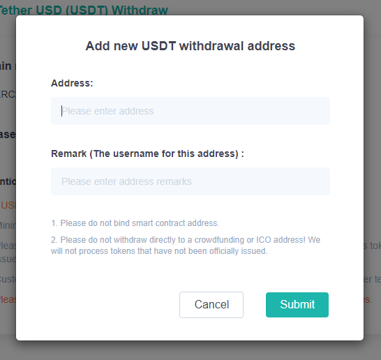

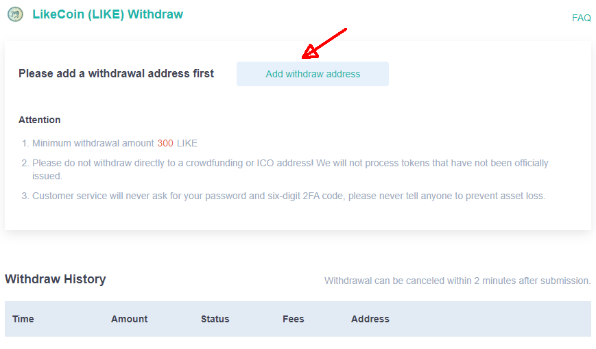

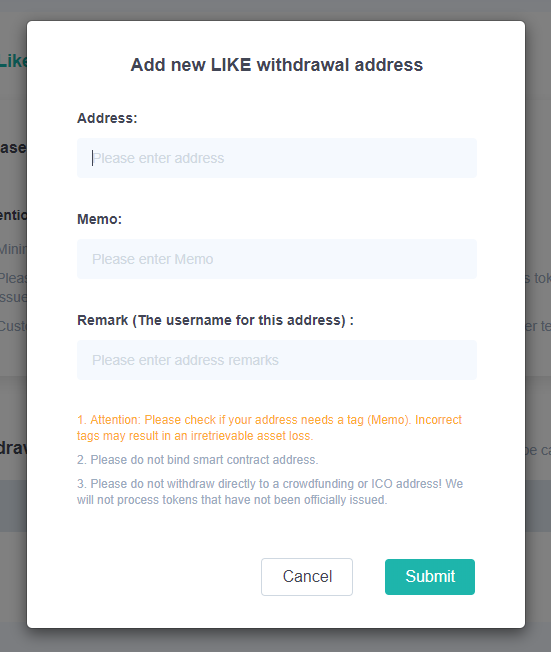

####

#### DigiFinex Official Tutorial

> [【Withdraw】- How to Withdraw in Website
>
> ](https://digifinex.zendesk.com/hc/en-us/articles/360000521962--Withdraw-How-to-Withdraw-in-Website)

> [【Withdraw】- How to withdraw in APP
>
> ](https://digifinex.zendesk.com/hc/en-us/articles/360002955534--Withdraw-How-to-withdraw-in-APP)
