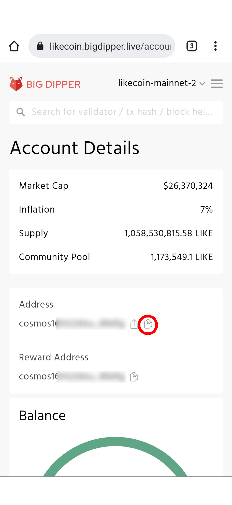
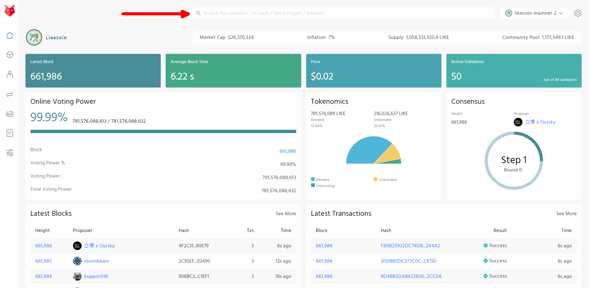

# Big Dipper

[Big Dipper](https://likecoin.bigdipper.live/) block explorer displays validators information, proposals, voting records and results in a simple user interface, and most importantly, all the LikeCoin transaction records. Big Dipper is just like an open government for citizens to search for open data within the LikeCoin DAO.

## How to check transactions on Big Dipper

### Keplr / Cosmostation / Liker Land web

Copy the [wallet address](../wallet-address.md) and paste it in the search field of the [Big Dipper](https://likecoin.bigdipper.live/) website.

### Liker Land app

Click on "My Wallet in Liker Land app then move to the bottom, click on "View on Big Dipper open data browser".

A browser will pop-up and show the Big Dipper block explorer. You may also copy the Cosmos wallet address of your Liker ID (circled in red), input the wallet address on desktop (Red Arrow)  and explore the transactions.

