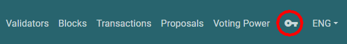

# Ledger

Before using your hardware wallet, please configure it and install the Cosmos app. Take Ledger as an example, you may install the Cosmos app via [Ledger Live](https://support.ledger.com/hc/en-us/articles/360013713840-Cosmos-ATOM-).

The following demo is on the block explorer [Big Dipper](block-explorer/big-dipper.md) environment, you may also manage your LikeCoin with hardware wallet on [Keplr](keplr/), referring to [How to use Ledger Nano hardware wallet with Keplr](https://medium.com/chainapsis/how-to-use-ledger-nano-hardware-wallet-with-keplr-9ea7f07826c2).

## Access your hardware wallet

### Step 1: Connect the Ledger device to your computer by a USB cable

### Step 2: Open the Cosmos app on the Ledger

Choose the Cosmos app by pressing both of the buttons on the Ledger device and get the app “Cosmos ready”.

### Step 3: Go to Big Dipper and login

Click the key icon on the upper right hand corner on [Big Dipper](https://likecoin.bigdipper.live/) and login. You may have to wait for a while for Big Dipper to detect the hardware wallet.

### Step 4: Check wallet details

After login the key icon changes to an avatar, you can then click on it to access the details of your wallet.

You can check your LikeCoin balance, delegation to validators, rewards and various other information. You perform deposit, withdrawal and various other transactions.

## Withdraw Rewards

Step 1: Click on the green “WITHDRAW” button on Big Dipper.

Step 2: A window pops up and asks you to proceed with the withdrawal action, click “NEXT”.

Step 3:  A confirmation screen displays, you are asked to "SIGN" and confirm the withdrawal.

Step 4: The Ledger's screen will then be changed and displays the details of the transaction, go through them by pressing the button. The last screen shows two options: "Approve" or "Reject". Press both buttons on the Ledger device to approve the transaction.

Step 5: "Transaction is broadcasted." appears on Big Dipper, you can check your wallet details and verify your transaction result.

## Delegate LikeCoin

Step 1: Click on your desired validator among the [Big Dipper Validators](https://likecoin.bigdipper.live/validators).

Step 2: Click on the green "DELEGATE" button on the "Voting Power" column of that validator.

Step 3: A window pops up and asks you to fill in the amount of LikeCoin that you are going to delegate to the validator, add any notes that you would like to remarks for the transaction, then click "NEXT".

Step 4: A confirmation screen displays, if everything is correct, click "SIGN".

Step 5: The Ledger device will ask you to confirm the transaction, approve it and verify transaction details on Big Dipper.

## Redelegate LikeCoin

Step 1: Click on the validator that you've delegated LikeCoin to.

Step 2: Click the red "REDELEGATE" button on the "Voting Power" column.

Step 3: A window pops up and asks you to input the amount of LikeCoin that you are going to redelegate. Click "SELECT A VALIDATOR" to select the validator that you would like to redelegate to.&#x20;

Step 4: Fill in the amount of LikeCoin to redelegate and add any notes that you would like to remarks for the transaction, then click "NEXT".

Step 5: A confirmation screen displays, if everything is correct, click "SIGN".

Step 6: The Ledger device will ask you to confirm the transaction, approve it and verify transaction details on Big Dipper.


How to manage your LikeCoin by Ledger Nano S

