# Ledger

在使用你的硬件錢包前，請設定並安裝 Cosmos app。以 Ledger 為例，你可以到 [Ledger Live](https://support.ledger.com/hc/en-us/articles/360013713840-Cosmos-ATOM-) 安裝它。

以下示範採用 [Big Dipper](block-explorer/big-dipper.md) 區塊鏈瀏覽器進行，你也可以使用 [Keplr](keplr/) 配合硬件錢包管理你的 LikeCoin，詳見 [How to use Ledger Nano hardware wallet with Keplr](https://medium.com/chainapsis/how-to-use-ledger-nano-hardware-wallet-with-keplr-9ea7f07826c2)。

## 讀取你的硬件錢包

### 步驟一：以 USB  傳輸線接通你的電腦及 Ledger

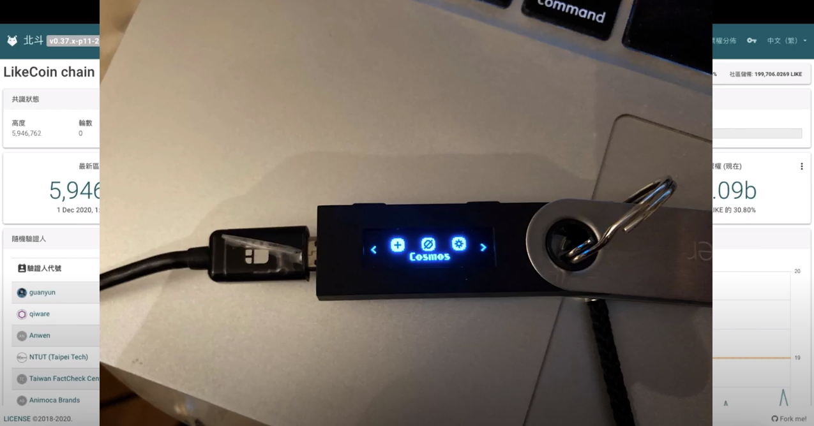

### 步驟二：在 Ledger 打開 Cosmos app

選取 Cosmos app 再按下 Ledger 兩邊的按鈕，使 Ledger 出現 "Cosmos ready"。

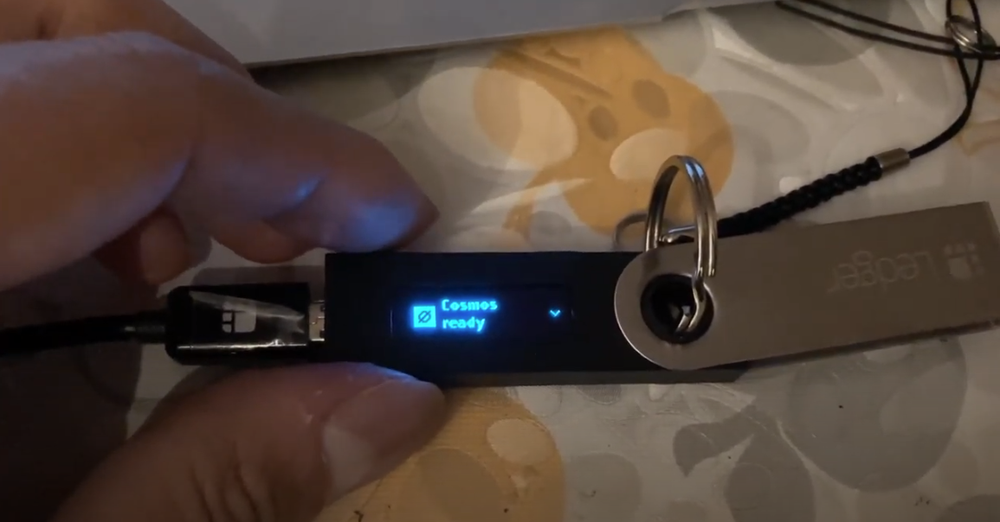

### 步驟三：到 Big Dipper 網站登入

在 [Big Dipper](https://likecoin.bigdipper.live/) 網站的右上角點擊鑰匙符號並登入，會需要一些時間讓 Big Dipper 掃瞄並連接 Ledger 硬件。

### 步驟四：查看錢包明細

成功登入後鑰匙符號轉變為頭像符號，點擊它即可查看錢包內帳戶明細。

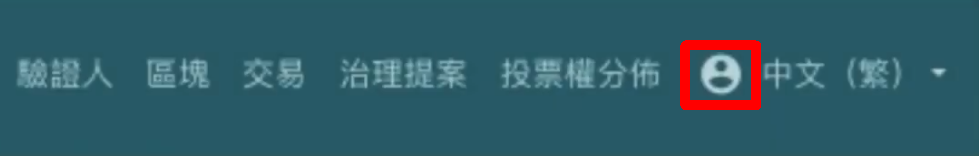

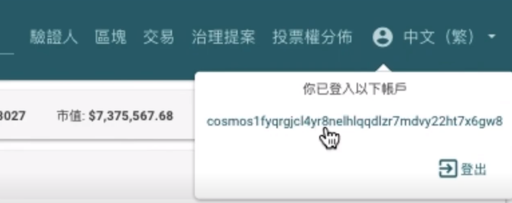

你可以查看你的 LikeCoin 數量、委託狀態、收益及其他內容，進行提存或其他操作。

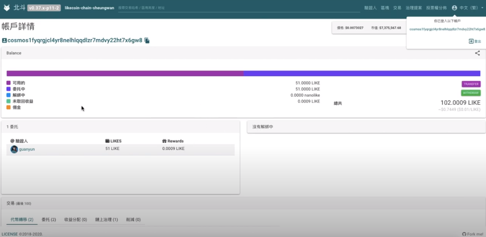

## 領取收益

步驟一：在 Big Dipper 點擊綠色「WITHDRAW」。

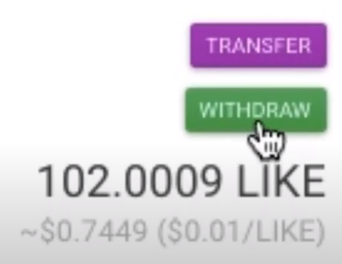

步驟二：視窗彈出詢問你是否希望領取收益，點擊「NEXT」。

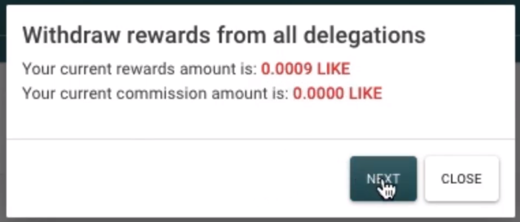

步驟三：確認頁面顯示你將要進行的操作，點擊「SIGN」確認你需要領取收益。

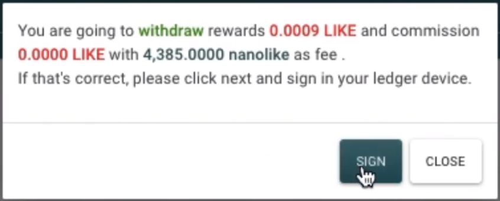

步驟四：你的 Ledger 顯示內容將變換並展示你的要進行的操作，讓你按鍵一一查閱。最後畫面顯示兩個選擇：「Approve」或「Reject」，同時按下 Ledger 兩邊的按鈕同意操作。

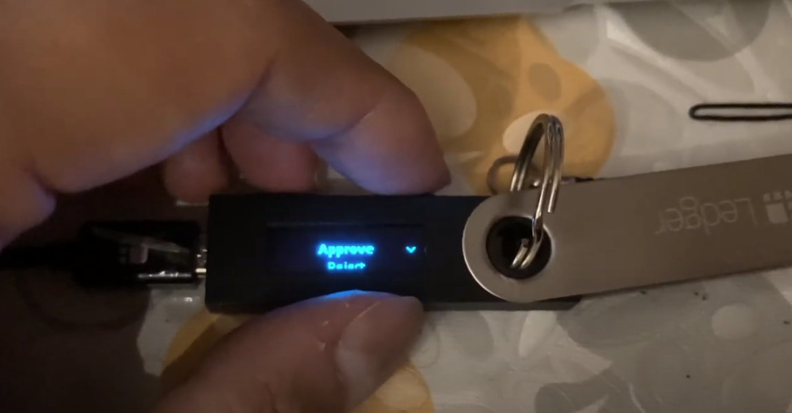

步驟五：Big Dipper 顯示 "Transaction is broadcasted."，你現在可以查看錢包明細並確認操作是否正確。

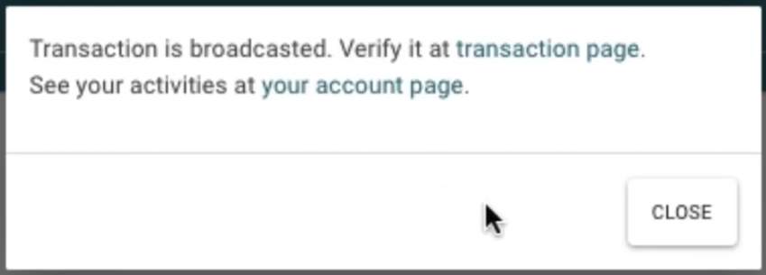

## 委託 LikeCoin&#x20;

步驟一：在 [Big Dipper 驗證人](https://likecoin.bigdipper.live/validators)中選取你屬意委託的驗證人。

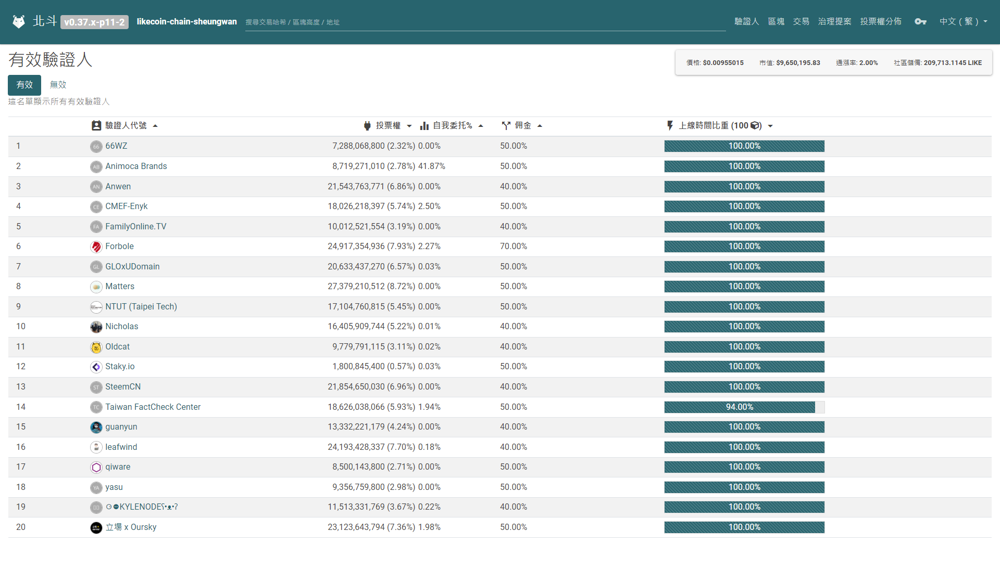

步驟二：於該投票人的「投票權」一欄點擊綠色的「DELEGATE」。

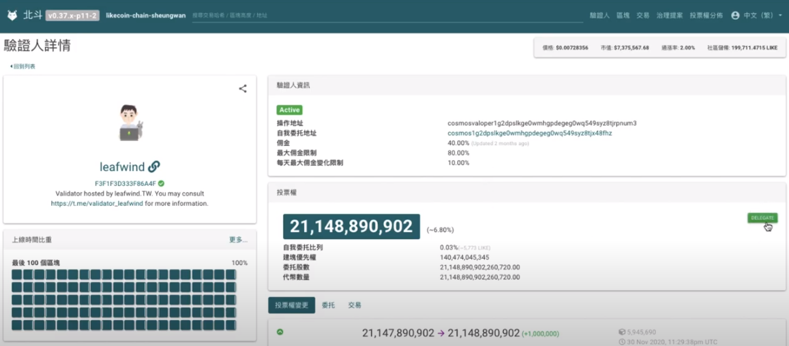

步驟三：視窗彈出要求你填寫委託 LikeCoin 的數量，你亦可以加上附註，再點擊「NEXT」。

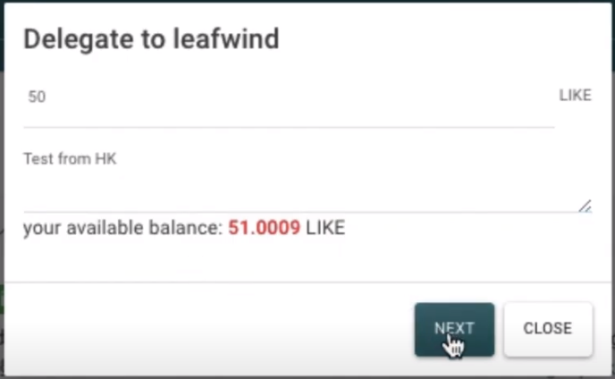

步驟四：確認頁面顯示你將要進行的操作，假如內容正確，點擊「SIGN」。

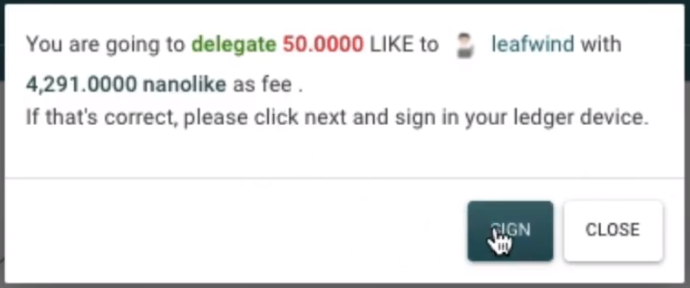

步驟五：Ledger 將詢問你是否確認操作，按鍵同意並於 Big Dipper 查閱錢包明細。

## 轉移委託 LikeCoin

步驟一：選取已委託 LikeCoin 的驗證人。

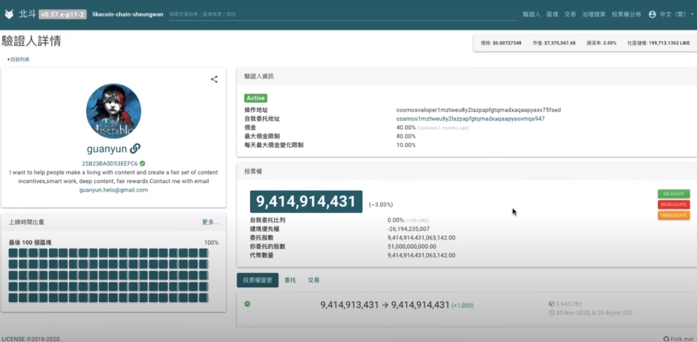

步驟二：於該投票人的「投票權」一欄點擊紅色的「REDELEGATE」。

步驟三：視窗彈出要求你填寫希望轉移委託的 LikeCoin 數量，點擊「SELECT A VALIDATOR」選擇你想轉移的目標驗證人。

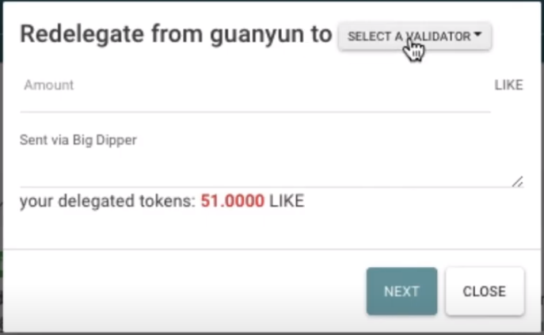

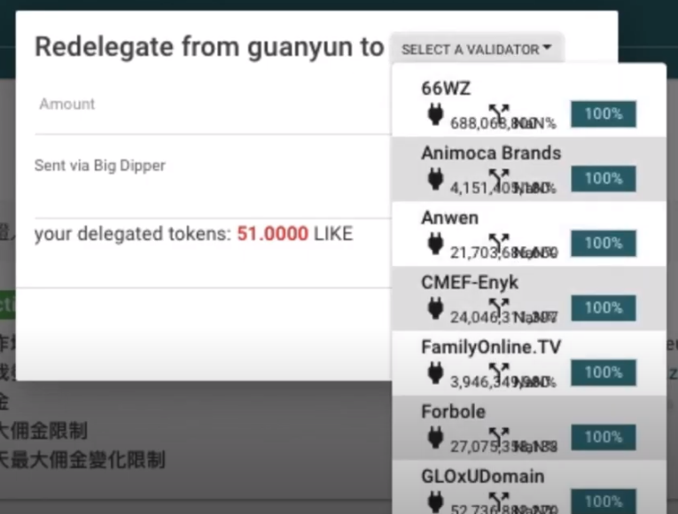

步驟四：填寫轉移委託 LikeCoin 的數量，你亦可以加上附註，再點擊「NEXT」。

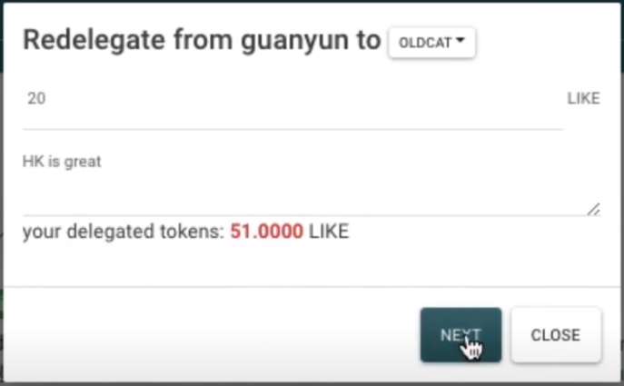

步驟五：確認頁面顯示你將要進行的操作，假如內容正確，點擊「SIGN」。

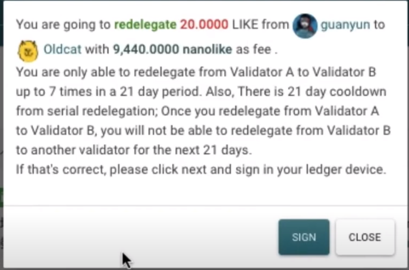

步驟六：Ledger 將詢問你是否確認操作，按鍵同意並於 Big Dipper 查閱錢包明細。
