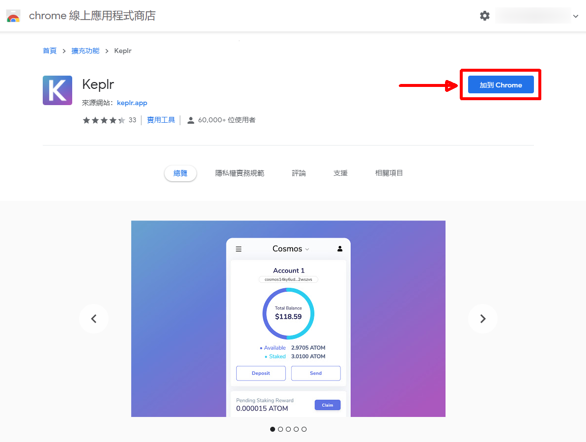
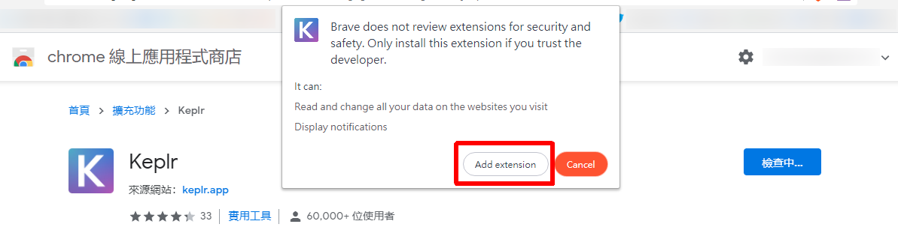

# 安裝 Keplr 瀏覽器擴充功能

## 步驟一：安裝 Keplr 瀏覽器擴充功能 

到 Chrome 線上應用程式商店點「加到 Chrome」安裝 [Keplr 瀏覽器擴充功能](https://chrome.google.com/webstore/detail/keplr/dmkamcknogkgcdfhhbddcghachkejeap)。

點「Add extension」將 Keplr 插件加到 Chrome。

在 Chrome 右上角按鍵訂選 Keplr 於瀏覽列方便使用。

<figure><figcaption>
釘選 Keplr 於瀏覽列
</figcaption></figure>

## 步驟二：註冊新帳戶 

### 方法一：以助記詞方式註冊

安裝完成後，點 Keplr 圖示並顯示註冊畫面。點「Create new account」註冊新帳戶。

<figure><figcaption>
點「Create new account」註冊新帳戶
</figcaption></figure>

第一行是你的助記詞 ( Mnemonic Seed )。請找一個安全的地方加密儲存，因為在回復錢包時會需要用到。輸入你的帳戶名稱 ( Account name )、新密碼 ( New Password )、確認密碼 ( Confirm password ) 然後點「Next」。

<figure><figcaption>
記下助記詞，輸入帳戶名稱及密碼
</figcaption></figure>

再依照次序確認助記詞後點「Register」。

<figure><figcaption>
確認助記詞
</figcaption></figure>

出現「Done」頁面代表經已完成註冊。

<figure><figcaption>
完成註冊 Keplr
</figcaption></figure>


請把助記詞及密碼保存於安全地方，假如你把它們忘記了就沒有辦法管理你的 LikeCoin，而任何人也不能為你重設 Keplr 錢包。


#### 教學影片





### 方法二：以 Google 帳戶註冊

點「Sign in with Google」註冊新 Keplr 帳戶。

<figure><figcaption>
「Sign in with Google」註冊新 Keplr 帳戶
</figcaption></figure>

彈出 Sign in with Google 視窗，登入 Google 帳戶。

<figure><figcaption>
彈出 Sign in with Google 視窗，登入 Google 帳戶
</figcaption></figure>

輸入你的帳戶名稱 ( Account name )、新密碼 ( New Password )、確認密碼 ( Confirm password ) 然後點「Next」。

<figure><figcaption>
輸入帳戶名稱及密碼
</figcaption></figure>

出現「Done」頁面代表經已完成註冊。

<figure><figcaption>
完成註冊 Keplr
</figcaption></figure>

## 步驟三：連接 LikeCoin chain 

打開 Keplr 錢包，在上方菜單點「Add Suggest Chains」。

<figure><figcaption>
在 Keplr 「Add Suggest Chains」
</figcaption></figure>

跳轉到 [https://chains.keplr.app/](https://chains.keplr.app/) 後搜尋 LikeCoin，再點「Add to Keplr >」。

<figure><figcaption>
在 https://chains.keplr.app/  搜尋 LikeCoin 再 「Add to Keplr >」
</figcaption></figure>

彈出 Keplr 視窗，點「Approve」。

<figure><figcaption>
彈出 Keplr 視窗，點「Approve」
</figcaption></figure>

菜單出現「LikeCoin」，選擇它。

<figure><figcaption>
在菜單選擇 LikeCoin
</figcaption></figure>

Keplr 錢包上出現你的 LikeCoin 餘額。

<figure><figcaption>
在 Keplr 錢包檢視 LikeCoin 餘額
</figcaption></figure>

#### 如需導入錢包，請參看：


[import-wallet-into-keplr.md](import-wallet-into-keplr.md)



安裝 Keplr 後你可以[使用它註冊 Liker ID](../../../user-guide/liker-id/register-with-keplr.md)

