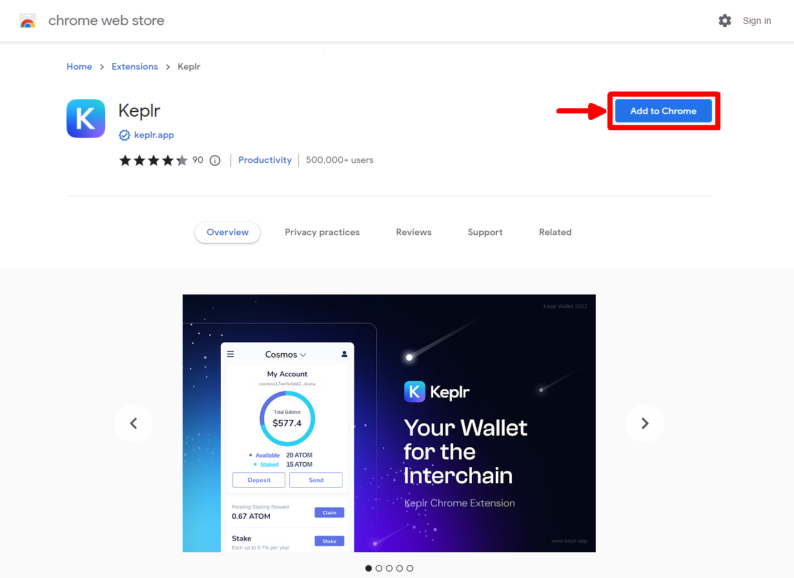
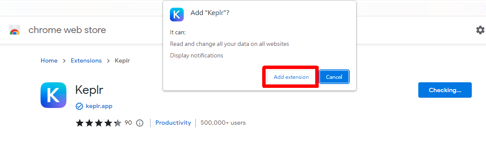
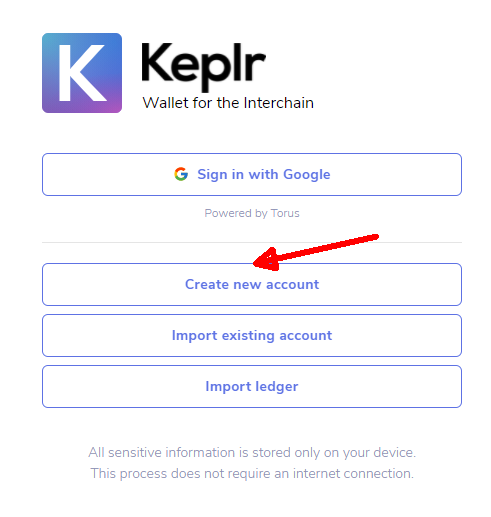
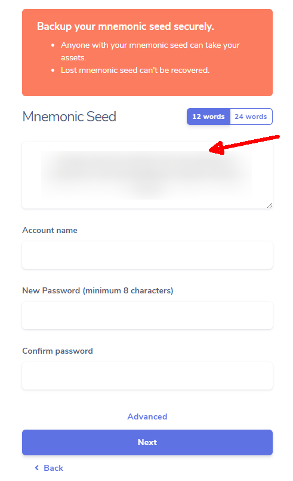

# How to install Keplr extension

### Step 1: Install Keplr

Go to the Chrome Webstore and click "Add to Chrome" to install the [Keplr extension](https://chrome.google.com/webstore/detail/keplr/dmkamcknogkgcdfhhbddcghachkejeap).

Click "Add extension".

### Step 2: Create new account

After installation, click on Keplr icon on the upper right corner of your browser and you will see the registration screen. Click “Create new account”.

The screen shows up your mnemonic seed. Find a secure place to encrypt and store the seed phrase as it is needed for account recovery.&#x20;

Fill in your Account name, password and click "Next", after validating the mnemonic seed, the wallet interface of Keplr appears.

#### For import existing wallet please refer to:


[import-wallet-into-keplr.md](import-wallet-into-keplr.md)



After successfully installed Keplr, visit [https://dao.like.co](https://dao.like.co/), choose "Connect by Keplr", and then choose "Approve" to add LikeCoin chain to Keplr. Please refer to [Deposit, send, delegate, vote and view transaction details.](keplr-deposit-and-send-likecoin.md)



Please keep your mnemonic seed and password safe. If you lose them you are not able to manage your LikeCoin. No one can reset your wallet for you.



After installation you can also [register a Liker ID](../../../user-guide/liker-id/register-with-keplr.md).

