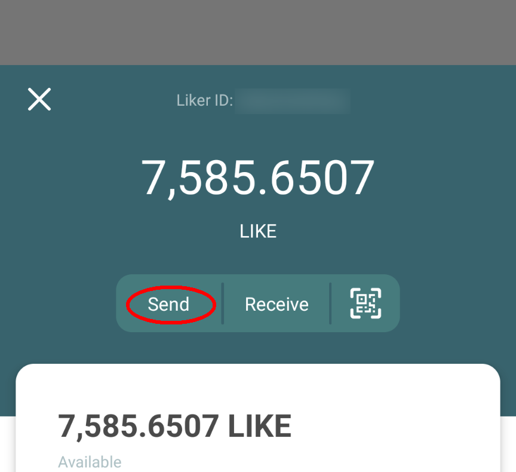

# LIKE pay

## LIKE pay on Liker Land app

### Step 1&#xD;

Download [Liker Land app](https://liker.land/getapp), [register a Liker ID by general method (with Authcore)](../../user-guide/liker-id/register/) and login.

### Step 2

Open the mobile app and click on \[My Wallet] on top. You can manage your wallet now. Then, click the \[Send] button.

### Step 3&#xD;

You can fill in the Liker ID or wallet address into the \[Receiver's Liker ID or address] field, or else scanning the QR Code: Ask the LikeCoin receiver to open his/her wallet and click \[Receive] button to show his/her QR Code. Then you can click on the icon circled in red, using your phone camera to scan the LikeCoin receiver's QR Code.&#x20;

### **Step 4**

Liker Land app will open your phone camera, scan the LikeCoin receiver's QR Code, and click the \[Next] button.

### **Step 5**

Some crypto exchanges may require input of Tag/Memo, please fill in the value here or press \[Next] if there is nothing to add.

.png>)

### **Step 6**


****
Input the amount of LikeCoin that you have to transfer, click \[Next].  You may click on the \[Details] to check the estimated [Transaction fee](transaction-fee.md) for this LikeCoin transfer.  Make sure that your wallet has enough spare LikeCoin other than those you have to transfer. Click \[Confirm] to finish the transfer.

## LIKE pay on Liker Land web

### Step 1

Login [Liker Land](https://liker.land/civic).

### Step 2

Connect the payment page in the browser, the format is https://like.co/\[Liker ID]. If the Liker ID is ckxpress, the payment page is [https://like.co/ckxpress](https://like.co/ckxpress) and enter the amount of LikeCoin to be transferred. Please make sure that your wallet has enough LikeCoin for [transaction fee](transaction-fee.md) other than those you have to transfer. Input the number of LikeCoin that you have to send and click "Confirm" to finish the transfer.

![Transaction Fee displayed below the \[Confirm\] button](../../.gitbook/assets/like-pay-5-en.png)

## Other functions


[delegation-of-likecoin.md](../stake/delegation-of-likecoin.md)



[app.like.co.md](../decentralized-publishing/app.like.co.md)



[collect-writing-nft](../writing-nft/collect-writing-nft/)



[depub.space](../../user-guide/depub.space/)

