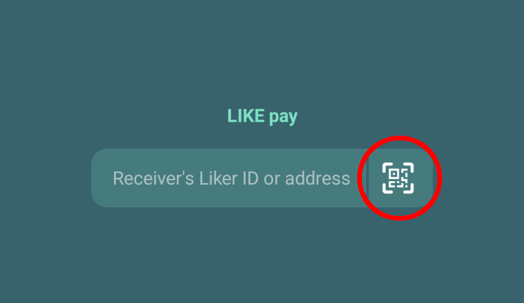

# LIKE pay

## LIKE pay on Liker Land app

### Step 1&#xD;

Download the [Liker Land app](https://liker.land/getapp), [register a Liker ID by general method (with Authcore)](../../user-guide/liker-id/register/), and login.

### Step 2

Open the mobile app and click on \[My Wallet] on top to manage your wallet. Then, click \[Send].

![Click \[Send\]](../../.gitbook/assets/like-pay-1-en.png)

### Step 3&#xD;

Fill in the Liker ID or wallet address in the \[Receiver's Liker ID or address] field, or scan the QR Code. Ask the LikeCoin receiver to open their wallet and click the \[Receive] button to show their QR Code. Then, click on the icon circled in red and use your phone camera to scan the LikeCoin receiver's QR Code.

### **Step 4**

The Liker Land app will open your phone camera, scan the LikeCoin receiver's QR Code, and click \[Next].

### **Step 5**

Some crypto exchanges may require the input of a Tag/Memo. Please fill in the value here or press \[Next] if there is nothing to add.

### **Step 6**

Input the amount of LikeCoin you want to transfer and click \[Next]. You can click on \[Details] to check the estimated [Transaction fee](transaction-fee.md) for this LikeCoin transfer. Make sure that your wallet has enough spare LikeCoin other than what you want to transfer. Click \[Confirm] to finish the transfer.

![Click \[Confirm\] to finish the transfer](../../.gitbook/assets/like-pay-4-en.png)

## LIKE pay on Liker Land web

### Step 1

Login [Liker Land](https://liker.land/civic).

### Step 2

Connect to the payment page in the browser, with the format https://like.co/\[Liker ID]. If the Liker ID is ckxpress, the payment page is [https://like.co/ckxpress](https://like.co/ckxpress). Enter the amount of LikeCoin to be transferred. Please make sure that your wallet has enough LikeCoin for the [transaction fee ](transaction-fee.md)other than what you want to transfer. Input the number of LikeCoin you want to send and click "Confirm" to finish the transfer.

![Transaction Fee displayed below the \[Confirm\] button](../../.gitbook/assets/like-pay-5-en.png)

## Other functions


[delegation-of-likecoin](../stake/delegation-of-likecoin/)



[app.like.co.md](../decentralized-publishing/app.like.co.md)



[nft-portal.md](../writing-nft/nft-portal.md)



[collect-writing-nft](../writing-nft/collect-writing-nft/)



[depub.space](../../user-guide/depub.space/)

