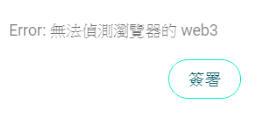

# LikeCoin Migration FAQ

Please check out our FAQ below. Don't see an answer to your question? Feel free to contact us.

## **1.** I never installed MetaMask, how to migrate?

If you did not install MetaMask, that means you never used a wallet to accumulate LikeCoin. he numbers displayed on [Like.co/in](https://like.co/in/) are just in temporary storage by the system.

You do not have to migrate your LikeCoin. Login to the [Liker Land app](../../../user-guide/liker-land/download.md) and the LikeCoin in temporary storage will go into your new wallet.

## **2.** During the migration process, MetaMask and Like.co/in both display 0 LikeCoin!

The system transfers LikeCoin ERC-20 from MetaMask to the smart contract, so your LikeCoin will disappear for a few minutes as they are on the way to the new LikeCoin chain. Please be patient.

## **3.** The amount of LikeCoin in Like.co is not the same as in the Liker Land app.

It may be the case that you never linked your Etherscan wallet to your Like ID, and there are rewards waiting to be released. Please check it a few days later.

## 4. During the migration process, I encountered "Error: NOT\_ENOUGH\_GAS, NEED X.XXXXX"

You have to prepare enough ETH (the number in NOT\_ENOUGH\_GAS, NEED X.XXXXX) as GAS Fee. You may refer to [ETH GAS Station](https://ethgasstation.info/) ffor the required fee.

## 5. I am stuck in "Waiting for ETH TX" for a very long time.

The system transfers LikeCoin ERC-20 from MetaMask to the smart contract, then deposits new LikeCoin to your new LikeCoin chain wallet. These two steps involve transfers and usually take at least 5 to 10 minutes. Please be patient. If the whole migration process takes more than 15 minutes and is not done, please contact our customer service.

## **6.** In the "Sign" process experiences "Cannot detect web3 in browser" error

This error indicates that the system cannot detect MetaMask, please check if you are using Chrome and have Metamask installed.

**7.** Error: "Please use the Etherscan address \[0x...] linking with your LikeCoin to sign"


The MetaMask wallet address that you are using, does not match the Liker ID that you link to. Metamask is a cryptocurrency wallet for managing different crypto addresses. Please try to remember:

* Have you reinstalled MetaMask?
* Have you reinstalled your computer?
* Are you using the same computer to register your Liker ID?

Suggest to use the MetaMask wallet when you register your Liker ID and try to migrate again.

If you lost your wallet address, please check if you have backed up the seed phrase or not. Private key or seed phrase are the only way to recover a crypto wallet. If you lose both, you will never be able access your wallet again.

## 8. Error: "Your MetaMask wallet does not register any Liker ID, if you need to register a new account, please go back and use Authcore"

Same reason as 7.
